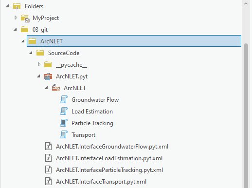

# SourceCode
This folder contains Python source codes of ArcNLET for ArcGIS Pro

Installation
-----------------------------------------------
ArcNLET V4.0 was developed based on ArcGIS Pro 3.1.3. The built-in arcpy package in ArcGIS Pro is required. The procedures of using ArcNLET V4.0 are briefly described as follows,

1. Please download the code locally,
2. Open the SourceCode folder,

3. Click SourceCode -> ArcNLET.pyt -> ArcNLET, and then choose the tool Groundwater Flow,
4. Use the lakeshore example for description. Click on the folder icon behind each input box to select the individual input file, and write the name of the output file. Change the parameter values, and click the run button.

5. The model will then start running. The results will be automatically displayed in Contents of ArcGIS Pro.
