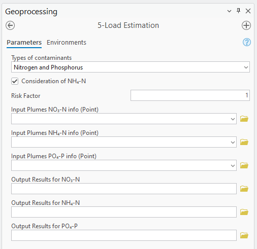
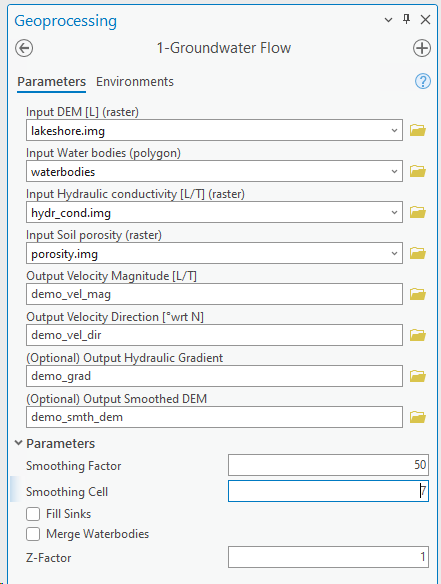

# ArcNLET-Py: ArcGIS Pro Python Toolbox

ArcNLET-Py, the Python version of the ArcGIS-Based Nitrogen Load Estimation Toolbox, is developed for ArcGIS Pro. It facilitates the study of nitrogen fate and transport in surficial groundwater aquifers. ArcNLET now includes advanced functionalities for modeling phosphorus transport and estimating phosphorus loads.

## Introduction

Developed at the Department of Earth, Ocean, and Atmospheric Science at Florida State University, ArcNLET-Py builds upon its predecessor, ArcNLET, which was created using Visual Basic for ArcMap. With the shift to ArcGIS Pro, the toolbox is now written in Python, offering several new features and an intuitive user interface.

ArcNLET-Py serves a crucial role in simulating the movement and transformation of nitrogen, primarily originating from onsite sewage treatment and disposal systems (OSTDS). It estimates the ammonium and nitrate load to surface water bodies and integrates seamlessly with GIS for efficient data management.

### Key Features

- **Data Preparation**: Assists in preparing soil hydraulic property data.
- **Reactive Transport Simulation**: Simulates the vertical transport of ammonium and nitrate.
- **Groundwater Flow Evaluation**: Calculates flow directions and magnitudes at OSTDS locations.
- **Nitrogen Plume Estimation**: Determines nitrogen travel paths and estimates plume formation.
- **Phosphorus Plume Estimation**: Models phosphorus transport using Langmuir and Linear isotherms.
- **Load Calculation**: Computes nitrate-nitrogen loss and final nitrate load to water bodies.

## Module Overview

Each module is designed to function cohesively, providing a comprehensive analysis of nitrogen transformation and transport.

1. **0-Preprocessing**: Prepares soil datasets from SSURGO.
   

      
   

2. **1-Groundwater Flow**: Approximates water table using smoothed topography.
   

      
   

3. **2-Particle Tracking**: Calculates flow paths based on groundwater velocity.
   

      
   

4. **3-VZMOD (Vadose Zone Model)**: Optional module for vertical soil flow estimation. This module now supports the simulation of vertical phosphorus transport.

   

      
   

5. **4-Transport**: Simulates the movement of contaminants, including nitrogen, phosphorus, or both, through groundwater systems.
   

      
   

6. **5-Load Estimation**: Calculates NH4/NO3 and PO4 mass load-input, -output, and -removal.
   

      
   

## Requirements

ArcNLET-Py is compatible with ArcGIS Pro 3.2.0 and requires specific system setups:

- **ArcGIS Pro Installation**: Detailed instructions provided in the user manual.
- **Data Preparation**: Guidelines for preparing input data for OSTDS locations and groundwater modeling.
- **Sensitivity Analysis and Calibration**: Tools for refining model accuracy.

## Installation

ArcNLET V4.0 was developed based on ArcGIS Pro 3.1.3. The built-in arcpy package in ArcGIS Pro is required. The procedures of using ArcNLET V4.0 are briefly described as follows:

1. Please download the code locally,
2. Open the SourceCode folder,

   

      
   

3. Click SourceCode -> ArcNLET.pyt -> ArcNLET, and then choose the tool Groundwater Flow,
4. Use the lakeshore example for description. Click on the folder icon behind each input box to select the individual input file, and write the name of the output file. Change the parameter values, and click the run button.

   

      
   

5. The model will then start running. The results will be automatically displayed in Contents of ArcGIS Pro.

### Lakeshore Example

A practical example, the Lakeshore case, is provided to demonstrate the application of each module, offering insights into preparing input files and executing the toolbox effectively.

## Contribution and Usage

We welcome contributions and feedback from the community. For more detailed information about each module and usage instructions, please refer to the [User Manual](https://arcnlet-py.readthedocs.io/en/latest/).

For any queries or contributions, feel free to contact us:
- Michael Core - mcore@fsu.edu
- Wei Mao - wm23a@fsu.edu
- Ming Ye - mye@fsu.edu

## Acknowledgements

Prepared for the Florida Department of Environmental Protection, Tallahassee, FL. The development and documentation of ArcNLET-Py are made possible by the collaborative efforts of our dedicated team.

The older version of ArcNLET can be found on [FSU Atmospheric Website](https://atmos.eoas.fsu.edu/~mye/ArcNLET/). Training videos are available on [YouTube](https://www.youtube.com/@mingye9168/videos).

---

*Please note: This README provides a project overview. For comprehensive guidance, refer to the user manual.*

