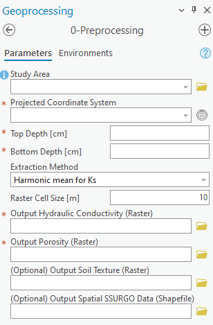
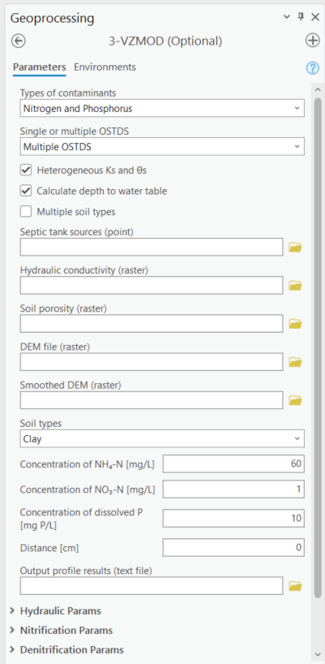

# ArcNLET-Py: ArcGIS Pro Python Toolbox 

ArcNLET-Py, the Python version of the ArcGIS-Based Nutrient Load Estimation Toolbox, is developed for ArcGIS Pro. It facilitates the study of nitrogen fate and transport in surficial groundwater aquifers. ArcNLET now includes advanced functionalities for modeling phosphorus transport and estimating phosphorus loads.

Visit the [ArcNLET YouTube Channel](https://www.youtube.com/@ArcNLET "click to open YouTube Channel") for the training videos. 

## Disclaimer

While ArcNLET-Py is designed to provide a practical and computationally efficient tool for nutrient fate assessment, it inevitably makes assumptions and simplifications that may not hold true in all hydrogeological or biogeochemical settings. Users should therefore be cautious when applying the model. The details are provided in the Simplications and Assumptions section.

## ArcNLET Assistant

The ArcNLET Assistant is currently in preliminary development and is designed to assist users by answering questions and providing guidance on using ArcNLET-Py. You can access this GPT-powered assistant through the URL provided below.

[ChatGPT ArcNLET Assistant](https://chatgpt.com/g/g-meMAcqHW4-arcnlet-assistant)

## Introduction

Developed at the Department of Earth, Ocean, and Atmospheric Science at Florida State University, ArcNLET-Py builds upon its predecessor, ArcNLET, which was created using Visual Basic for ArcMap. With the shift to ArcGIS Pro, the toolbox is now written in Python, offering several new features and an intuitive user interface.

ArcNLET-Py serves a crucial role in simulating the movement and transformation of nitrogen, primarily originating from onsite sewage treatment and disposal systems (OSTDS). It estimates the ammonium and nitrate load to surface water bodies and integrates seamlessly with GIS for efficient data management.

### Key Features

- **Data Preparation**: Assists in preparing soil hydraulic property data with the Preprocessing Module.
- **Groundwater Flow Evaluation**: Calculates flow directions and magnitudes at OSTDS locations with the Groundwater Flow Module.
- **Reactive Transport Simulation**: Simulates the vertical transport of ammonium, nitrate, and phosphate with the VZMOD.
- **Nitrogen Plume Estimation**: Determines nitrogen travel paths and estimates plume formation with the Transport Module.
- **Phosphorus Plume Estimation**: Models phosphorus transport using Langmuir and Linear isotherms with the Transport Module.
- **Load Calculation**: Computes nitrogen and/or phosphorus removal and final load estimates to water bodies with the Load Estimation Module.
- **Temporal Variation Evaluation**: Empirically evaluates the temporal variation of nitrogen and phosphorus concentrations and loads by accounting for fluctuations in groundwater levels at monitoring wells.

### Temporal Variation Method

ArcNLET-Py introduces a method to empirically evaluate the [Temporal Variation](https://arcnlet-py.readthedocs.io/en/latest/UserManual/temporalvariation.html). of nitrogen and phosphorus concentrations and loads. While the model typically assumes steady-state groundwater flow, this new method addresses the dynamic nature of real-world hydrological conditions. 

By selecting study areas where long-term groundwater level and nitrogen/phosphorus concentration data are available (e.g., Turkey Creek sub-basin), the method enables users to analyze how **high**, **average**, and **low groundwater levels** affect the load estimates. This approach is particularly useful in assessing how fluctuating conditions impact nitrogen and phosphorus transport over time.

For example, continuous measurements from monitoring wells provide valuable data that allow users to evaluate the differences in estimated loads under varying groundwater levels. This method highlights the importance of temporal variation in environmental modeling and provides deeper insights into the uncertainty associated with steady-state assumptions.

## Module Overview

Each module is designed to function cohesively, providing a comprehensive analysis of nitrogen transformation and transport.

1. **0-Preprocessing**: Prepares soil datasets from SSURGO.
   

      
   

2. **1-Groundwater Flow**: Approximates water table using smoothed topography.
   

      
   

3. **2-Particle Tracking**: Calculates flow paths based on groundwater velocity.
   

      
   

4. **3-VZMOD (Vadose Zone Model)**: Optional module for vertical soil flow estimation. This module now supports the simulation of vertical phosphorus transport.

   

      
   

5. **4-Transport**: Simulates the movement of contaminants, including nitrogen, phosphorus, or both, through groundwater systems.
   

      
   

6. **5-Load Estimation**: Calculates NH4/NO3 and PO4 mass load-input, -output, and -removal.
   

      
   

## Requirements

ArcNLET-Py is compatible with ArcGIS Pro 3.2.0 and requires specific system setups:

- **ArcGIS Pro Installation**: Detailed instructions provided in the user manual.
- **Data Preparation**: Guidelines for preparing input data for OSTDS locations and groundwater modeling.
- **Sensitivity Analysis and Calibration**: Tools for refining model accuracy.

## Installation

ArcNLET V4.0 was developed based on ArcGIS Pro 3.1.3. The built-in arcpy package in ArcGIS Pro is required. The procedures of using ArcNLET V4.0 are briefly described as follows:

1. Please download the code locally,
2. Open the SourceCode folder,

   

      
   

3. Click SourceCode -> ArcNLET.pyt -> ArcNLET, and then choose the tool Groundwater Flow,
4. Use the lakeshore example for description. Click on the folder icon behind each input box to select the individual input file, and write the name of the output file. Change the parameter values, and click the run button.

   

      
   

5. The model will then start running. The results will be automatically displayed in Contents of ArcGIS Pro.

### Lakeshore Example

A practical example, the Lakeshore case, is provided to demonstrate the application of each module, offering insights into preparing input files and executing the toolbox effectively.

## Simplifications and Assumptions

George Box, a British statistician, wrote in 1976 that “[all models are wrong, but some are useful](https://en.wikipedia.org/wiki/All_models_are_wrong "click to open wiki")”, meaning that (statistical) models “always fall short of the complexity of reality but can still be useful nonetheless”. It is the case for ArcNLET-Py, which is based on a simplified conceptualization about the reactive transport of nutrients from onsite sewage treatment and disposal systems (OSTDS) to surface water bodies. Below are the major simplifications and assumptions made by ArcNLET-Py: 

1. **Steady-State Water Flow and Solute Transport**

   ArcNLET-Py assumes that the water flow (of unsaturated soil water and saturated groundwater) and solute transport (of nitrogen and phosphorus) from OSTDS drainfields to surface water bodies are under steady-state conditions. As a result, the model outcomes generally reflect long-term average conditions. If one is interested in an acute event (e.g., OSTDS nutrient transport after a hurricane), ArcNLET-Py is not a suitable tool for simulating the acute events. If monitoring data are available, it is necessary to examine whether the data exhibit trends in hydraulic heads and/or nutrient concentrations. If trends are observed, ArcNLET-Py is not a suitable tool for simulating the data. 

2. **Water Table as a Subdued Replica of Topography**

   ArcNLET-Py assumes that the water table is a subdued replica of topography and generates the shape of the water table through topographic smoothing. This assumption is valid when the water table is controlled primarily by surface features, as described by Haitjema and Mitchell-Bruker (2005). The condition for validity is (R·L²) / (m·k·H·d) > 1 , where R [m/d] is the recharge rate, L [m] is the average distance between two surface water bodies, m [-] is a dimensionless shape factor related to aquifer geometry, K [m/d] is the hydraulic conductivity, H [m] is average aquifer thickness, d [m] is the maximum terrain rise between water bodies. 

3. **1-D Vertical Model with Homogeneous Parameter Values in Vadose Zone**

   In the vadose zone between the OSTDS drainfields and water table, ArcNLET-Py assumes that the soil water flow and solute transport are one-dimensional in the vertical direction. ArcNLET-Py uses hydraulic loading rate as a lump-sum parameter for water entering the vadose zone through the drainfields, and does not explicitly account for precipitation, evapotranspiration, and other processes occurring at the drainfields. 

   All the soil hydraulic parameters (e.g., saturated hydraulic conductivity and soil retention parameters) are assumed to be homogeneous in the vertical direction (i.e., constant over depth). The parameters, however, are heterogeneous in the horizontal direction. When simulating multiple OSTDS, ArcNLET-Py can use a soil type file that specifies soil types in the horizontal direction, and each soil type has its own parameters. All parameters related to nitrification and denitrification modeling are homogeneous in space. For example, the nitrification rate has only one value for the entire modeling domain, regardless of the number of OSTDS and soil types. 

4. **2-D Horizontal Model with Analytical Solutions and Homogeneous Parameter Values in Groundwater Aquifer**

   In the surficial aquifer below the water table, the groundwater flow and solute transport are assumed to be two-dimensional. In other words, groundwater velocity and nutrient concentrations produced by ArcNLET-Py are assumed to be constant over aquifer depth. To estimate the amount of nutrient load, ArcNLET-Py users can either specify the plume depth or estimate it using ArcNLET-Py. Except for hydraulic conductivity and porosity, all the parameters of the groundwater flow and solute transport model are assumed to be homogeneous.

5. **Simplified Nutrient Reactive Transport Models**

   The nutrient reactive transport is complex, depending on a large number of environmental factors such as carbon and oxygen availability between OSTDS drainfields and surface water bodies. ArcNLET-Py does not consider all the factors, but uses simplified models for nutrient reactive transport. For example, the nitrification process is modeled using a first-order kinetics characterized by nitrification rates, without explicitly considering carbon and oxygen availability in soils. 

Due to the simplifications and assumptions made by ArcNLET-Py, users need to evaluate whether the ArcNLET-Py outputs (e.g., nutrient concentrations and loads) are reasonable for the site of interest based on the users’ experience and available data and information. 

ArcNLET-Py modeling results are dependent on model parameter values, especially those related to nutrient reactive transport such as denitrification. Although ArcNLET-Py provides default parameter values to start a simulation, the parameter values are based on literature and not site-specific. ArcNLET users should use site-specific parameter values whenever possible. Based on different modeling goals, we offer the following two recommendations:

- **For approximate estimations** where high accuracy is not required and/or site-specific data are unavailable, default parameters can be used. However, users should be aware that such results may contain uncertainty and may not accurately reflect real conditions.

- **For accurate and site-specific results**, model calibration using field data (e.g., groundwater levels and nutrient concentrations) is necessary. One can compare modeling simulations with corresponding field observations to evaluate whether ArcNLET-Py can simulate real-world conditions related to OSTDS nutrient transport.

## Contribution and Usage

We welcome contributions and feedback from the community. For more detailed information about each module and usage instructions, please refer to the [User Manual](https://arcnlet-py.readthedocs.io/en/latest/).

For any queries or contributions, feel free to contact us:
- Michael Core - mcore@fsu.edu
- Wei Mao - wm23a@fsu.edu
- Ming Ye - mye@fsu.edu

## Acknowledgements

This research was supported by grant NS095 with the Florida Department of Environmental Protection. Any opinions, findings, and conclusions or recommendations expressed in this material are those of the author(s) and do not necessarily reflect the views of the Florida Department of Environmental Protection.

The development and documentation of ArcNLET-Py are made possible by the collaborative efforts of our dedicated team.

The older version of ArcNLET can be found on the [FSU Website](https://atmos.eoas.fsu.edu/~mye/ArcNLET/). Training videos are available on [YouTube](https://www.youtube.com/@mingye9168/videos).

---

*Please note: This README provides a project overview. For comprehensive guidance, refer to the user manual.*