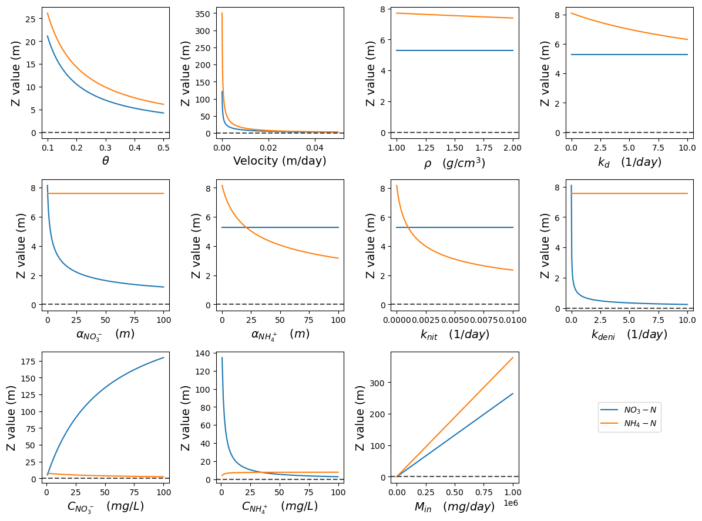

.. _Zcalculation:
.. role:: raw-html(raw)
   :format: html

ArcNLET-Py Groundwater Solute-Transport Module: Theoretical Foundations
=======================================================================

1. Purpose of This Document
---------------------------

The purpose of this document is to provide a clear, step-by-step
exposition of the physical and mathematical foundations of the
ArcNLET-Py groundwater solute-transport module. In particular, it:

- **Derives** the steady-state, two-dimensional
  advection–dispersion–decay equations from the Domenico solution
  (Section 2.1; Equations 7–9).
- **Shows** how the source-plane thickness :math:`Z` is related to the
  specified input mass rate :math:`M_{in}` for a single solute (Section
  2.2; Equation 29).
- **Explains** how auxiliary-variable transformations decouple the
  coupled NH₄⁺-N and NO₃⁻-N reaction equations into independent
  first-order decay problems (Section 2.3; Equations 38–41 for NH₄⁺-N,
  and 42–45 for NO₃⁻-N).
- **Extends** the :math:`Z\text{-}M_{in}` relationship to the NH₄⁺-N
  system when NH₄⁺-N and NO₃⁻-N coexist (Section 2.4; Equation 53).
- **Applies** a similar derivation to the NO₃⁻-N system—first
  illustrating a common misstep, then presenting the correct formulation
  when NH₄⁺-N and NO₃⁻-N coexist (Section 2.5; Equation 76).

This document is intended for hydrogeologists, groundwater modelers, and
environmental scientists who seek a deeper understanding of the
theoretical basis behind ArcNLET-Py. It will also benefit advanced
graduate students, regulators, and consulting engineers who need to
critically evaluate model assumptions, set parameters correctly, or
interpret model outputs in the context of solute transport and reactive
processes.

2. Equations of Ammonium and Nitrate Calculation in Groundwater
---------------------------------------------------------------

ArcNLET-Py employs a steady-state, two-dimensional advection-dispersion
equation to simulate the reactive transport of ammonium and nitrate in
groundwater. The term “two-dimensional” specifically refers to the
horizontal :math:`x`-axis, which aligns with the direction of
groundwater flow, and the horizontal :math:`y`-axis, which is
perpendicular to the :math:`x`-axis. It is important to note that while
the model does not account for variability along the :math:`z`-axis (the
vertical dimension), the :math:`z`-axis remains a critical input
parameter. If the :math:`z`-value is not directly provided, the model
requires the mass of the contaminant entering the groundwater, denoted
as :math:`M_{in}`, and calculates the :math:`z`-value accordingly, which
is described in Section 2.2. ArcNLET-Py assumes a uniform concentration
distribution along the :math:`z`-axis with no vertical variability. The
:math:`z`-value is used to calculate the volume of the plume, and
subsequently calculate the mass balance items of ammonium and nitrate.

2.1 The Domenico Solution
~~~~~~~~~~~~~~~~~~~~~~~~~

The Domenico solution with decay (Domenico, 1987) considers a simplified
form of advection-dispersion equation, and is shown as,

.. math::
   :nowrap:

   \[
   \frac{\partial C}{\partial t} = D_x \frac{\partial^2C}{\partial x^2}
   + D_y \frac{\partial^2C}{\partial y^2}
   + D_z \frac{\partial^2C}{\partial z^2}
   - v \frac{\partial C}{\partial x}
   - kC
   \]

where :math:`C` is the contaminant concentration :math:`[M/L^3]`;
:math:`D_x`, :math:`D_y` and :math:`D_z` are the homogeneous dispersion
coefficients in :math:`x`, :math:`y`, and :math:`z` respectively
:math:`[L^2/T^{-1}]`; :math:`v` is the constant seepage velocity in the
:math:`x` direction :math:`[L]` and k is the first order decay constant
:math:`[T^{-1}]`. The boundary and initial conditions are,

.. math::
   :nowrap:

   \[
   \begin{gathered}
   C(x,y,z,0) = 0 \quad \forall\, 0 < x < \infty,\; -\infty < y < \infty,\; -\infty < z < \infty \\
   C(0,y,z,t) = C_0 \quad -\frac{Y}{2} < y < \frac{Y}{2},\; -\frac{Z}{2} < z < \frac{Z}{2},\; \forall\, t > 0 \\
   \lim_{x \to +\infty} \frac{\partial C(x,y,z,t)}{\partial x} = 0 \\
   \lim_{y \to \pm\infty} \frac{\partial C(x,y,z,t)}{\partial y} = 0 \\
   \lim_{z \to \pm\infty} \frac{\partial C(x,y,z,t)}{\partial z} = 0
   \end{gathered}
   \]

These conditions essentially correspond to considering a single plume,
having a source plane centered at (0, 0, 0), with dimensions :math:`Y`
and :math:`Z` and a constant concentration :math:`C_0` while only
considering groundwater flow in the :math:`x` direction but dispersion
in all three directions, as the Figure 1 shows as follows. Additional
constraints assume that the system evolves only in the positive half of
the :math:`x` coordinate space and that the system is initially free of
contaminant.

   Fig. 1. The geometry of the Domenico solution source plane.

The general form of the Domenico solution used in this model is the
three-dimensional transient solution of Martin-Hayden and Robbins
(1997), which is based on the work by Domenico and Robbins (1985) and
Domenico (1987),

.. math::
   :nowrap:

   \[
   C(x,y,z,t)=\frac{C_0}{8}F_1(x,t)F_2(y,x)F_3(z,x)
   \]

with

.. math::
   :nowrap:

   \[
   \begin{gathered}
   F_1 = \exp\left[\frac{x}{2\alpha_x}\left(1-\sqrt{1+\frac{4k\alpha_x}{v}}\right)\right] \times \text{erfc}\left[\frac{x-vt\sqrt{1+\frac{4k\alpha_x}{v}}}{2\sqrt{\alpha_xvt}}\right] \\
   + \exp\left[\frac{x}{2\alpha_x}\left(1+\sqrt{1+\frac{4k\alpha_x}{v}}\right)\right] \times \text{erfc}\left[\frac{x+vt\sqrt{1+\frac{4k\alpha_x}{v}}}{2\sqrt{\alpha_xvt}}\right]
   \end{gathered}
   \]

.. math::
   :nowrap:

   \[
   F_2=erf\left(\frac{y+Y/2}{2\sqrt{\alpha_yx}}\right)-erf\left(\frac{y-Y/2}{2\sqrt{\alpha_yx}}\right)
   \]

.. math::
   :nowrap:

   \[
   F_3=erf\left(\frac{z+Z/2}{2\sqrt{\alpha_z x}}\right)-erf\left(\frac{z-Z/2}{2\sqrt{\alpha_z x}}\right)
   \]

where :math:`\alpha_x`, :math:`\alpha_y`, and :math:`\alpha_z` are the
longitudinal, horizontal transverse and vertical transverse
dispersivities :math:`[L]`; :math:`k` is the first order decay
coefficient :math:`[T^{-1}]`; :math:`v` is the groundwater seepage
velocity in the longitudinal direction :math:`[LT^{-1}]`, :math:`Y` and
:math:`Z` are the width and height of the source plane respectively
:math:`[L]` and :math:`t` is time :math:`[T]`.

The actual form of the Domenico solution used in ArcNLET-Py is the
steady-state, two-dimensional version of Equation 3 as follows,

.. math::
   :nowrap:

   \[
   C(x,y)=\frac{C_0}{2}F_1(x)F_2(y,x) 
   \]

.. math::
   :nowrap:

   \[
   F_1=exp\left[\frac{x}{2\alpha_x}\left(1-\sqrt{1+\frac{4k\alpha_x}{v}}\right)\right]
   \]

.. math::
   :nowrap:

   \[
   F_2=erf\left(\frac{y+Y/2}{2\sqrt{\alpha_y x}}\right)-erf\left(\frac{y-Y/2}{2\sqrt{\alpha_y x}}\right)
   \]

Equation 7 (along with Equation 8 and 9) is obtained by ignoring
vertical dispersion in Equation 3 by setting the transverse vertical
dispersivity, :math:`a_z`, in Equation 6 equal to zero. The error
function tends to :math:`\pm 1` as the argument tends to
:math:`\pm \infty`. Therefore, when :math:`-Z/2<z<Z/2`, :math:`F_3`
becomes :math:`erf(+\infty)-erf(-\infty)=2`. This makes the solution
two-dimensional. To impose a steady-state condition, :math:`t` is taken
to :math:`+\infty`. The complementary error function is defined as
:math:`erfc(t)=1-erf(t)` therefore as the argument tends to
:math:`+\infty`, :math:`erft(t)` tends to :math:`0` and as it tends to
:math:`-\infty`, it tends to :math:`2`. Using these properties, as
:math:`t` goes to :math:`+\infty`, the term after the addition sign in
Equation 4 become :math:`0` and the first :math:`erfc` term becomes 2.
The other terms do not depend on :math:`t` and therefore remain
unchanged.

2.2 The Relationship between :math:`M_{in}` and :math:`Z` for a single solute
~~~~~~~~~~~~~~~~~~~~~~~~~~~~~~~~~~~~~~~~~~~~~~~~~~~~~~~~~~~~~~~~~~~~~~~~~~~~~

:math:`M_{in}` means the mass input from the source plane, as shown in
Figure 1, to groundwater. The calculation of the mass input rate,
:math:`M_{in}`, is more complicated. The input load calculation accounts
not only for mass input due to advection from the source plane but also
through dispersion of the source plane.

.. math::
   :nowrap:

   \[
   M_{in} = M_{adv}+M_{dsp}
   \]

The advection term is calculated using the volume of water that flows
across the interface (source plane) in unit time, multiplied by the
solute concentration,

.. math::
   :nowrap:

   \[
   M_{adv}=C_0YZ\theta v
   \]

where :math:`C_0[M/L^3]` is the concentration of the source plane;
:math:`Y` and :math:`Z` are the dimensions of the source plane
:math:`[L]`; :math:`v[L/T]` is the seepage velocity, and
:math:`\theta [\text-]` is the porosity. The dispersion term is
calculated by assuming dispersion is governed by Fick’s Law (Freeze and
Cherry, 1979). The dispersion through the source plane is written as,

.. math::
   :nowrap:

   \[
   M_{dsp}=-D_{xx}YZ\theta \frac{\partial C}{\partial x}
   \]

where :math:`D_{xx} [L^2/T]` is the component of the dispersion tensor
along the x-direction. The dispersion parameters is actually a second
order tensor in three dimensions, represented by a :math:`3 \times 3`
matrix. Because the direction of the principal flow has been aligned
with the coordinate system, and the flow is assumed to be only in the
:math:`x`-direction, all :math:`y`-terms, :math:`z`-terms and
:math:`x\text{-}y` cross terms vanish, leaving only the :math:`D_{xx}`
term.

Disregarding molecular diffusion, the dispersion coefficient is
calculated as,

.. math::
   :nowrap:

   \[
   D_{xx} = \alpha_x v
   \]

where :math:`\alpha_x [L]` is the medium’s dispersivity in the
:math:`x`-direction and :math:`v[L/T]` is seepage velocity as before.
Putting everything together and :math:`M_{in}` can be shown as,

.. math::
   :nowrap:

   \[
   M_{in}=C_0YZ\theta v-\alpha_xYZ\theta v \frac{d C}{d x} \Big|_{x=0} 
   \]

Equation 12 uses the partial derivative symbol :math:`\partial` while
Equation 14 uses the total derivative symbol :math:`d` because x is the
only independent variable. The :math:`\frac{d C}{d x}` term can be
calculated from Equation 7. The remaining terms in Equation 12 are
specified parameters or are otherwise known.

Differentiating Equation 7 (using the chain rule) and evaluating it at
the location of the source plane,

.. math::
   :nowrap:

   \[
   \frac{d C}{d x} \Big|_{x=0}=\frac{C_0}{2}F_2|_{x=0}\frac{d F_1}{d x}\Big|_{x=0}+\frac{C_0}{2}F_1|_{x=0}\frac{d F_2}{d x}\Big|_{x=0}
   \]

Calculating :math:`d F_1/d x` is straightforward,

.. math::
   :nowrap:

   \[
   \begin{gathered}
   \left.\frac{d F_1}{d x}\right|_{x=0} &= \frac{d}{d x} \exp\left[ \frac{x}{2\alpha_x} \left(1 - \sqrt{1 + \frac{4k\alpha_x}{v}}\right) \right] \\
   &= F_1|_{x=0} \times \frac{1 - \sqrt{1 + \frac{4k\alpha_x}{v}}}{2\alpha_x} \notag \\
   &= \frac{1 - \sqrt{1 + \frac{4k\alpha_x}{v}}}{2\alpha_x}
   \end{gathered}
   \]

The calculation of :math:`d F_2/d x` requires multiple steps. The
intermedia variables is used as,

.. math::
   :nowrap:

   \[
   u=\frac{y+Y/2}{2\sqrt{\alpha_yx}}, \quad v=\frac{y-Y/2}{2\sqrt{\alpha_yx}}
   \]

Therefore,

.. math::
   :nowrap:

   \[
   F_2 = erf(u)-erf(v)
   \]

The error function is,

.. math::
   :nowrap:

   \[
   erf(z)=\frac{2}{\sqrt{\pi}}\int^{z}_{0}e^{-t^2}dt
   \]

Based on Leibniz’s integral rule, the derivative of the error function
is,

.. math::
   :nowrap:

   \[
   \frac{d}{dz}\left[erf(z)\right]=\frac{d}{dz}\left[\frac{2}{\sqrt{\pi}}\int^{z}_{0}e^{-t^2}dt\right]=\frac{2}{\sqrt{\pi}}\cdot \frac{d}{dz}\left[\int^{z}_{0}e^{-t^2}dt\right]=\frac{2}{\sqrt{\pi}}e^{-z^2}
   \]

Therefore,

.. math::
   :nowrap:

   \[
   \frac{dF_2}{dx}=\frac{d}{dx}\left[erf(u)-erf(v)\right]=\frac{2}{\sqrt{\pi}}\left[e^{-u^2}\cdot \frac{du}{dx}-e^{-v^2}\cdot \frac{dv}{dx}\right]
   \]

.. math::
   :nowrap:

   \[
   \begin{gathered}
   u = \frac{C_u}{\sqrt{x}} \quad \Rightarrow \quad \frac{du}{dx} = -\frac{C_u}{2x^{3/2}} \\
   v = \frac{C_v}{\sqrt{x}} \quad \Rightarrow \quad \frac{dv}{dx} = -\frac{C_v}{2x^{3/2}}
   \end{gathered}
   \]

:math:`C_u` and :math:`C_v` are constant parameters, as
:math:`C_u=\frac{y+Y/2}{2\sqrt{\alpha_y}}`, and
:math:`C_v=\frac{y-Y/2}{2\sqrt{\alpha_y}}`.

.. math::
   :nowrap:

   \[
   \begin{gathered}
   \frac{dF_2}{dx}=\frac{2}{\sqrt{\pi}}\left[e^{-u^2}\cdot \left(-\frac{y+Y/2}{4\sqrt{\alpha_y}\cdot x^{3/2}}\right)-e^{-v^2}\cdot \left(-\frac{y-Y/2}{4\sqrt{\alpha_y}\cdot x^{3/2}}\right)\right] \\
   =\frac{1}{2\sqrt{\pi \alpha_y}\cdot x^{3/2}}\left[-\left(y+Y/2\right)e^{-u^2}+\left(y-Y/2\right)e^{-v^2}\right] \\
   =\frac{1}{2\sqrt{\pi \alpha_y}\cdot x^{3/2}}\left[-\frac{y+Y/2}{e^{\frac{(y+Y/2)^2}{4\alpha_y x}}}+\frac{y-Y/2}{e^{\frac{(y-Y/2)^2}{4\alpha_y x}}}\right]
   \end{gathered}
   \]

The result of this expression depends on the limit value of,

.. math::
   :nowrap:

   \[
   \lim_{x \to 0}\frac{e^{-C/x}}{x^{3/2}} \to 0
   \]

where :math:`C` is a positive constant value.

As :math:`x \to 0^+`,

- :math:`x^{3/2} \to 0^+`, The denominator tends to infinity,
- The numerator :math:`e^{-C/x} \to 0`, but exponentially fast.

The exponential decay like :math:`e^{-1/x}` goes to :math:`0` **much
faster** than any power of x goes to infinity, therefore the Equation 24
goes to 0. As a result,

.. math::
   :nowrap:

   \[
   \frac{dF_2}{dx}\Big |_{x=0}=0
   \]
   
Besides,

.. math::
   :nowrap:

   \[
   \begin{gathered}
   F_2\big|_{x=0}=erf\left(\frac{y+Y/2}{2\sqrt{\alpha_y x}}\right)-erf\left(\frac{y-Y/2}{2\sqrt{\alpha_y x}}\right) \\
   =erf(+\infty)-erf(-\infty)
   =1-(-1)=2
   \end{gathered}
   \]

Then,

.. math::
   :nowrap:

   \[
   \begin{gathered}
   \frac{\partial C}{\partial x} \Big|_{x=0}=\frac{C_0}{2}F_2|_{x=0}\frac{dF_1}{dx}\Big |_{x=0}+\frac{C_0}{2}F_1|_{x=0}\frac{dF_2}{dx}\Big |_{x=0} \\
   =\frac{C_0}{2}F_2|_{x=0}\frac{dF_1}{dx}\Big |_{x=0}+0 \\
   =\frac{C_0}{2}\times 2 \times \frac{1-\sqrt{1+\frac{4k\alpha_x}{v}}}{2\alpha_x} \\
   =C_0 \cdot \frac{1-\sqrt{1+\frac{4k\alpha_x}{v}}}{2\alpha_x} 
   \end{gathered}
   \]

Equation 14 can be finally calculated as,

.. math::
   :nowrap:

   \[
   \begin{gathered}
   M_{in}=C_0YZ\theta v-\alpha_xYZ\theta v \frac{d C}{d x} \Big|_{x=0} \\
   =C_0YZ\theta v-\alpha_xYZ\theta v C_0 \cdot \frac{1-\sqrt{1+\frac{4k\alpha_x}{v}}}{2\alpha_x} \\
   =C_0YZ\theta v\left(1-\frac{1-\sqrt{1+\frac{4k\alpha_x}{v}}}{2}\right) \\
   =C_0YZ\theta v\frac{1+\sqrt{1+\frac{4k\alpha_x}{v}}}{2} 
   \end{gathered}
   \]

.. math::
   :nowrap:

   \[
   Z=\frac{M_{in}}{C_0Y\theta v}\cdot \frac{2}{1+\sqrt{1+\frac{4k\alpha_x}{v}}}
   \]

In the solute transport module of ArcNLET-Py, if “Specified Input Mass
Rate” is selected, Equation 29 is employed to calculate the
:math:`z`-value, and the contaminant input mass :math:`M_{in}` becomes
an essential input parameter. Conversely, if “Specified Z” is chosen,
providing the :math:`z`-value itself is required as an essential input.

2.3 Considering both ammonium and nitrate
~~~~~~~~~~~~~~~~~~~~~~~~~~~~~~~~~~~~~~~~~

The governing equation used in ArcNLET-Py to calculate both ammonium and
nitrate solute transport is the steady-state advection-dispersion
equation, which can be presented as,

.. math::
   :nowrap:

   \[
   0=D_x\frac{\partial^2{C_{NH^{+}_4}}}{dx^2}+D_y\frac{\partial^2{C_{NH^{+}_4}}}{dy^2}-v\frac{\partial{C_{NH^{+}_4}}}{\partial{x}}-k_{nit}\left(1+\frac{\rho k_d}{\theta}\right)C_{NH^{+}_4}
   \]

.. math::
   :nowrap:

   \[
   0=D_x\frac{\partial^2{C_{NO^{-}_3}}}{dx^2}+D_y\frac{\partial^2{C_{NO^{-}_3}}}{dy^2}-v\frac{\partial{C_{NO^{-}_3}}}{\partial{x}} \\ +k_{nit}\left(1+\frac{\rho k_d}{\theta}\right)C_{NH^{+}_4}-k_{deni}C_{NO^{-}_3}
   \]

where the :math:`D_x` and :math:`D_y` are the dispersivity coefficients
in the longitudinal :math:`(x)` and horizontal transverse :math:`(y)`
directions, respectively; :math:`c_{NH^+_4}` and :math:`c_{NO^-_3}` are
the concentrations of ammonium and nitrate, respectively; :math:`v` is
groundwater velocity in the longitudinal direction; :math:`\rho` is bulk
density; :math:`k_d` is linear adsorption coefficient of ammonium;
:math:`k_{nit}` and :math:`k_{deni}` are the first-order nitrification
and denitrification rates, respectively; and :math:`\theta` is porosity.

The boundary conditions for the ammonium and nitrate are as follows,

.. math::
   :nowrap:

   \[
   \begin{gathered}
   C_{NH_4^+}(0,y)=\begin{cases}
     C_{0,NH_4^+} &\text{if } -\frac{Y}{2}<y<\frac{Y}{2} \\
      0 &\text{elsewhere}
   \end{cases} \\
   \lim_{x \to \pm \infty}{\frac{\partial C_{NH_4^+}(x, y)}{\partial x}}=0; \lim_{y \to \pm \infty}{\frac{\partial C_{NH_4^+}(x, y)}{\partial y}}=0
   \end{gathered}
   \]

.. math::
   :nowrap:

   \[
   \begin{gathered}
   C_{NO_3^-}(0,y)=\begin{cases}
     C_{0,NO_3^-} &\text{if } -\frac{Y}{2}<y<\frac{Y}{2} \\
      0 &\text{elsewhere}
   \end{cases} \\
   \lim_{x \to \pm \infty}{\frac{\partial C_{NO_3^-}(x, y)}{\partial x}}=0; \lim_{y \to \pm \infty}{\frac{\partial C_{NO_3^-}(x, y)}{\partial y}}=0
   \end{gathered}
   \]

Equations 30 and 31 cannot be solved directly using the Domenico
solution; instead, a transformation is required. The analytical
solutions of Equation 30 and 31 can be obtained by using the method of
Sun et al. (1999) that transforms the two coupled equations into two
independent equations. This is done by defining the auxiliary variables
as,

.. math::
   :nowrap:

   \[
   a_{NH^+_4}=C_{NH^+_4}
   \]

.. math::
   :nowrap:

   \[
   a_{NO^-_3}=C_{NO^-_3}+\frac{k_{nit}\left(1+\rho k_{d}/\theta\right)}{k_{nit}(1+\rho k_{d}/\theta)-k_{deni}}C_{NH^+_4}
   \]

With the auxiliary variable, Equations 30 and 31 can be transformed to,

.. math::
   :nowrap:

   \[
   0=D_x\frac{\partial^2{a_i}}{\partial x^2}+D_y\frac{\partial^2{a_i}}{\partial y^2}-v\frac{\partial{a_i}}{\partial{x}}-k_i a_i
   \]

.. math::
   :nowrap:

   \[
   \begin{gathered}
   k_i=\begin{cases}
      k_{nit}\left(1+\frac{\rho k_d}{\theta}\right) &\text{if } i=NH_4^+ \\
      k_{deni} &\text{if } i=NO_3^-
   \end{cases}
   \end{gathered}
   \]

For ammonium, the Domenico solution can be,

.. math::
   :nowrap:

   \[
   C_{NH_4^+}=a_{NH_4^+}
   \]

.. math::
   :nowrap:

   \[
   a_{NH_4^+}(x,y)=\frac{a_{NH_4^+, 0}}{2}F_{1,NH_4^+}(x)F_{2,NH_4^+}(y,x)
   \]

.. math::
   :nowrap:

   \[
   F_{1,NH_4^+}=exp\left[\frac{x}{2\alpha_{NH_4^+,x}}\left(1-\sqrt{1+\frac{4k_{nit}(1+\frac{\rho k_d}{\theta})\alpha_{NH_4^+,x}}{v}}\right)\right]
   \]

.. math::
   :nowrap:

   \[
   F_{2,NH_4^+}=erf\left(\frac{y+Y/2}{2\sqrt{\alpha_{NH_4^+,y} x}}\right)-erf\left(\frac{y-Y/2}{2\sqrt{\alpha_{NH_4^+,y} x}}\right)
   \]

For nitrate, the Domenico solution can be,

.. math::
   :nowrap:

   \[
   C_{NO_3^-}=a_{NO_3^-}-\frac{k_{nit}(1+\rho k_d/\theta)}{k_{nit}(1+\rho k_d/\theta)-k_{deni}}a_{NH_4^+}
   \]

.. math::
   :nowrap:

   \[
   a_{NO_3^-}(x,y)=\frac{a_{NO_3^-, 0}}{2}F_{1,NO_3^-}(x)F_{2,NO_3^-}(y,x)
   \]

.. math::
   :nowrap:

   \[
   F_{1,NO_3^-}=exp\left[\frac{x}{2\alpha_{NO_3^-,x}}\left(1-\sqrt{1+\frac{4k_{deni}\alpha_{NO_3^-,x}}{v}}\right)\right]
   \]

.. math::
   :nowrap:

   \[
   F_{2,NO_3^-}=erf\left(\frac{y+Y/2}{2\sqrt{\alpha_{NO_3^-,y} x}}\right)-erf\left(\frac{y-Y/2}{2\sqrt{\alpha_{NO_3^-,y} x}}\right)
   \]

2.4 The Relationship between :math:`M_{in}` and :math:`Z` for ammonium
~~~~~~~~~~~~~~~~~~~~~~~~~~~~~~~~~~~~~~~~~~~~~~~~~~~~~~~~~~~~~~~~~~~~~~

For ammonium,

.. math::
   :nowrap:

   \[
   M_{in, NH_4^+} = M_{adv,NH_4^+}+M_{dsp,NH_4^+}
   \]

.. math::
   :nowrap:

   \[
   M_{adv,NH_4^+}=C_{0, NH_4^+}YZ_{NH_4^+}\theta v
   \]

.. math::
   :nowrap:

   \[
   \begin{gathered}
   M_{dsp,NH_4^+}=-D_{xx, NH_4^+}YZ_{NH_4^+}\theta \frac{d C_{NH_4^+}}{d x}\Big|_{x=0} \\
   =-\alpha_{x, NH_4^+}vYZ_{NH_4^+}\theta \frac{d C_{NH_4^+}}{d x} \Big|_{x=0}
   \end{gathered}
   \]

.. math::
   :nowrap:

   \[
   \begin{gathered}
   \frac{d C_{NH_4^+}}{d x} \Big|_{x=0}=\frac{C_{0, NH_4^+}}{2}F_{2,NH_4^+}|_{x=0}\frac{d F_{1,NH_4^+}}{d x}\Big|_{x=0}+\\
   \frac{C_{0,NH_4^+}}{2}F_{1,NH_4^+}|_{x=0}\frac{d F_{2,NH_4^+}}{d x}\Big|_{x=0}
   \end{gathered}
   \]

.. math::
   :nowrap:

   \[
   \begin{gathered}
   \frac{d F_{1,NH_4^+}}{d x}\Big|_{x=0}=\frac{d}{d x}exp\left[\frac{x}{2\alpha_{x,NH_4^+}}\left(1-\sqrt{1+\frac{4k_{nit}(1+\frac{\rho k_d}{\theta})\alpha_{x,NH_4^+}}{v}}\right)\right] \\ = F_{1,NH_4^+}|_{x=0} \times
   \frac{1-\sqrt{1+\frac{4k_{nit}(1+\frac{\rho k_d}{\theta})\alpha_{x,NH_4^+}}{v}}}{2\alpha_{x,NH_4^+}} \\
   =\frac{1-\sqrt{1+\frac{4k_{nit}\left(1+\frac{\rho k_d}{\theta}\right)\alpha_{x,NH_4^+}}{v}}}{2\alpha_{x,NH_4^+}}
   \end{gathered}
   \]

:math:`F_{1,NH_4^+} = 1` while :math:`x=0`.

:math:`\frac{d F_{2,NH_4^+}}{d x}\Big|_{x=0}` can be calculated as
similar as the processes in Section 2.2, and the result is 0. Therefore,

.. math::
   :nowrap:

   \[
   \begin{gathered}
   \frac{d C_{NH_4^+}}{d x} \Big|_{x=0}=\frac{C_{0, NH_4^+}}{2}F_{2,NH_4^+}|_{x=0}\frac{d F_{1,NH_4^+}}{d x}\Big|_{x=0}+\\
   \frac{C_{0,NH_4^+}}{2}F_{1,NH_4^+}|_{x=0}\frac{d F_{2,NH_4^+}}{d x}\Big|_{x=0}  \\
   =\frac{C_{0,NH_4^+}}{2}F_{2,NH_4^+}|_{x=0}\frac{dF_{1,NH_4^+}}{dx}\Big |_{x=0}+0 \\
   =\frac{C_{0,NH_4^+}}{2}\times 2 \times \frac{1-\sqrt{1+\frac{4k_{nit}(1+\frac{\rho k_d}{\theta})\alpha_{x,NH_4^+}}{v}}}{2\alpha_{x,NH_4^+}} \\
   =C_{0,NH_4^+} \cdot \frac{1-\sqrt{1+\frac{4k_{nit}(1+\frac{\rho k_d}{\theta})\alpha_{x,NH_4^+}}{v}}}{2\alpha_{x,NH_4^+}} 
   \end{gathered}
   \]

.. math::
   :nowrap:

   \[
   \begin{gathered}
   M_{in,NH_4^+}=C_{0,NH_4^+}YZ_{NH_4^+}\theta v-\alpha_{x,NH_4^+}YZ_{NH_4^+}\theta v \frac{d C_{NH_4^+}}{d x} \Big|_{x=0} \\
   =C_{0,NH_4^+}YZ_{NH_4^+}\theta v-\alpha_{x,NH_4^+}YZ_{NH_4^+}\theta v C_{0,NH_4^+} \cdot \frac{1-\sqrt{1+\frac{4k_{nit}(1+\frac{\rho k_d}{\theta})\alpha_{x,NH_4^+}}{v}}}{2\alpha_{x,NH_4^+}}  \\
   =C_{0,NH_4^+}YZ_{NH_4^+}\theta v\left(1-\frac{1-\sqrt{1+\frac{4k_{nit}(1+\frac{\rho k_d}{\theta})\alpha_{x,NH_4^+}}{v}}}{2}\right) \\
   =C_{0,NH_4^+}YZ_{NH_4^+}\theta v\frac{1+\sqrt{1+\frac{4k_{nit}(1+\frac{\rho k_d}{\theta})\alpha_{x,NH_4^+}}{v}}}{2}
   \end{gathered}
   \]

.. math::
   :nowrap:

   \[
   Z_{NH_4^+} = \frac{M_{in,NH_4^+}}{C_{0,NH_4^+}Y\theta v}\cdot \frac{2}{1+\sqrt{1+\frac{4k_{nit}(1+\frac{\rho k_d}{\theta})\alpha_{x,NH_4^+}}{v}}}
   \]

This equation is similar with Equation 29.

2.5 The Relationship between :math:`M_{in}` and :math:`Z` for nitrate
~~~~~~~~~~~~~~~~~~~~~~~~~~~~~~~~~~~~~~~~~~~~~~~~~~~~~~~~~~~~~~~~~~~~~

The following equations use the same derivation method as before, though
there are some questionable aspects to consider. First, I will present
the derivation approach, and then highlight the problematic points using
an example with specific input parameters.

For nitrate,

.. math::
   :nowrap:

   \[
   M_{in, NO_3^-} = M_{adv,NO_3^-}+M_{dsp,NO_3^-}
   \]

.. math::
   :nowrap:

   \[
   M_{adv,NO_3^-}=C_{0, NO_3^-}YZ_{NO_3^-}\theta v
   \]

.. math::
   :nowrap:

   \[
   \begin{gathered}
   M_{dsp,NO_3^-}=-D_{xx, NO_3^-}YZ_{NO_3^-}\theta \frac{\partial C_{NO_3^-}}{\partial x}\Big|_{x=0} \\
   =-\alpha_{x, NO_3^-}vYZ_{NO_3^-}\theta \frac{\partial C_{NO_3^-}}{\partial x} \Big|_{x=0}
   \end{gathered}
   \]

We can define :math:`\lambda` as a variable to simplify the equations:

.. math::
   :nowrap:

   \[
   \lambda = \frac{k_{nit}(1+\rho k_d/\theta)}{k_{nit}(1+\rho k_d/\theta)-k_{deni}}
   \]

Therefore,

.. math::
   :nowrap:

   \[
   C_{NO_3^-}=a_{NO_3^-}-\lambda a_{NH_4^+}
   \]

.. math::
   :nowrap:

   \[
   \begin{gathered}
   \frac{d C_{NO_3^-}}{d x} \Big|_{x=0}=\frac{da_{NO_3^-}}{dx}-\lambda \frac{da_{NH_4^+}}{dx}
   \\ = \frac{a_{0, NO_3^-}}{2}F_{2,NO_3^-}|_{x=0}\frac{d F_{1,NO_3^-}}{d x}\Big|_{x=0}+
   \frac{a_{0,NO_3^-}}{2}F_{1,NO_3^-}|_{x=0}\frac{d F_{2,NO_3^-}}{d x}\Big|_{x=0} \\
   -\lambda\left(\frac{C_{0, NH_4^+}}{2}F_{2,NH_4^+}|_{x=0}\frac{d F_{1,NH_4^+}}{d x}\Big|_{x=0}+
   \frac{C_{0,NH_4^+}}{2}F_{1,NH_4^+}|_{x=0}\frac{d F_{2,NH_4^+}}{d x}\Big|_{x=0}\right)
   \end{gathered}
   \]

.. math::
   :nowrap:

   \[
   \begin{gathered}
   \frac{d F_{1,NO_3^-}}{d x}\Big|_{x=0}=\frac{d}{d x}exp\left[\frac{x}{2\alpha_{x,NO_3^-}}\left(1-\sqrt{1+\frac{4k_{deni}\alpha_{x,NO_3^-}}{v}}\right)\right] \\ = F_{1,NO_3^-}|_{x=0} \times
   \frac{1-\sqrt{1+\frac{4k_{deni}\alpha_{x,NO_3^-}}{v}}}{2\alpha_{x,NO_3^-}} \\
   =\frac{1-\sqrt{1+\frac{4k_{deni}\alpha_{x,NO_3^-}}{v}}}{2\alpha_{x,NO_3^-}}
   \end{gathered}
   \]

As a results,

.. math::
   :nowrap:

   \[
   \begin{gathered}
   \frac{d C_{NO_3^-}}{d x} \Big|_{x=0}=\frac{da_{NO_3^-}}{dx}-\lambda \frac{da_{NH_4^+}}{dx}
   \\ =a_{0, NO_3^-}\cdot \frac{1-\sqrt{1+\frac{4k_{deni}\alpha_{x,NO_3^-}}{v}}}{2\alpha_{x,NO_3^-}}-\lambda \cdot C_{0,NH_4^+} \cdot \frac{1-\sqrt{1+\frac{4k_{nit}(1+\frac{\rho k_d}{\theta})\alpha_{x,NH_4^+}}{v}}}{2\alpha_{x,NH_4^+}}
   \end{gathered}
   \]

.. math::
   :nowrap:

   \[
   \begin{gathered}
   M_{in,NO_3^-}=C_{0,NO_3^-}YZ_{NO_3^-}\theta v-\alpha_{x,NO_3^-}YZ_{NO_3^-}\theta v \frac{d C_{NO_3^-}}{d x} \Big|_{x=0}\\
   =C_{0,NO_3^-}YZ_{NO_3^-}\theta v -\alpha_{x,NO_3^-}YZ_{NO_3^-}\theta v \cdot \\
   \left(a_{0, NO_3^-}\cdot \frac{1-\sqrt{1+\frac{4k_{deni}\alpha_{x,NO_3^-}}{v}}}{2\alpha_{x,NO_3^-}}- 
   \lambda \cdot C_{0,NH_4^+} \cdot \frac{1-\sqrt{1+\frac{4k_{nit}(1+\frac{\rho k_d}{\theta})\alpha_{x,NH_4^+}}{v}}}{2\alpha_{x,NH_4^+}}\right)
   \end{gathered}
   \]

:math:`C_{0,NO_3^-}=a_{0,NO_3^-}-\lambda C_{0,NH_4^+}`, therefore,

.. math::
   :nowrap:

   \[
   \begin{aligned}
   M_{in,NO_3^-}= & (a_{0,NO_3^-}-\lambda C_{0,NH_4^+})YZ_{NO_3^-}\theta v -\alpha_{x,NO_3^-}YZ_{NO_3^-}\theta v \cdot \\
   & \left[\frac{a_{0, NO_3^-}}{2\alpha_{x,NO_3^-}}\cdot \left(1-\sqrt{1+\frac{4k_{deni}\alpha_{x,NO_3^-}}{v}}\right)- \right. \\
   & \left. \lambda \cdot \frac{C_{0,NH_4^+}}{2\alpha_{x,NH_4^+}} \cdot \left(1-\sqrt{1+\frac{4k_{nit}(1+\frac{\rho k_d}{\theta})\alpha_{x,NH_4^+}}{v}}\right)\right]
   \end{aligned}
   \]

The terms containing :math:`a_{0, NO_3^+}` on the right side of this
equation combine together, resulting in,

.. math::
   :nowrap:

   \[
   \begin{gathered}
   a_{0,NO_3^-}YZ_{NO_3^-}\theta v-\alpha_{x,NO_3^-}YZ_{NO_3^-}\theta v \frac{a_{0, NO_3^-}}{2\alpha_{x,NO_3^-}}\cdot \left({1-\sqrt{1+\frac{4k_{deni}\alpha_{x,NO_3^-}}{v}}}\right) \\
   =a_{0,NO_3^-}YZ_{NO_3^-}\theta v\left[1-\frac{1}{2}\left({1-\sqrt{1+\frac{4k_{deni}\alpha_{x,NO_3^-}}{v}}}\right)\right] \\
   =\frac{a_{0,NO_3^-}YZ_{NO_3^-}\theta v}{2}\left({1+\sqrt{1+\frac{4k_{deni}\alpha_{x,NO_3^-}}{v}}}\right)
   \end{gathered}
   \]

The terms containing :math:`C_{0, NH_4^-}` on the right side of this
equation combine together, resulting in,

.. math::
   :nowrap:

   \[
   \begin{gathered}
   -\lambda C_{0,NH_4^+}YZ_{NO_3^-}\theta v+\alpha_{x,NO_3^-}YZ_{NO_3^-}\theta v \cdot \lambda \frac{C_{0, NH_4^+}}{2\alpha_{x,NH_4^+}}\cdot \\ 
   \left({1-\sqrt{1+\frac{4k_{nit}(1+\frac{\rho k_d}{\theta})\alpha_{x,NH_4^+}}{v}}}\right) \\
   =-\lambda C_{0,NH_4^+}YZ_{NO_3^-}\theta v \cdot \\
   \left[1-\frac{\alpha_{x,NO_3^-}}{2\alpha_{x,NH_4^+}}\left(1-\sqrt{1+\frac{4k_{nit}(1+\frac{\rho k_d}{\theta})\alpha_{x,NH_4^+}}{v}}\right)\right]
   \end{gathered}
   \]

:math:`M_{in,NO_3^+}` is the sum of Equations 64 and 65,

.. math::
   :nowrap:

   \[
   \begin{aligned}
   M_{in,NO_3^-}= & \frac{a_{0,NO_3^-}YZ_{NO_3^-}\theta v}{2}\left(1+\sqrt{1+\frac{4k_{deni}\alpha_{x,NO_3^-}}{v}}\right)- \\
   & \lambda C_{0,NH_4^+}YZ_{NO_3^-}\theta v \cdot \\
   & \left[1-\frac{\alpha_{x,NO_3^-}}{2\alpha_{x,NH_4^+}}\left(1-\sqrt{1+\frac{4k_{nit}(1+\frac{\rho k_d}{\theta})\alpha_{x,NH_4^+}}{v}}\right)\right] \\
   = & YZ_{NO_3^-}\theta v\ \left\{ \frac{a_{0,NO_3^-}}{2}\left(1+\sqrt{1+\frac{4k_{deni}\alpha_{x,NO_3^-}}{v}}\right) \right. \\
   & \left. - \lambda C_{0,NH_4^+}\left[1-\frac{\alpha_{x,NO_3^-}}{2\alpha_{x,NH_4^+}}\left(1-\sqrt{1+\frac{4k_{nit}(1+\frac{\rho k_d}{\theta})\alpha_{x,NH_4^+}}{v}}\right)\right]\right\}
   \end{aligned}
   \]

.. math::
   :nowrap:

   \[
   \begin{gathered}
   Z_{NO_3^-}=\frac{M_{in,NO_3^-}}{Y\theta v} \cdot \frac{1}{\frac{a_{0,NO_3^-}}{2}\cdot m - \lambda C_{0,NH_4^+}\left(1-\frac{\alpha_{x,NO_3^-}}{2\alpha_{x,NH_4^+}} \cdot n \right)}
   \end{gathered}
   \]

where

.. math::
   :nowrap:

   \[
   \begin{gathered}
   m = 1+\sqrt{1+\frac{4k_{deni}\alpha_{x,NO_3^-}}{v}} \\
   n = 1-\sqrt{1+\frac{4k_{nit}\left(1+\frac{\rho k_d}{\theta}\right)\alpha_{x,NH_4^+}}{v}}
   \end{gathered}
   \]

A significant issue is that :math:`Z_{NO_3^-}` can become negative under
certain conditions using Equation 67. These problematic cases will be
highlighted using an example with specific input parameters.

.. math::
   :nowrap:

   \[
   \begin{gathered}
   M_{in,NO_3^-}=20000 \, mg \\
   Y = 6 \, m \\
   \theta = 0.4 \\
   v = 0.02 \, m/day \\
   C_{0, NO_3^-} = 1 \, mg/L \\
   C_{0, NH_4^+} = 50 \, mg/L \\
   \alpha_{x, NO_3^-} = 2.113 \, m\\
   \alpha_{x, NH_4^+} = 2.113 \, m\\
   k_{nit} = 0.0001 \, 1/day \\
   k_{deni} = 0.008 \, 1/day \\
   \rho = 1.42 \, g/cm^3 \\
   k_d = 2 \, cm^3/g
   \end{gathered}
   \]

Using these parameters in Equation 67, the calculated :math:`Z_{NO_3^-}`
value is -383.92.

The following figure presents the results of the centerline (
:math:`y=0` ) of NH₄⁺-N and NO₃⁻-N based on Equations 38–45.

   Fig. 2. Centerline ( :math:`y=0` ) concentrations of f
   :math:`NO_3\text{-}N` and :math:`NH_4\text{-}N`, calculated using
   Equations (38)–(45) with parameters defined in Equation (68). NH₄⁺
   and NO₃⁻-N

For NH₄⁺-N, its concentration gradually decreases due to advection,
dispersion, and nitrification effects. For NO₃⁻-N, although advection,
dispersion, and denitrification processes reduce its concentration,
nitrification converts NH₄⁺-N to NO₃⁻-N. When NO₃⁻-N generation through
nitrification exceeds the combined reduction effects, the overall NO₃⁻-N
concentration increases—this explains the initial rise in NO₃⁻-N shown
in Fig. 2.

As shown in Fig. 3, the gray plane represents the nitrate source in
groundwater, where nitrate enters the aquifer through both advection and
dispersion processes. This leads to the relationship
:math:`M_{in, NO_3^-} = M_{adv,NO_3^-}+M_{dsp,NO_3^-}` .

In the absence of ammonium, the source plane naturally exhibits the
highest nitrate concentration, and dispersion occurs from the source
plane along the direction of groundwater flow. In this study, the
groundwater flows in the positive :math:`x`-direction, which is
perpendicular to the source plane. The advective and dispersive
contributions of nitrate can be quantified. Their calculation requires
both the concentration and the corresponding volume of the nitrate
plume. The concentration is obtained using the Domenico solution, while
the volume is expressed as a function of :math:`Z`. This results in a
relationship between :math:`M_{in,NO_3^-}` and :math:`Z`, which forms
the basis of the previous approach.

However, when both ammonium and nitrate are present, the situation
becomes more complex. Nitrate concentrations can increase not only from
the source plane but also through nitrification of ammonium. Under
certain conditions, the nitrate concentration downstream of the source
plane may exceed that within the source plane itself, as shown in Fig.
1. As a result, the dispersion of nitrate may occur in the direction
opposite to groundwater flow. If this reverse dispersion is stronger
than the advective transport from the source plane, it can result in a
negative value for :math:`M_{in, NO_3^-}`. This explains why, under
specific parameter combinations as discussed earlier, our approach may
yield a negative value.

   Fig. 3. Mass flux from source plane (gray plane) into groundwater system.

The governing equation of nitrate can be written as,

.. math::
   :nowrap:

   \[
   0=D_x\frac{\partial^2{C_{NO^{-}_3}}}{dx^2}+D_y\frac{\partial^2{C_{NO^{-}_3}}}{dy^2}-v\frac{\partial{C_{NO^{-}_3}}}{\partial{x}}+k_1-k_2C_{NO^{-}_3}
   \]

where,

.. math::
   :nowrap:

   \[
   \begin{gathered}
   k_1=k_{nit}\left(1+\frac{\rho k_d}{\theta}\right)C_{NH_4^+}(x,y) \\
   k_2 = k_{deni}
   \end{gathered}
   \]

Suppose :math:`C_{NO_3^-}=C_{1,\,NO_3^-}+C_{2,\,NO_3^-}`, where
:math:`C_{1,\,NO_3^-}` represents the nitrate from the source plane, and
:math:`C_{2,\,NO_3^-}` represents the nitrate produced by ammonium
nitrification. The first- and second‑order derivative operators are
linear and thus satisfy the principle of superposition. Then Equation 70
can be split into,

.. math::
   :nowrap:

   \[
   0=D_x\frac{\partial^2{C_{1,\,NO^{-}_3}}}{dx^2}+D_y\frac{\partial^2{C_{1,\,NO^{-}_3}}}{dy^2}-v\frac{\partial{C_{1,\,NO^{-}_3}}}{\partial{x}}-k_2C_{1,\,NO^{-}_3} 
   \]

.. math::
   :nowrap:

   \[
   0=D_x\frac{\partial^2{C_{2,\,NO^{-}_3}}}{dx^2}+D_y\frac{\partial^2{C_{2,\,NO^{-}_3}}}{dy^2}-v\frac{\partial{C_{2,\,NO^{-}_3}}}{\partial{x}}+k_1-k_2C_{2,\,NO^{-}_3} 
   \]

Equation 72 describes the reactive transport of nitrate from the source
plane, while Equation 73 describes the reactive transport of nitrate
produced by nitrification reactions.

As a results, the :math:`M_{in,NO_3^-}` from source plane to groundwater
system can be calculated as,

.. math::
   :nowrap:

   \[
   \begin{gathered}
   M_{in,NO_3^-}=M_{adv,NO_3^-}+M_{dsp,NO_3^-}\\
   = C_{0,NO_3^-}YZ_{NO_3^-}\theta v-\alpha_{x, NO_3^-}vYZ_{NO_3^-}\theta \frac{\partial C_{1,\,NO_3^-}}{\partial x} \Big|_{x=0}
   \end{gathered}
   \]

Using the Domenico analytical solution for Equation 72 and substituting
it into Equation 74, we can obtain the final result:

.. math::
   :nowrap:

   \[
   \begin{gathered}
   M_{in,NO_3^-}=C_{0,NO_3^-}YZ_{NO_3^-}\theta v-\alpha_{x,NO_3^-}YZ_{NO_3^-}\theta v C_{0,NO_3^-}\cdot \frac{1-\sqrt{1+\frac{4k_{deni}\alpha_{x,NO_3^-}}{v}}}{2\alpha_{x,NO_3^-}} \\
   =C_{0,NO_3^-}YZ_{NO_3^-}\theta v \frac{1+\sqrt{1+\frac{4k_{deni}\alpha_{x,NO_3^-}}{v}}}{2}
   \end{gathered}
   \]

Therefore,

.. math::
   :nowrap:

   \[
   Z_{NO_3^-}=\frac{M_{in,NO_3^-}}{C_{0,NO_3^-}Y\theta v}\cdot \frac{2}{1+\sqrt{1+\frac{4k_{deni}\alpha_{x,NO_3^-}}{v}}}
   \]

After deriving numerous formulas and conducting a thorough analysis, we
ultimately return to the form of Equation 76.

Figure 4 presents the sensitivity analysis results of :math:`Z`. Each
subplot varies one parameter while keeping others constant at the values
from Equation 69. The results demonstrate how different parameter values
influence the outcome. For example, at very low velocities, :math:`Z`
becomes highly sensitive to velocity changes. This sensitivity is
expected since :math:`v` appears in the denominator of the formula. When
:math:`v` changes from 10⁻⁵ to 10⁻³ m/day, the seemingly small numerical
difference actually represents a significant change of multiple orders
of magnitude of :math:`Z`. Besides, the analysis shows that some
parameters, such as :math:`\rho`, have no effect on :math:`Z`
values—specifically the :math:`Z_{NO_3^-}` calculation. This follows
directly from the equations.

   Fig. 4 Sensitivity analysis of :math:`Z`.

Figure 4 raises another important issue regarding the parameter
:math:`Z_{max}` in ArcNLET-Py. When calculating :math:`Z`, the result
must not exceed :math:`Z_{max}`. While the default value of
:math:`Z_{max}` is 3, the results in Figure 4 demonstrate that
calculated :math:`Z` values frequently exceed this threshold.

The depths of the plumes were investigated and the results are listed
as:

- Turkey Creek study area

The report stated: “the wells were drilled to a depth of 5 feet below
the water table or to the top of a sandy clay loam layer encountered at
the Groseclose site…” Based on this description of the monitoring well
installation, the investigation implicitly assumes that plumes primarily
occur within a depth range of 5 feet below the groundwater table, and
the groundwater quality monitoring wells were positioned accordingly.

- St. George Island

The report stated: “multi-level samplers (MLS) and 5 cm PVC monitoring
wells were installed at all sites to an approximate depth of 3 meters.”
Since it is a coastal island with a groundwater table depth of less than
1 m most of the time, the investigation on St. George Island implicitly
assumes that the plumes primarily occur within a depth range of 2–3
meters below the groundwater table.

- Wekiva area

For the Seminole County site, the report stated: “based on nitrate
concentration contour intervals of 10 mg/L, the :math:`NO_3\text{-}N`
plume’s maximum dimensions measure approximately 30 feet long by 25 feet
wide and approximately 8 feet thick. … Based on total nitrogen
concentration contour intervals of 10 mg/L, the plume’s maximum
dimensions measure approximately 115 feet long by 75 feet wide and
approximately 12 feet thick.”

For the Lake County site, the report stated: “based on nitrate
concentration contour intervals of 10 mg/L, the dimensions of nitrate
plume … with a total vertical thickness of approximately 14 feet ”

For the Orange County site, the report stated: “based on contour
intervals of 10 mg/L, the nitrate plumes dimensions … with a well
defined maximum vertical thickness of approximately 12 feet ”

Note that these depths represent the vertical extent where
concentrations exceed 10 mg/L. Therefore, the plumes primarily occur
within a depth range of 8-14 feet (2.4-4.3 meters) in this site.

- The Soap and Detergent Association Monitoring Site

The groundwater table at the study site is 1.5 to 5 feet below the
ground surface. The nitrogen plume reaches its primary depth at 6 feet
below the groundwater surface and does not extend significantly beyond
12 feet below ground surface. Based on these measurements, the nitrogen
plume roughly has a vertical thickness of 6 feet (2 meters).

- St. Lucie River study area

The M.H.E. PushPoint sampling tool, which is primarily 36 inches in
length, was used to sample groundwater. Although the report does not
include measured groundwater levels, the use of this shorter length tool
implicitly suggests that plumes occur primarily within one foot below
the ground surface.

- St. John River Basin (including Eggleston Height, Lakeshore, and
  Julington Creek)

This study area primarily used PushPoints of 48 and 72 inches in length
for groundwater quality monitoring. This implicitly assumes that plumes
occur primarily within 4-6 feet below the ground surface.

Based on the monitoring data from multiple study areas, nitrogen plumes
are generally confined within a shallow subsurface zone, typically
ranging from 1 to 4 meters (3 to 14 feet) below the groundwater table or
ground surface. Therefore, setting :math:`Z_{max}=3` meters in
ArcNLET-Py appears to be a reasonable and representative choice, as it
aligns well with the observed vertical extent of nitrogen plumes across
diverse field conditions. However, it is important to note that if
site-specific measurements of plume depth are available, the “Specified
Z” option is recommend and the value of :math:`Z` should be adjusted
accordingly to reflect actual field observations.

Reference
---------

Domenico, P. A. 1987. An analytical model for multidimensional transport
of a decaying contaminant species. Journal of Hydrology 91, 49–58.

Domenico, P. A., Robbins, G. A. 1985. A new method of contaminant plume
analysis. Groundwater 23, 4, 476–485.

Martin-Hayden, J. M., Robbins, G. A. 1997. Plume distortion and apparent
attenuation due to concentration averaging in monitoring wells.
Groundwater 35, 2, 339–346.

Sun, Y., Petersen, J.N., Clement, T.P., Skeen, R.S. 1999. Development of
Analytical Solutions for Multispecies Transport with Serial and Parallel
Reactions. Water Resources Research *35*\ (1), 185–190.
