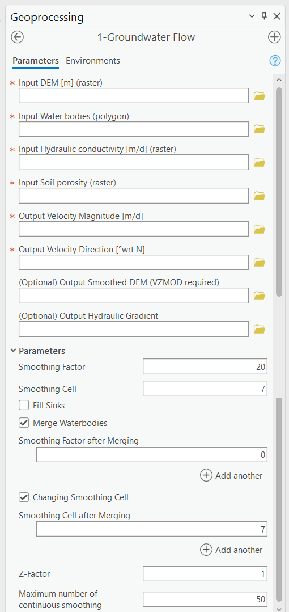

.. _groundwaterflow:

1-Groundwater Flow
==================

In traditional groundwater modeling, groundwater velocity is calculated
using Darcy’s Law. Darcy’s Law requires determining the hydraulic head
everywhere in the domain by solving a differential equation (heat
equation) given certain initial and boundary conditions. Once the
hydraulic head is known everywhere, the hydraulic gradient can be
calculated, and the flow velocities can be determined using Darcy’s Law.
Traditional tools are challenging to use and require field data that is
not usually readily available. The task is to devise a simplified
groundwater flow model that reduces data requirements and integrates
into ArcGIS Pro.

Obtaining field data for calculating the hydraulic head of the surficial
aquifer (either by solving a differential equation or by interpolation)
is complex and resource-intensive. The approach taken by this model is
to assume that the hydraulic head distribution of the surficial aquifer
(e.g., the water table) is a subdued replica of the topography. A
subdued replica means the shape of the water table can generally follow
the shape of the overlying topography. In other words, if the topography
has many peaks and dips, the water table is smoother and has fewer peaks
and dips. This assumption is widely used (either explicitly or
implicitly) in hydrological modeling. Topographic data is readily
available through digital elevation models (DEMs). By processing a DEM,
generating a subdued replica of the topography is possible, thereby
reducing traditional groundwater modeling data requirements.

It is necessary to make several approximations regarding the system to
use the processed DEM as a proxy for the water table. First, the system
is assumed to be in a steady state. This state means that the generated
water table should be considered an “average” over time. The Smoothing
Factor parameter value is the number of smoothings that the user inputs.
A larger number leads to a smoother DEM. A very large number (e.g.,
1,000) of Smoothing Factor leads to a flat smoothed DEM. The Groundwater
Flow Module also assumes that the Dupuit approximation is valid in the
surficial aquifer. Under the Dupuit conditions, vertical hydraulic
gradients can be ignored (i.e., flow is horizontal only, and simulating
two-dimensional flow is sufficient for three-dimensional domains), and
the hydraulic gradient is considered equal to the slope of the water
table. Finally, flow is assumed to occur solely within the surficial
aquifer. In other words, unsaturated flow, flow to or from confined
aquifers, and the interactions between groundwater and surface water are
not considered. Additionally, recharge is also not considered.

The mandatory outputs of the Groundwater Flow Module (Figure 1-1) are
two raster datasets representing the magnitude and direction components
of the groundwater flow velocity vector. The module has the optional
raster outputs for hydraulic gradient and the smoothed DEM. The smoothed
DEM raster can be used to calculate the depth from the bottom of the
OSTDS to the water table using the optional VZMOD Module.

For a new ArcNLET-Py modeling, the Groundwater Flow Module is the first
module that needs to be run. All other modules in the ArcNLET-Py toolbox
depend on the groundwater velocity for their calculations. If
groundwater velocity does not change in a new execution, there is no
need to rerun this module. This module uses a DEM to approximate the
hydraulic gradient, which is then combined with aquifer properties to
calculate groundwater seepage velocity. Inputting the DEM and aquifer
properties is described below.

   Figure 1-1: The Groundwater Flow Module in the Geoprocessing Pane.

Input Layers
------------

-  **Input DEM [m] (raster):** Used to generate an approximation of the
   water table. This input must be a raster layer (preferably in GRID
   format). Note that a higher resolution DEM does not necessarily give
   better results since a coarser DEM may better approximate the water
   table (Wolock and Price, 1994). This DEM is the base for all
   processing in this module.

-  **Input Water bodies (polygon):** Must be a polygon-type layer. This
   dataset determines the locations of water bodies to which groundwater
   flows. This input is also used when the **Fill Sinks** option is
   selected.

-  **Input Hydraulic conductivity [m/d] (raster):** Must be a raster
   layer. This input represents a map of hydraulic conductivity for the
   domain. The linear units of the hydraulic conductivity must be the
   same as the units of the DEM. For example, if the DEM has linear
   (ground distance) units of meters, the hydraulic conductivity must
   have units of meters per unit of time. The output seepage velocity
   magnitude has the same units as the input, i.e., L/T (length over
   time). It is the user’s responsibility to ensure that all units are
   consistent.

-  **Input Soil porosity (raster):** It must be a raster layer. This
   input represents a map of soil porosity for the domain, and the soil
   porosity is used to calculate groundwater seepage velocity.

Options and Parameters
----------------------

-  **Smoothing Factor:** This controls the number of smoothing
   iterations performed on the DEM to generate a subdued replica of the
   topography. Higher numbers mean more smoothing and, thus, a flatter
   replica. As the number of iterations increases, the difference in the
   output from one iteration to the next becomes smaller and smaller.
   Values typically range between 20 and 100 depending on the specific
   application area. The optimum value may be determined by comparing
   the smoothed DEM with hydraulic head observations. The default value
   is 20.

-  **Smoothing Cell:** This is the window size or neighborhood for
   smoothing the DEM. An odd number is recommended. The default value is
   7, meaning that in a smoothing calculation, the center of the window
   in the DEM becomes the average of all the pixels in the 7-by-7
   neighborhood around it.

-  **Fill Sinks:** Enables or turns off sink-filling. It is helpful to
   enable sink-filling when the presence of sinks or pits in the DEM
   causes flowlines (generated by the Particle Tracking Module, see
   Section 2.3) to become trapped before they reach a water body. More details
   about filling sinks are available at
   https://pro.arcgis.com/en/pro-app/latest/tool-reference/spatial-analyst/how-fill-works.htm.
   Generally speaking, leaving sink-filling disabled (the default of
   ArcNLET-Py) can be advantageous, even if some pits remain after
   smoothing, but only if the pits do not interfere with the flow lines. As
   part of the sink-filling functionality, areas in the smoothed input DEM
   that are overlain by a water body are superimposed onto the sink-filled
   DEM, thereby preserving low-elevation areas in large water bodies
   (smaller water bodies are likely smoothed away). This superposition of
   the smoothed, unfilled DEM in areas where water bodies are present can
   be helpful in limited circumstances where sink-filling has caused the
   cells of the smoothed DEM immediately bordering a water body to flow in
   unnatural directions.\ 

-  **Merge Water bodies:** During the smoothing process, the elevation at 
   water bodies often increases, which artificially decreases the control 
   of water bodies on groundwater flow, since groundwater typically discharges 
   to these water bodies. To address this, the original DEM where the water 
   bodies are located can be merged with the smoothed DEM, which helps restore 
   the influence of water bodies on groundwater flow. This merging process may 
   be repeated several times until reasonable groundwater flow paths are obtained 
   in the Particle Tracking Module.

   a. **Smoothing Factor after Merging:** After merging, additional smoothing 
      iterations can be applied to ensure that the integration of the water bodies 
      with the smoothed DEM results in realistic groundwater flow paths. The 
      smoothing factor controls the number of these iterations, and adjusting it 
      allows for fine-tuning the impact of the merging process on the flow paths.

   b. **Changing Smoothing Cell:** By adjusting the size of the smoothing cell, 
      the user can control the level of detail applied during the smoothing process. 
      Decreasing the neighborhood size can enhance the resolution of the smoothing 
      near surface water bodies, generating more accurate gradients. This is 
      particularly useful for guiding particles to flow into natural features like 
      ditches, canals, and lakes rather than becoming trapped in artificial 'gaps' 
      at the edge of these water features.

   c. **Smoothing Cell after Merging:** This parameter allows for further 
      customization of the smoothing process after merging. By decreasing the size 
      of the smoothing cell and merging water body elevations into the smoothed DEM, 
      the model can better simulate the natural gradients that direct particles 
      toward surface water bodies. This approach improves the representation of 
      groundwater flow by creating realistic paths that lead particles into water 
      bodies, enhancing the accuracy of flow modeling in areas with complex surface 
      water features.

-  **Z-Factor:** If the horizontal measurement units of the input
   DEM are different than the vertical units, the Z-factor value serves as
   a conversion factor to convert the vertical unit into the horizontal
   unit, which is necessary for slope calculations. For example, if the
   horizontal units are meters and the vertical units are feet, the
   z-factor is 0.3048 since one-foot equals 0.3048 meters. If the units are
   the same, this value should be left at the default 1. Note that the
   **Z-Factor** cannot be used to convert between two different horizontal
   measurement units.

Outputs
-------

-  **Velocity Magnitude [m/d]:** Each cell in this raster represents the
   magnitude of the seepage velocity in the same units as the hydraulic
   conductivity. The output format is a GRID raster.\ 
-  **Output Velocity Direction [°wrt N]:** Each cell in this raster 
   represents the direction component of the seepage velocity 
   in degrees clockwise from the grid north. The output format is a GRID 
   raster.\ 
-  **(Optional) Output Smoothed DEM (VZMOD required):** The smoothed DEM represents 
   the subdued replica of the topology provided by the input DEM. 
   This DEM represents the shape of groundwater. This DEM does not 
   represent the elevation of the
   groundwater. The smoothed DEM can be used as a data input in the VZMOD
   module.
-  **(Optional) Output Hydraulic Gradient:** If named, it enables the 
   output of the raster of hydraulic gradient magnitude. The 
   output format is a GRID raster. This 
   output is for informational purposes only (e.g., for examining the
   gradient values) and is not required in the other modules.\ 

Notes
-----

-  Inputs from geodatabases are not supported at this time. All datasets
   must be shapefile-based.
-  The input raster images (DEM elevation,
   hydraulic conductivity, and porosity) should ideally have the same
   spatial extent. Otherwise, the output raster of velocity magnitude has
   the extent of the smallest input raster. The direction raster has the
   same extent as the input DEM.
-  It is recommended for the input raster datasets to have square cells
   since inaccuracies may be introduced in the calculations if the
   cells are rectangular. The user should ensure that the sizes of the
   cells are the same for all raster datasets.
-  Units must be consistent. For example, if the values of hydraulic
   conductivity are in meters per day, the input DEM should also be in
   units of meters.

Troubleshooting
---------------

Table 1-1 lists two possible issues encountered during model execution,
their possible causes, and suggested solutions. Note that the error
messages may appear for reasons other than those listed. If you cannot
find a solution to the issue, you can submit a [New issue] in the
ArcNLET-Py GitHub repository (`Issues · ArcNLET-Py/ArcNLET-Py ·
GitHub <https://github.com/ArcNLET-Py/ArcNLET-Py/issues>`__) as
described in the GitHub instructions at `Creating an issue - GitHub
Docs <https://docs.github.com/en/issues/tracking-your-work-with-issues/creating-an-issue>`__.

.. raw:: html

   

      Table 1-1: The Groundwater Flow Module troubleshooting guide.
   

     <!-- Add a line break here --> 

+--------------------------+---------------------+---------------------+
|    **Error**             |    **Cause**        |    **Solution**     |
+==========================+=====================+=====================+
|    Raster image outputs  |    There might have |    Ensure all your  |
|    have a solid black    |    been an error    |    data inputs are  |
|    fill with only null   |    processing the   |    correct, in an   |
|    or no-data values.    |    data inputs.     |    accessible file  |
|                          |                     |    folder, and are  |
|                          |                     |    uncorrupted.     |
+--------------------------+---------------------+---------------------+
|    Empty output          |    An issue with    |    Ensure all your  |
|    datasets.             |    the input data,  |    data             |
|                          |    an error in the  |    inputs/outputs   |
|                          |    file names, or   |    are correct, in  |
|                          |    ArcGIS Pro not   |    an accessible    |
|                          |    having           |    file folder, and |
|                          |    read/write       |    are uncorrupted. |
|                          |    access to input  |                     |
|                          |    or output file   |                     |
|                          |    locations.       |                     |
+--------------------------+---------------------+---------------------+
