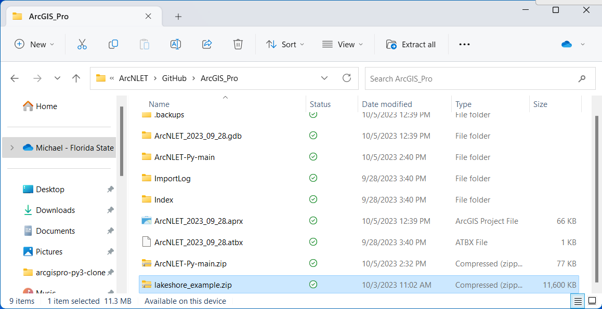

.. _lakeshoeexample:
.. role:: raw-html(raw)
   :format: html

Lakeshore Example
=================

.. contents:: Table of Contents
   :local:
   :depth: 2

The final goal of this tutorial is to show an example workflow for using
this software. This section discusses the basic steps required to
prepare model input data and run the model. Program features related to
this specific example are explained. The desired output of the model in
this example is the nitrogen load due for OSTDS for waterbodies in the
Lakeshore neighborhood of Jacksonville, Florida. The data in this
tutorial is provided as part of the “lakeshore_example” package, which
can be downloaded from the GitHub website. The basic workflow in a 
typical modeling run is as follows:

1. Prepare input data.

2. Enter the study area into the Preprocessing Module to obtain soil
   data.

3. Enter the data into the input fields of the Groundwater Flow Module.

4. Use the output of the flow module as input to the Particle Tracking
   Module.

5. Enter the data into the input fields of the VZMOD Module.

6. Use the output of the particle tracking and VZMOD Module as input to
   the Transport Module.

7. Use the output of the Transport Module as input to the Load
   Estimation Module.

Unit Consistency Quick Reference
--------------------------------

Due to the importance of keeping units consistent between parameter
values, a quick reference chart is provided that cross-references the
units of each parameter with the units of other parameters. Generic
units are used: L is used for units of length (e.g., meters), T is used
for units of time (e.g., days), and M represents units of mass (e.g.,
milligrams). To read Table 8-1, read down the rows to find the desired
parameter for which the units need to be determined. Then, for that
parameter, read across the columns. Each non-blank cell specifies that
the units must be of the type specified in the cell and the same as the
parameter name in the corresponding column. For example, the units of
:raw-html:`<strong>Min</strong>` are mass per time. The time portion of the units must be the
same as the time portion of the **Hydraulic Conductivity** units and the
**Decay Constant** units. The mass portion of the :raw-html:`<strong>Min</strong>` units must
be the same as the mass units of **C0** and the units of the **Threshold
Concentration**. Note that only parameters with units are included in
the table.

   
   Table 8-1: Unit consistency quick reference for parameters.

Description of Modeling Data
----------------------------

This example focuses on the Lakeshore neighborhood of Jacksonville,
Florida. In this neighborhood, houses are served by OSTDS. The Florida
Department of Environmental Protection (FDEP) provides a map of OSTDS
locations assumed to be at the center of the property/parcel. To
generate a map of the hydraulic gradient, a DEM of the area was obtained
from the National Elevation Dataset (NED) service maintained by the
USGS. This DEM has a horizontal resolution of 1/3 arc seconds
(approximately 10 meters). Although higher-resolution data may be
available, using a higher resolution may not be appropriate because the
increased detail is not well suited for hydrologic simulations (Wolock
and Price, 1994). Shapefiles that contain the location information of
water bodies that may be impacted were obtained for the FDEP. Groundwater 
flow and transport parameters used in this example are taken from the 
literature. This example serves for training purposes and not for 
realistic estimation of nitrate load in the Lakeshore neighborhood.

When using your data, the procedure for obtaining the DEM data is given
in the **Preparing Input Data** section. Other data needed for running 
the software (e.g., the water body polygons) is obtainable from an 
appropriate database such as the National Hydrography Dataset (NHD)
and FDEP.

The unprocessed DEM and water body data are provided for reference in 
the **Examples** directory in the ZIP file. For illustration purposes, 
this section outlines the required steps to prepare data for use in 
ArcNLET-Py.

Lakeshore Example Data
----------------------

The Lakeshore Example, created from real-world data, allows you to model
groundwater and soil interactions that produce pollution plumes and load
estimates for nitrate. The Lakeshore Example exercise is designed to
acclimate you to the ArcNLET-Py Python Toolbox within the ArcGIS Pro
desktop environment.

Open ArcGIS Pro
"""""""""""""""

1. Ensure you have completed all the steps for installing ArcGIS Pro 
   before continuing.

   a. ArcGIS Pro must be installed, and the ArcNLET-Py repository
      [Download ZIP] file from GitHub must be saved on your local or
      network computer.

2. Open your current ArcGIS Pro Project File by double-clicking the
   [.aprx] file in the folder directory; for this example, the Project
   File is called [ArcNLET_2023_09_28.aprx].

   a. Please ensure that the [ArcNLET-Py-main.zip] file from GitHub has
      been extracted in a subfolder in this directory, as seen in Figure
      8-1.

   Figure 8-1: The extracted ArcNLET-Py-main folder in the Windows File Explorer.

Open ArcNLET-Py
"""""""""""""""

1. Once your ArcGIS Pro Project File is open, navigate to the [Catalog Pane] 
   or [Catalog View] as seen in Figure 8-2 and Figure 8-3. Click the expand 
   arrow for [Folders], and you may notice there are two [ArcNLET-Py-main] 
   folders (…\\\\ArcNLET-Py-main\\ArcNLET-Py-main). The folder structure is 
   due to the way GitHub extracts the repository. In the second 
   [ArcNLET-Py-main] folder, look for the [ArcNLET] folder that contains
   the [ArcNLET.pyt] ArcGIS Pro Python Toolbox.

   a. You can access the ArcNLET Toolset in the [ArcNLET.pyt] toolbox by
      clicking the expand arrow next to the toolbox. The toolbox includes the
      following modules/tools: **0-Preprocessing**, **1-Groundwater Flow**, 
      **2-Particle Tracking**, **3-VZMOD**, **4-Transport**, and **5-Load Estimation**.

   b. **3-VZMOD** is an optional tool for modeling ammonium and nitrate, 
      and/or phosphate decay within the Vadose Zone.

   c. Note that tools in the ArcNLET Toolset are called modules.

   Figure 8-2: The ArcNLET-Py Python Toolset in the Catalog View in ArcGIS Pro.

  
   Figure 8-3: The ArcNLET-Py Python Toolset in the Catalog Pane in ArcGIS Pro.

Download and Extract Example Data
"""""""""""""""""""""""""""""""""

The zip file contains a fully completed model run and all processed input 
and output files required to generate results. The subfolder, named
**Examples**, contains unprocessed information. This information includes 
unclipped and unprojected DEM and unprocessed (but clipped) water body data.

1. For this case, we use the Lakeshore Example for phosphorus, 
   [2_lakeshore_example_phosphorus] at the following URL:
   https://github.com/ArcNLET-Py/ArcNLET-Py/blob/main/Examples/lakeshore_example.zip.

   a. Click the link, and the zip file should automatically download
      to your [Downloads] folder. You should receive a notification from
      your web browser when the download is completed (Figure 8-4). 
   b. If the download does not begin, please check your pop-up blocker.

   Figure 8-4: The download notification for lakeshore_example.zip.

2. Navigate to your [Downloads] folder and locate the example data in
   the file labeled [lakeshore_example.zip], as seen in Figure 8-5.

3. Move (Copy and Paste) the zip file to your ArcGIS Pro Project home
   folder where your ArcGIS Pro Project (.aprx) file was saved in
   Section 3.3.

   Figure 8-5: The lakeshore_example.zip file in the Windows File Explorer.

4. With the zip file in the same file directory as your ArcGIS Pro
   Project file, right-click the file [lakeshore_example.zip] and select
   [Extract All…] shown in Figure 8-6.

   Figure 8-6: The Extract All… option in the right-click submenu.

5. The [Extract Compressed (Zipped) Folders] dialog box displays the
   destination for the file extraction. Please use the default setting
   and click [Extract], which extracts the file’s contents to a
   subfolder in the current directory called [lakeshore_example] (Figure
   8-7).

   Figure 8-7: The Extract Compressed (Zipped) Folders window for ArcNLET-Py-main.zip.

6. Return to your ArcGIS Pro Project, navigate to the [Catalog View] or
   [Catalog Pane], right-click the icon for [Folders], and click
   [Refresh], as shown in Figure 8-8. Refreshing the folders updates the
   information and makes your newly extracted data available in ArcGIS
   Pro.

   8-8: The refresh option in the right-click menu in ArcGIS Pro.Figure

7. Now, you can expand the [Folders] selection by clicking the down arrow,
   revealing the file connections in your ArcGIS Pro Project.
   Notice there are three lakeshore examples as shown in Figure 8-9. All three 
   examples have folders for the modules used in the example, and each 
   contain a complet set of input and output data.

   8-9: The three Lakeshore example folders. 

   a. [0_lakeshore_example_simple]: This is the most straight forward example that uses
      the least amount of modules to get nitrate load estimations. This is a great leaping 
      off point if you are new to ArcNLET. The file contains inputs and outputs for the 
      **Groundwater Flow Module**, **Particle Tracking Module**, **Transport Module**, and
      the **Load Estimation Module**.

   b. [1_lakeshore_example_complex]: This example is more comprehensive and uses all 
      five modules to estimate both ammonium and nitrate loads. It includes the 
      **0-Preprocessing**, **1-Groundwater Flow**, **2-Particle Tracking**, **3-VZMOD**, 
      **4-Transport**, and **5-Load Estimation** modules. This example provides a 
      thorough walkthrough of each step, making it ideal for users who want to explore 
      the full capabilities of ArcNLET for modeling complex scenarios.

   c. [2_lakeshore_example_phosphorus]: This example uses all five modules to model 
      ammonium, nitrate, and phosphate loads, providing a complete analysis of nutrient 
      transport and load estimation. It incorporates the **0-Preprocessing**, 
      **1-Groundwater Flow**, **2-Particle Tracking**, **3-VZMOD**, **4-Transport**, and 
      **5-Load Estimation** modules. This example is ideal for users aiming to 
      understand the impact of multiple nutrients on groundwater and surface water quality 
      in a more detailed and complex setting.

8. Navigate to the […\\lakeshore_example\\2_lakeshore_example_phosphorus\\…inputs] folders 
   to see the shapefiles and raster image files needed for the exercise.

   a. Please verify that all the files were extracted correctly. You
      should have two additional folders: the [ArcNLET-Py-main], which
      contains the ArcGIS Pro Python Toolbox, and the
      [lakeshore_example] file folder, which contains the example data.

   b. The files needed for this exercise are shown in Figure 8-10 and are listed as follows:

      i.   [study_area.shp]

           1. This shapefile defines the study area boundaries and is required for the **Preprocessing Module**.

      ii.  [lakeshore.img]

           1. The digital elevation model (DEM) of the land surface from the United States Geologic Survey (USGS) The National Map Download Client (TNM Download), used in the **Groundwater Flow Module**.

      iii. [waterbodies.shp]

           1. The water bodies shapefile derived from the USGS TNM Download, used in the **Groundwater Flow Module**.

      iv.  [PotentialSepticTankLocations.shp]

           1. This shapefile identifies potential septic tank locations and is required for the **Particle Tracking Module**.

   c. Note: All other necessary inputs are derived from the operation of the ArcNLET modules. 
      Every input and output file for all modules is available in the Inputs folders for your convenience.

   Figure 8-10: The GIS files in ArcGIS Pro for the Lakeshore example in the Catalog View.

ArcNLET-Py Toolbox
------------------

ArcNLET-Py is built to work directly in the ArcGIS Pro environment with
no installation. If you are familiar with Esri Geoprocessing tools,
working with the ArcNLET-Py toolsets/modules is straightforward.

ArcNLET.pyt ArcGIS Python Toolbox
"""""""""""""""""""""""""""""""""

In the [Catalog View] or [Catalog Pane], click the down-down arrow to
expand the [ArcNLET-Py-main\\ArcNLET-Py-main] and [ArcNLET] folders to
expose the [ArcNLET.pyt] ArcGIS Pro Python Toolbox, as shown in Figure
8-11.

   Figure 8-11: The ArcNLET-Py Python Toolbox in the Catalog View.

ArcNLET-Py ArcGIS Pro Python Toolsets
"""""""""""""""""""""""""""""""""""""

Click the drop-down arrow next to the [ArcNLET.pyt] Python Toolbox to
expose the toolsets inside of the toolbox as shown in Figure 8-12. Six modules comprise the
ArcNLET-Py ArcGIS Pro Python toolset, which are the Preprocessing Module
(0 Preprocessing), the Groundwater Flow Module (1 Groundwater Flow), the
Particle Tracking Module (2 Particle Tracking), the optional VZMOD
Module (3 VZMOD (Optional)), the Transport Module (4 Transport), and the
Load Estimation Module (5 Load Estimation).

   Figure 8-12: The ArcNLET-Py Python Toolset in the Catalog Pane in ArcGIS Pro.

Detailed steps:
- :ref:`usingpreprocessing` for using preprocessing.
- :ref:`usinggroundwaterflow` on using groundwater flow.
- :ref:`usingparticletracking` for particle tracking usage.
- :ref:`usingvzmod` for applying vertical zone modeling.
- :ref:`usingtransport` on transport modeling.
- :ref:`usingloadestimation` for load estimation.
- :ref:`visualization` for visualization techniques.