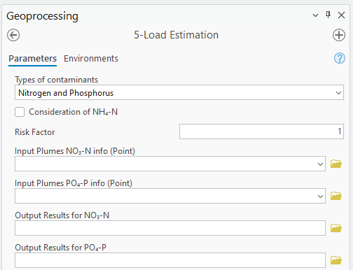

.. _loadestimation:
.. role:: raw-html(raw)
   :format: html

5-Load Estimation
=================

The load of ammonium, nitrate, and phosphate to the receiving water bodies is
estimated using the mass balance method. Using nitrate load estimation
as an example, the mass balance equation contains three terms: the
nitrate load rate to the waterbodies (M\ :sub:`out`), the mass input
load rate from the source (M\ :sub:`in`), and the mass removed by
denitrification (M\ :sub:`removal`). M\ :sub:`out` is calculated by
subtracting M\ :sub:`removal` from M\ :sub:`in`. If M­\ :sub:`in` is not
specified, the Transport Module calculates M\ :sub:`in` by considering
the mass inflow from both advection and dispersion. M\ :sub:`removal` is
calculated on a plume-by-plume basis using the definition of first-order
decay. The output of the Load Estimation Module is a comma-separated
value (CSV) text file consisting of a list of nitrate load estimates for
water bodies that intersect a plume.

The Load Estimation Module uses the Transport Module output to simulate
the mass input load of ammonium, nitrate, and/or phosphare entering the 
surface water body. As a reminder, the Transport Module outputs include 
the mass concentration of each plume for each OSTDS. The Load Estimation 
Module also simulates the mass of ammonium and nitrate removed by adsorption,
nitrification, and denitrification from the plumes originating from the
OSTDS. Furthermore, the module has a mass output load estimation for
each water body (indexed by FID) and plumes that do not intersect a
water body. The Load Estimation Module (Figure 5-1) calculates the load
to the target water body by summing the individual contributions of each
plume for each water body.

   Figure 5-1: The Load Estimation Module.

Input
-----

-  **Types of Contaminats:** This setting allows the user to select which type 
   of contaminants to model. The three options are:

   -  **Nitrogen:** Focuses on modeling nitrogen species, including ammonium 
      (NH\ :sub:`4`\ :sup:`+`) and nitrate (NO\ :sub:`3`\ :sup:`-`).

   -  **Phosphorus:** Models phosphorus transport in the form of phosphate 
      (PO\ :sub:`4`\ :sup:`3-`), accounting for adsorption processes.

   -  **Nitrogen and Phosphorus:** Allows for the simultaneous modeling of 
      both nitrogen and phosphorus species, providing a comprehensive assessment 
      of nutrient transport.

-  :raw-html:`<strong>Consideration of NH4:</strong>` This option, shown in Figure 5-2, allows
   for the consideration of NH\ :sub:`4`. By default, this option is
   unchecked. There are several options revealed when considering NH\ :sub:`4`:

   a. :raw-html:`<strong>Input Plumes NH4 info (Point):</strong>` The Transport Module produces
      the auxiliary “_info” file for :raw-html:`<strong>NH4</strong>` associated with the
      plume’s raster. The information in this file’s attribute table should
      not be manually modified.

   b. :raw-html:`<strong>Output Results for NH4:</strong>` The output is a list showing the
      calculated load values for each water body. The default file name is
      the same as the input plumes “_info” shapefile, and the extension
      is CSV. The default storage location is the same as the input plume
      shapefile.

.. figure:: ./media/loadestimationMedia/media/image2.png
   :align: center
   :alt: A screenshot of a computer Description automatically generated

   Figure 5-2: The Load Estimation Module with Consideration of NH\ :sub:`4`.

-  :raw-html:`<strong>Input Plumes NO3 info (Point):</strong>` The Transport Module produces the
   auxiliary “\_info” file associated with the plume’s raster. The
   information in this file’s attribute table should not be manually
   modified. Only point feature layers whose names have the “\_info” suffix
   are shown in the dropdown menu.

-  :raw-html:`<strong>Input Plumes PO4 info (Point):</strong>` The auxiliary info 
   file for phosphorus associated with the plumes raster calculated by the transport module. 
   The information contained in the attribute table of this file should not be manually modified.

Options and Parameters
----------------------

-  **Risk Factor:** The values in the Mass Output Load column are
   multiplied by the risk factor for each water body. The resulting number
   is then shown in the **Mass Output Load x Risk Factor** Column. The Risk
   Factor is applied to the load of both ammonium and nitrate. The user
   should determine the value of the risk factor based on his/her project
   needs. The default value of the risk factor is 1.

Outputs
-------

-  **Output Results for NH\ 4**, **Output Results for NO\ 3**, and 
   **Output Results for P:** The output is a list showing the calculated 
   load values for each water body and can be seen in Tables 5-1 - 5-3 below. 
   The output is exported to a tabular format, which can be opened in any 
   spreadsheet program. A water body feature ID of -1 in the designation 
   for all plumes that did not intersect a water body. The output columns are:

   a. **Water body FID:** The Water body FID indicates where all flow paths
      terminate. The water body corresponding to this FID can be determined
      using the ArcGIS Pro Information tool or by opening the attribute table
      of the water bodies feature class and selecting the entry with the
      corresponding FID. The selection is then shown on the map.

   b. **Mass output load:** The total estimated nitrate load to the water
      body with the given FID in mass units per time. The unit of mass is the
      same as the mass unit used in the source concentration (e.g., mg in mg/L).
      The unit of time is the same as the time unit used in the velocity flow
      field units calculated by the flow module (e.g., day in meter/day). This
      output load equals the **Mass removal rate** subtracted from the **Mass
      input load.** 
   
   c. **Mass output load x Risk Factor:** The **Mass output load**
      multiplied by the **Risk Factor**.

   d. **Mass removal rate:** The total amount of mass removed due to
      denitrification, modeled as a first-order decay process in mass units
      per time. The units are the same as the units of **Mass output load**.

   e. **Mass input load:** The total input mass flux rate into groundwater
      due to the constant concentration plane source of the Domenico solution,
      taking into account both advection and dispersion.

.. raw:: html

   

      Table 5-1: NH4 plumes information.
   

+----------------+-------------------------+--------------------------------+-------------------------+-----------------------+
| Waterbody FID  | Mass Output Load [mg/d] | Mass Output Load * Risk Factor | Mass Input Load [mg/d]  | Mass Removal Rate     |
|                |                         | [mg/d]                         |                         | [mg/d]                |
+================+=========================+================================+=========================+=======================+
|       30       |      58.96497036        |           58.96497036          |      58.96497036        |          0            |
+----------------+-------------------------+--------------------------------+-------------------------+-----------------------+

.. raw:: html

   

      Table 5-2: NO3 plumes information.
   

+----------------+-------------------------+--------------------------------+-------------------------+-----------------------+
| Waterbody FID  | Mass Output Load [mg/d] | Mass Output Load * Risk Factor | Mass Input Load [mg/d]  | Mass Removal Rate     |
|                |                         | [mg/d]                         |                         | [mg/d]                |
+================+=========================+================================+=========================+=======================+
|       30       |      776388.7734        |          776388.7734           |     19409127.84         |     18632739.06       |
+----------------+-------------------------+--------------------------------+-------------------------+-----------------------+

.. raw:: html

   

      Table 5-3: PO4 plumes information.
   

+----------------+-------------------------+--------------------------------+-------------------------+-----------------------+
| Waterbody FID  | Mass Output Load [mg/d] | Mass Output Load * Risk Factor | Mass Input Load [mg/d]  | Mass Removal Rate     |
|                |                         | [mg/d]                         |                         | [mg/d]                |
+================+=========================+================================+=========================+=======================+
|       30       |      27856.8685         |          27856.8685            |     450516.4046         |     422659.5361       |
+----------------+-------------------------+--------------------------------+-------------------------+-----------------------+

Troubleshooting
---------------

Table 5-4 lists some possible issues encountered during model execution,
a probable cause, and a possible solution. The error messages may appear
for reasons other than those listed. If you cannot find a solution to
the issue, then please submit a [New issue] in the ArcNLET-Py GitHub
repository (`Issues · ArcNLET-Py/ArcNLET-Py ·
GitHub <https://github.com/ArcNLET-Py/ArcNLET-Py/issues>`__) as
described in the GitHub instructions at `Creating an issue - GitHub
Docs <https://docs.github.com/en/issues/tracking-your-work-with-issues/creating-an-issue>`__.

.. raw:: html

   

      Table 5-4: The Load Estimation Module troubleshooting guide.
   
   
+---------------------+-----------------------+-----------------------+
|    Error            |    Cause              |    Solution           |
+=====================+=======================+=======================+
| Error message “All  | The likely cause is   | Re-run the Transport  |
| plumes must be xxx” | the user modifying    | Module.               |
| or “All plumes must | the associated        |                       |
| have xxx” appears   | “\_info” table        |                       |
| where xxx can be    | generated by the      |                       |
| various messages.   | Transport Module. The |                       |
|                     | “\_info” file must    |                       |
|                     | not be changed.       |                       |
+---------------------+-----------------------+-----------------------+
