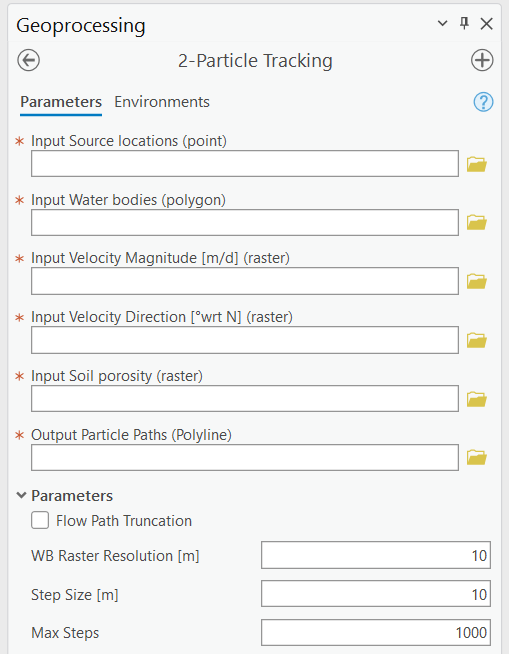
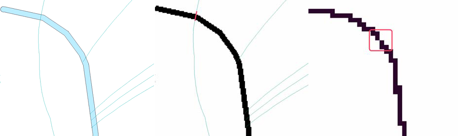

.. _particletracking:

2-Particle Tracking
===================

The Particle Tracking Module (Figure 2-1) estimates the path along which
a synthetic particle travels from an OSTDS, which is the point where the
effluent enters the surficial aquifer, to a receiving water body. The
flow field is based on the Groundwater Flow Module outputs, which are
the direction velocity and direction magnitude raster images to
determine the flow path of the imaginary particle. The flow path is used
to calculate the contaminant plume’s advective transport from any OSTDS.
The output of the Particle Tracking Module is a polyline shapefile
containing a set of flow paths from the septic tank locations along the
gradient of the water table. The Transport Module uses these particle
paths to incorporate flow heterogeneity in the plume calculation.

Sinks or pits in the DEM are problematic for generating flow paths since
they cause the flow to become trapped. The toolbox allows filling any
sinks to their nearest pour point. The pour point is analogous to the
location along the rim where liquid overflows a water-filled bucket.
More details of using the sink filling option are given below.

   Figure 2-1: The Particle Tracking Module.

Input Layers
------------

-  **Input Source locations (point):** A point feature layer specifying
   the OSTDS locations. If the exact locations are unknown, they can be
   approximated by geometric centers of property parcels.

-  **Input Water bodies (polygon):** The locations of water bodies used
   by the Groundwater Flow Module. If a flow path intersects a water
   body, the path is terminated at the water body.

-  **Input Velocity Magnitude [m/d] (raster):** This is the magnitude
   raster generated by the Groundwater Flow Module. The magnitude
   information calculates an average velocity (harmonic mean) value
   along the flow path for the Transport Module.

-  **Input Velocity Direction [°wrt N] (raster):** This is the angle
   direction from the north of each grid cell. The direction raster is
   the output of the Groundwater Flow Module.

-  **Input Soil porosity (raster):** The soil porosity used by the
   Groundwater Flow Module. The information calculates an average
   porosity (arithmetic mean) value along the flow path for use by the
   Transport Module.

Options and Parameters
----------------------

-  **Flow Path Truncation:** The truncation option trims line features
   (flow paths) intersecting the water body polygons and extends
   particle paths that fall short of the water body polygons. This
   option is merely for better visualizing the flow paths and does not
   affect any calculation of flow paths and nitrogen transport. Enabling
   flow path truncation requires more computer time for the
   post-processing of flow paths.

-  **W.B. Raster Resolution [L]:** This is the water body raster
   resolution. The resolution is in map units, which convert the water
   bodies’ polygon to raster. The default value is automatically set to
   one-half of the velocity-direction raster cell size, determined by
   the DEM resolution. This value should only be changed if the default
   does not provide satisfactory results, as explained in the
   troubleshooting notes and Figure 2‑2.\ 

-  **Step Size [L]:** The length of each flow path segment (in
   map units). The default is automatically calculated to equal the value
   of **W.B. Raster Resolution.** This value should only be changed if the
   default does not produce satisfactory results (see troubleshooting notes
   below).\ 

-  **Max Steps:** The maximum number of steps before terminating
   the path. This parameter prevents infinite loops by ensuring there is
   always a stopping criterion for particle tracking. The default should
   suffice for most circumstances.

Outputs
-------

-  **Output Particle Paths (Polyline):** A polyline shapefile containing
   line segments representing the path of a particle starting from each
   source point and moving through the flow field. Any given path from a
   source point (i.e., OSTDS) to a water body is composed of a series of
   line segments (of length **Step Size**) in which the hydraulic
   conductivity and soil porosity are assumed constant within each segment.
   Each entry in the shapefile’s attribute table corresponds to a single
   segment.

Table 2-1 shows the fields in the shapefile’s attribute table. The
Transport Module calculates the average velocity and porosity values
using this table. Details of the attribute table are only needed for
advanced uses of the software (e.g., visualization discussed in Section
5.11); general users do not need to understand the meaning of each item
of the table.

.. raw:: html

   

      Table 2-1: The Particle Tracking Module field list guide.
   

     <!-- Add a line break here --> 

+--------------------+-------------------------------------------------+
|    **Field Name**  |    **Description**                              |
+====================+=================================================+
|    PathID          |    The FID (unique identifier) of the           |
|                    |    corresponding point (i.e., septic tank       |
|                    |    location) in the **Source Locations** point  |
|                    |    feature class. All path segments             |
|                    |    corresponding to the same source have the    |
|                    |    same PathID value.                           |
+--------------------+-------------------------------------------------+
|    SegID           |    The ID of the current segment. This ID is    |
|                    |    assigned in sequence with 0 corresponding to |
|                    |    the first segment in the flow path for any   |
|                    |    given PathID.                                |
+--------------------+-------------------------------------------------+
|    TotDist         |    The total cumulative travel distance for the |
|                    |    current segment.                             |
+--------------------+-------------------------------------------------+
|    TotTime         |    The total cumulative travel time for the     |
|                    |    current segment.                             |
+--------------------+-------------------------------------------------+
|    SegPrsity       |    The porosity at the starting point of the    |
|                    |    current segment.                             |
+--------------------+-------------------------------------------------+
|    SegVel          |    The velocity at the starting point of the    |
|                    |    current segment.                             |
+--------------------+-------------------------------------------------+
|    DirAngle        |    The angle of the current segment.            |
+--------------------+-------------------------------------------------+
|    WbID            |    The water body's FID intersects the current  |
|                    |    segment's starting or ending point. If no    |
|                    |    water body intersects the current segment,   |
|                    |    this value is -1. In a sequence of segments  |
|                    |    corresponding to a given PathID, only the    |
|                    |    final segment should have a value other than |
|                    |    -1. If the sequence does not terminate at a  |
|                    |    water body, all segments have a value of -1. |
+--------------------+-------------------------------------------------+
|    PathWbID        |    The FID of the destination water body. The   |
|                    |    value of this field is the same for each     |
|                    |    segment and is equal to the value of the     |
|                    |    WbID of the final segment in the path.       |
+--------------------+-------------------------------------------------+

Troubleshooting
---------------

Table 2‑2 lists a possible issue encountered during model execution, a
probable cause, and a possible solution. Note that the error messages
may appear for reasons other than those listed. If you cannot find a
solution to the issue, then please submit a [New issue] in the
ArcNLET-Py GitHub repository (`Issues · ArcNLET-Py/ArcNLET-Py ·
GitHub <https://github.com/ArcNLET-Py/ArcNLET-Py/issues>`__) as
described in the GitHub instructions at `Creating an issue - GitHub
Docs <https://docs.github.com/en/issues/tracking-your-work-with-issues/creating-an-issue>`__.

.. raw:: html

   

      Table 2‑2: The Particle Tracking Module troubleshooting guide.
   

     <!-- Add a line break here --> 

+---------------------+-----------------------+-----------------------+
|    **Error**        |    **Cause**          |    **Solution**       |
+=====================+=======================+=======================+
|    Particle paths   |    The selection of   |    Make sure the      |
|    appear as        |    input magnitude    |    correct magnitude  |
|    vertical or      |    and direction      |    and direction      |
|    nearly vertical  |    layers have been   |    raster are         |
|    lines.           |    reversed.          |    selected.          |
+---------------------+-----------------------+-----------------------+

Particle paths may travel through a water body, depending on the value
of the **W.B. Raster Resolution** parameter and the **Step Size**
parameter. This phenomenon is related to the **Step Size,** as explained
in Figure 2‑2a, which shows a small creek that is 6 m wide. The thin
blue lines represent flow paths. Note that the leftmost line crosses the
creek while the other four exhibit the expected behavior and do not
cross it. This behavior is because the leftmost particle path does not
“see” the creek, as demonstrated in Figure 2‑2b when the creek is
converted from a polygon to a raster with a 1 m cell size. The particle
tracking algorithm detects whether the path has reached the water body
by checking whether the starting or ending point of the flow path
segment overlaps a raster cell that represents a water body. The red
feature in Figure 2‑2b shows the segment “skips” over the creek because
the segment length is too large and is positioned so that neither the
starting nor ending points coincide with the creek's location. This
situation may be remedied by selecting a smaller value for the **Step
Size** parameter.

.. raw:: html

   

      Figure 2‑2: Possible scenarios of the particle paths crossing a thin 
      waterbody. The paths pass the water body (Figure 2‑2a (left)). The cell 
      sizes of (Figure 2‑2b(center)) and (Figures Figure 2‑2c(right)) are 1 
      meter and 5 meters, respectively.
   

     <!-- Add a line break here --> 
   
Another possible reason for a flow line to cross the creek is that the
**W.B. Raster Resolution** is too large to represent the creek
accurately. This scenario is shown in Figure 2‑2c in the area indicated
by the red box. In Figure 2‑2c, the creek is illustrated with a raster
resolution of 5 m. In this case, because of the coarse resolution, there
may be a gap in the water body's raster representation, enabling the
flow path to “leak” through the gap indicated by the region within the
red box. This situation may be remedied by selecting a smaller value of
the **W.B. Raster Resolution** parameter or by increasing the width of
the narrow creek (if it is reasonable).

Another potential problem of the particle tracking function is that the
flow path may be trapped in a sink or pit close to the water body. A
sink can exist very close to the water body, even if sinks have been
filled. The sinks are due to converting the water body from a polygon to
a raster format in conjunction with the superposition of the smoothed,
unfilled DEM in areas overlain by the water body (see Section 2.2.2,
**Fill Sinks** parameter). The DEM raster cell containing the sink may
lie slightly outside of the polygon representation of the water body but
is contained within the raster representation of the water body. In this
case, flow may become trapped in the sink before reaching the water
body. This scenario may be treated by manually modifying the boundary of
the water body to extend over the sink.