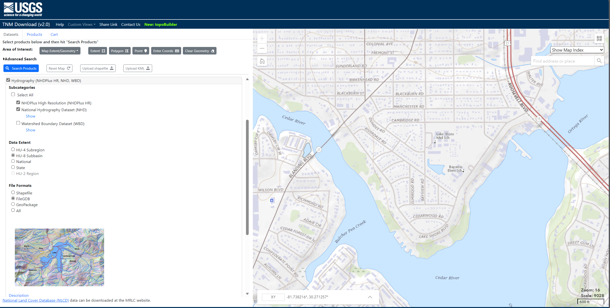
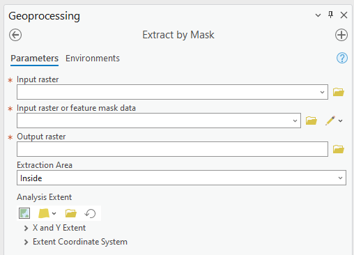
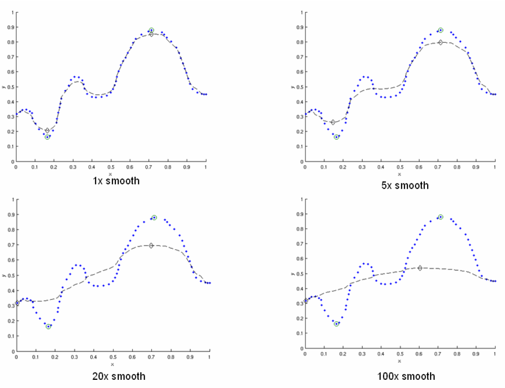
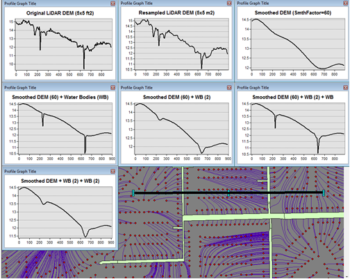

.. _preparinginputdata:

Preparing Input Data
====================

.. contents:: Table of Contents
   :local:
   :depth: 2

This section describes several topics for preparing data for ArcNLET-Py.
The advanced features of ArcNLET-Py are described via two real-world
applications in the Eggleston Heights and Julington Creek neighborhoods
in Jacksonville, FL. The underlying model of nitrate fate and transport
and the associated algorithmic implementation are described in detail in
the technical manual (Rios et al., 2011).

The structure of the manual is as follows: the manual begins with a
sensitivity study of the model, which provides the guidelines for model
calibration. Then, the procedure for processing LiDAR data to produce a
digital elevation model layer (DEM) is discussed. The procedure is
followed by two example problems and the model calibration procedure.
Finally, the results of nitrate load estimation based on calibrated
parameters are shown.

The procedures of preparing a DEM layer based on the National Elevation
Dataset (NED), a water body layer based on the National Hydrology
Dataset (NHD), and homogenous hydraulic conductivity and porosity layers
using raster calculator tool of ArcGIS Pro are fully described in the
user’s manual of this software. However, more reliable nitrate load
estimation may entail improving the accuracy of NED and NHD data. This
manual describes how to achieve this using LiDAR data for its high
resolution. On the other hand, for nitrogen load estimation at a
relatively large modeling domain, using heterogeneous zones for
hydraulic conductivity and porosity parameters is necessary to reflect
spatial variability of the site-specific hydrologic conditions. This
manual elaborates on how to do so based on soil survey data. For
illustration purposes, examples for the Eggleston Heights and Julington
Creek neighborhoods in Jacksonville, FL, are used in the discussions
below.

Obtaining the Data
------------------

Several data sources are available for both the DEM and the water
bodies. The sample data for the tutorial was obtained from various
sources: the DEM was obtained from the USGS Seamless server, which is
not deprecated, while the water body data was obtained from the FDEP
(which is based on the National Hydrography Dataset (NHD) data). Both
are available at the USGS The National Map (TNM) Download. To illustrate
the process of downloading a DEM, the USGS TNM is used as an example.
The method outlined describes obtaining a National Elevation Dataset
(NED) DEM from the USGS Seamless Server.

1. Using the National Map Download (TNM) v2 (`Figure
   7‑1 <#_bookmark111>`__):

   a. Go to `TNM Download v2
      (nationalmap.gov) <https://apps.nationalmap.gov/downloader/>`__,
      and open the Map Viewer.

   b. Zoom to the area of interest.

   c. Select [Map Extent/Geometry] as the Area of Interest.

   d. Under the [Elevation Products (3DEP)] menu, select [1/3 arc-second
      DEM].

   e. Click the [Search Products] button.

   f. Select the desired area to download by clicking [Download Link
      (TIF)] (make sure it is large enough to encompass the region of
      interest).

   g. After selection, a window pops up with the download link.

   Figure 7‑1: Downloading DEM data using TNM Download.

Although the water body data for this example was obtained from the
FDEP, water body data can be obtained from publicly available sources
such as the National Hydrography Dataset using the USGS TNM Download
`TNM Download v2
(nationalmap.gov) <https://apps.nationalmap.gov/downloader/>`__. (Figure
7‑2)

1. Go to `TNM Download v2 (nationalmap.gov) 
   <https://apps.nationalmap.gov/downloader/>`__, and open the Map Viewer.

2. Zoom to the area of interest.

3. Select [Map Extent/Geometry] as the Area of Interest.

4. Under the [Hydrography (NHDPlus HR, NHD, WBD)] menu, select
   [NHDPlus High Resolution (NHDPlus HR)] and
   [National Hydrography Dataset (NHD)].

5. Click the [Search Products] button.

6. Select the desired area to download by clicking [Download Link
   (ZIP)] (make sure it is large enough to encompass the region of
   interest). You may need to download more than one file to converge the
   entire area.

7. After selection, a window appears with the download link.

   Figure 7‑2: Downloading NHD data.

OSTDS Locations
---------------

Another dataset that must be prepared is the source locations. In this
example, the source locations (OSTDS) are provided. However, if such a
file needs to be created from scratch, a procedure similar to the one
used for creating the clipping region is used. The only difference is
that instead of creating a polygon feature class, a point feature class
is created by making an appropriate selection in the Geometry type
dropdown of Figure 7‑8.

Projections
-----------

All model inputs and the map data frame should have the same coordinate
system to ensure consistency. Because the example DEM has elevation
units of meters but x- and y-coordinates of degrees, the DEM should be
projected into a coordinate system with linear meters units. Projecting
the DEM into the correct coordinate system prevents errors in assigning
units to model parameters and interpreting the model results. The
Universal Transverse Mercator (UTM) is a convenient coordinate system
since it is in meter units and uses an easy-to-understand cartesian
coordinate system. Since the area of interest lies in UTM Zone 17N, the
datasets are projected to this coordinate system. This transformation
uses the Project Raster (for the DEM) and Project (for the water bodies)
geoprocessing tools of the Data Management toolbox. When projecting the
DEM (Figure 7‑3), select Bilinear or Cubic as the resampling technique.
For the DEM of this example, change the output cell size from the
default value (here, 9.620954m) to 10m, which approximately corresponds
to the DEM resolution of 1/3 arc seconds; it is selected for ease of
interpretation, and users can select another cell size if desired. As
shown in Figure 7‑3, select the output coordinate system
NAD_1983_UTM_Zone_17N (this zone encompasses most of Florida).
Projecting the water bodies (or any other non-raster format) is
straightforward, as the only option required is selecting the output
coordinate system, NAD_1983_UTM_Zone_17N, in this example.

   Figure 7‑3: Using the Project Raster tool for clipping the DEM.

The clipped and projected datasets are shown in Figure 7‑4. The final
DEM raster should be a floating-point pixel type. The pixel type can be
checked by examining the layer properties, as shown in Figure 7‑5. The
raster can be converted to a floating-point type using the Float
function in the SA toolbox. In addition to checking the data type, the
map or data frame’s coordinate system should be set to UTM. If not, this
can be done by right-clicking the Map in the Contents Pane and in the
Map Properties, selecting NAD 1983 UTM Zone 17N from the list, as shown
in Figure 7‑6.

   Figure 7‑4: The clipped and projected input data. 

The OSTDS are shown as red dots, the study areas (Lakeshore) are shown
in a red dashed line, and the DEM ranges from high in green to the water
level in blue.

   Figure 7‑5: Check for floating point pixel type in layer properties.

   Figure 7‑6: Setting the coordinate system in the map properties.

Clipping
--------

When working with unprocessed data, the first step is to clip the
datasets (e.g., DEM and water body) to encompass the area of interest.
The area of interest in this example is indicated by the dotted outline
in Figure 7‑7. It is crucial to clip oversized datasets to the extent of
the study area. A buffer of 0.5 to 1.5 times the dimensions of the area
of interest on all sides should suffice for most applications. This
extra padding ensures that any artifacts caused by calculations near the
edges of the domain do not affect the results.

   Figure 7‑7: Area of interest within the DEM. 

The dashed red lines indicate the Lakeshore neighborhood, and the DEM is
the base map that ranges from green and yellow to blue (for the water
body).

The clip area can be defined using an existing feature class, or a new
clipping region can be created from scratch. To define a new region,
create a blank polygon feature class using the Create Feature Class tool
in the ArcGIS Pro Geoprocessing Pane, shown in Figure 7‑8. After
inputting the feature class location and name parameters, all other
options can be left as default.

   Figure 7‑8: Creating a blank polygon feature class.

After creating the blank feature class, begin with the Edit section on
the ribbon in ArcGIS Pro and create a new polygon feature for the
desired clipping region using the polygon tool, as shown in Figure 7‑9.
Ensure that the editing task is set to Create New Feature and that the
target layer is the previously created feature class (Figure 7‑8). After
creating the polygon, save the changes via the Edit section of the
ribbon (Figure 7‑10).

   Figure 7‑9: Define a new clipping region.

   Figure 7‑10: Saving the edits.

After completing the above steps, you should have a clipping region
similar to the rectangular region shown in Figure 7‑11.

   Figure 7‑11: The newly defined clipping region.
   
The black rectangle with hatch lines denotes the clipping region.

To clip the raster, use the Extract by Mask geoprocessing tool from the
SA toolbox shown in Figure 7‑12. Select the DEM as the input raster.
Select the newly created clipping region as the mask. Add the extension
“.img” to the file name when naming the output raster. Adding the
extension uses the ERDAS IMAGINE image format, which is easier to manage
and does not have filename length restrictions. Clipping the water
bodies (and any other non-raster file, i.e., OSTDS locations) is done
with the Pairwise Clip geoprocessing tool from the Analysis toolbox
(Figure 7‑13). As the input features, select the water bodies layer. As
the clip features, select the clipping region.

   Figure 7‑12: Extract by Mask dialog.

   Figure 7‑13: Clipping with features.

Merging Line and Water Bodies Features
--------------------------------------

Small ditches and streams may be represented as line features in a
separate shapefile rather than as polygon features in the main water
body shapefile, as with the Lakeshore data. To include these features in
the model, they must be incorporated into the main water body shape
using the procedure outlined below:

1. Create a buffer around the line features (NHD_Flowline_DEP_NHD) using
   the Buffer tool of the Analysis toolbox. The buffer size should be
   set to a value that appropriately represents the features and is the
   same or more significant than the DEM cell size. A buffer of 5 meters
   on each side of the line should be sufficient for this case.

2. Use the Merge geoprocessing tool of the Data Management toolbox to
   combine the buffered lines into the water body polygon feature class.

   a. (Optional) Delete any overlapping polygons by removing parts of the 
      buffered flow lines that cover the water body polygons. Find hidden 
      lines by selecting entries from the attribute table and checking if 
      they lay underneath a larger polygon. Merging features reduce the 
      number of water bodies in the shapefile, making it easier to 
      analyze results.

3. Ensure the final result is in the UTM coordinate system.

Excessive DEM Smoothing
-----------------------

When selecting the amount of smoothing (i.e., determining the value of
the smoothing factor in the groundwater module) to perform on a DEM, it
should be noted that smoothing by repeated averaging tends to shift the
locations of peaks and valleys in the dataset. This is illustrated in
Figure 7‑14. The figure’s dotted line represents a hypothetical
two-dimensional elevation cross-section of a terrain. The circles mark
the locations of the highest and lowest elevation points. The dashed
line represents the smoothed elevation profile using various amounts of
smoothing. The diamonds mark the locations of the maximum and minimum
elevations of the smoothed profile. With one smoothing pass (1x smooth),
the locations of the peaks and valleys of the smoothed profile match the
unsmoothed profile. As the smoothing amount increases, it is apparent
that the locations of the peaks and valleys in the smoothed profile
begin to shift, in this case, to the left, which corresponds to the
general elevation trend. In the case of 100 smoothing iterations, the
peaks have shifted significantly from their original location. If the
locations of the valleys coincide with the locations of water bodies
(e.g., rivers), the implication is that flow will no longer be towards
the water body.

In practice, this effect may produce flow lines that run parallel to the
actual location of a river. This phenomenon may sometimes be mistaken
for errors in the water body locations or the DEM. If there are errors
in the locations of the water bodies, this problem may be exacerbated.
This peak/valley shift is a limitation of the smoothing algorithm and is
most apparent with small water bodies, i.e., creeks and ponds. It can be
mitigated by using smaller smoothing factors (if possible), DEM burning
in some instances (see Section 4.7), or by manually shifting the
location of the water bodies (if it is determined that doing so would
not affect the length of the plumes and the number of plumes
intersecting the water body in question).

   
   Figure 7‑14: Effect of smoothing on the location of peaks and valleys.   

The DEM is a blue line, and the smoothed DEM is in black.

DEM Burning
-----------

In certain circumstances, it may be desirable to force groundwater flow
towards a water body at a known location, even though flow may not
naturally be towards it, as a result. An approach that can be used to
force flow toward the desired water bodies is a technique known as DEM
burning. The simplest form consists of creating a deep valley or pit in
the location of the water body. After calculating flow directions, the
flow towards this artificially created pit or valley. This simple DEM
burning can be accomplished with the ArcGIS Raster Calculator tool. For
example, the following command can be used to create a valley that is 30
units deep in the location of all the water bodies on the map.

.. math::

   \text{con(isnull([water\ bodies])} = 0, \text{[DEM]} - 30, \text{[DEM]})

Where [water bodies] is the raster representation of the water bodies
layer, and [DEM] is the DEM to burn. Note that DEM burning does not
produce the desired result in all cases (e.g., it may not work in cases
where excessive smoothing has caused a shift in the location of peaks
and valleys in the DEM) and may introduce unnatural-looking flow paths.
It is left to the modeler's discretion whether or not to perform DEM
burning.

Multiple Smoothings
-------------------

Suppose small water bodies such as ditches and canals are not reflected
in the hydraulic gradient produced in the Groundwater Flow Module and do
not impact the particle flow paths as expected. In that case, the
solution is to build the small water bodies into the smoothed DEM (the
optional output of the Groundwater Flow Module) so that the small water
bodies can control the shape of the approximated water table and
groundwater flow paths. The phenomena are related to the impacted
surface-water drainage network effects on the groundwater gradient, and
resultant flow path lines are not fully recognized in the model due to
over-sampling (creating a raster that is too coarse) when projecting the
LiDAR DEM and the smoothing operation in the Groundwater Flow Module.

This issue is exemplified by groundwater from certain OSTDS not flowing
into the nearby ditches. The missing small water bodies relate to the
conceptual model of groundwater flow based on which ArcNLET modules of
groundwater flow and particle tracking are developed. In the current
conceptual model, the small water bodies do not control local
groundwater flow because the relation between the ditches and
groundwater flow is mainly unknown. In other words, groundwater is
controlled by the hydraulic head of the neighborhood scale, whose shape
is approximated by the Groundwater Flow Module and can be seen in the
optional smoothed DEM output that ArcNLET generates.

Figure 7‑15 illustrates groundwater flow in the current groundwater
conceptual model in which the ditches do not control local groundwater
flow. The blue lines in Figure 7‑15 represent flow paths from septic
tanks (red square) estimated by ArcNLET using a smoothing factor of 60.
Three profiles of DEM along the black line marked in Figure 7‑15 are
plotted; the black line intersects two ditches. Examining the three
profiles shows that:

1. The profile at the left, titled Original LiDAR DEM (5 x 5
   ft\ :sup:`2`), is based on the original LiDAR DEM with 5 × 5
   ft\ :sup:`2` resolution (provided by FDEP), and the two ditches are
   revealed as the two deep valleys on the profile. It suggests that the
   LiDAR DEM can reflect ditches, including intermittent ones, at the
   local scale. The LiDAR DEM is projected to the NAD 1983 UTM Zone 17N
   coordinate system, and the elevation unit is converted from foot to
   meter.

2. The profile in the middle, titled Resampled LiDAR DEM (10 x 10
   m\ :sup:`2`), is for the resampled (projected) DEM, from 5 × 5
   ft\ :sup:`2` to 10 × 10 m\ :sup:`2` resolution. (Note that using a
   raster cell size of 3 x 3 m\ :sup:`2` is recommended for ArcNLET.)
   The resampling is to save computational time for ArcNLET modeling.
   The profile of the smoothed DEM shows that the resampling resolution
   is too coarse for the two narrow ditches in that the two ditches are
   not retained. This problem illustrates the tradeoff between finer
   resolution and reasonable computational time determined by users to
   meet their specific project needs. The solution to this problem is to
   increase the resampling resolution; in the discussion below, the
   resolution is empirically increased from 10 × 10 m\ :sup:`2` to 5 × 5
   m\ :sup:`2`.

3. The profile at the right, Smoothed DEM (SmthFactor=60),
   is the smoothed DEM obtained after 60 times of smoothing of the
   resampled DEM. While large-scale spatial variability is preserved,
   local-scale variability disappears after the smoothing. As a result,
   for OSTDS down-gradient of (right to) the peak shown in the profile,
   groundwater from them flows in the down-gradient direction, i.e., to
   the right. This explains why groundwater from certain OSTDS does not
   flow into nearby ditches. As shown below, smoothing is the dominant
   reason for the disappearing ditches, even when ditches are retained
   in the resampled DEM.

The above observations are the basis for the proposed solution below to
meet the expectation that localized groundwater-table depression occurs
near wet ditches. Note that the smoothed DEM is not a default output
raster file of ArcNLET. To produce it, one needs to enter the name of
the output raster in the [(Optional) Output Smoothed DEM] field in the
Groundwater Flow Module to determine the impact on wet ditches. Making
multiple smoothed DEMs using various [Smoothing Factor] values may be
helpful, too. Including the smoothing factor value in the output, names
are valuable for record keeping and determining the best solution.

   Figure 7‑15: Simulated flow paths from OSTDS with smoothing.

The OSTDS (red squares) are the origins of the paths (blue lines), and
the paths are generated by running ArcNLET with a smoothing factor of
60. The three profiles along the black line marked in the figure are the
original LiDAR DEM of 5 × 5 ft2 resolution (left), the resampled LiDAR
DEM of 10 × 10 m2 resolution (middle), and the smoothed DEM (right)
based on the resampled LiDAR DEM. The flow paths are estimated based on
the smoothed DEM.

The instructions below detail a solution to build the ditches into the
smoothed DEM so that the ditches control the shape of the approximated
water table and, subsequently, groundwater flow paths. The instructions
are as follows:

1. When resampling the [LiDAR DEM] (Figure 7‑15 (left)), determine the
   appropriate resolution so that local ditches are retained in the
   [resampled DEM].

   a. Although this step may be automated, it remains empirical at this 
      stage. The results are presented below for the resolution of 5 × 5 m\ :sup:`2`.

2. Extract the elevations of water bodies, including the ditches,
   from the [resampled DEM] (Figure 7‑15(middle)). Extract by Mask
   in the SA Toolbox in ArcGIS can extract the elevation values
   using water body data (raster or polygon).

   a. The extracted elevations are merged into the [smoothed DEM] in a 
      later step so that the ditches can control groundwater flow paths 
      calculated from the [smoothed DED]. 

3. Conduct smoothing by running the Groundwater Flow Module. As shown
   below, the ditches may disappear after smoothing, although they
   are retained in the [resampled DEM]. Since the [smoothed DEM] is
   needed for the next step, we need to type a file name into the
   [(Optional) Output Soothed DEM] filed to save the DEM.

   a. Including the [Smoothing Factor] value in the output file name is good practice.  

4. Add the extracted elevation of water bodies obtained from the
   [resampled DEM] to the [smoothed DEM]. Merging these datasets can
   be done using the Mosaic function in the Data Management Toolbox
   in ArcGIS.

   a. This step warrants that the [smoothed DEM] at ditches is lower than that of nearby OSTDS.

   b. Since the ditch elevations were not used to calculate the hydraulic gradient, the 
   hydraulic gradient is still the same as that of [smoothed DEM] output in the above 
   step. In other words, the ditches still do not control groundwater flow paths toward the 
   ditches for some OSTDS.

5. To use the elevation of the ditches added to the [smoothed DEM],
   conduct another round of smoothing in the Groundwater Flow Module
   so that the ditches added in the step above are used to calculate the
   hydraulic gradient near the ditches.

   a. The [Smoothing Factor] value should be small, i.e., 2, because a large 
      value for the [Smoothing Factor] may, once again, eliminate the ditches.

   b. This step changes the hydraulic gradient near the ditches.

6. Run the Particle Tracking Module to simulate the flow paths.
   If the flow paths are unsatisfactory, repeat Steps 4 and 5 until the
   expectation is met. Repeating the process results in the ditches
   having more control of groundwater flow paths.

   a. If hydraulic head measurements are available, then use them as the criteria 
      to determine when to stop the iterative process.

   b. While this procedure is empirical, it may be automated if the procedure is 
      accepted. For example, the water body elevation can automatically be added 
      to the [smoothed DEM] before each smoothing iteration. 

The results of the above operations are seen in Figure 7‑16, which plots
the simulated groundwater flow path and several profiles. The results
are for the 5 × 5 m\ :sup:`2` resolution in the resampled DEM. Each
profile is discussed below:

-  The profile at the left of row 1, titled 
   Original LiDAR DEM (5 x 5 ft\ :sup:`2`), is based on the original LiDAR 
   DEM with 5 × 5 ft\ :sup:`2` resolution provided by the FDEP. It is the 
   same as the profile shown in Figure 7‑16 (left).

-  The profile in the middle of row 1, titled Resampled LiDAR DEM 
   (5 x 5 m\ :sup:`2`), is based on the resampled DEM produced in Step 1
   above by resampling the LiDAR DEM to 5 × 5 m\ :sup:`2` resolution.
   The profile shows that the two ditches are retained with this resolution,
   while small-scale variability disappears after the resampling.

-  The profile at the right of row 1, titled Smoothed DEM 
   (Smoothing Factor=60), is the smoothed DEM generated by the Groundwater
   Flow Module using a smoothing factor of 60, which is the result of 
   Step 3. It shows that the two ditches disappear due to the smoothing,
   although they were retained in Step 1.

-  The profile at the left of row 2, title Smoothed DEM (60) + Water Bodies
   (WB), is the DEM after adding the extracted elevations of water bodies to
   the smoothed DEM. The extracted elevation file is represented with a WB
   in the plots in Figure 7‑16 and was obtained in Step 2. The use of the
   Mosaic function of ArcGIS is the result of Step 4. The profile shows the
   two ditches. Since the ditches have not been used to calculate the 
   hydraulic gradient, the gradient is the same as that of smoothed DEM 
   in Step 3. As a result, for the left ditch in the plots, the groundwater
   flow paths travel from the OSTDS in a rightward direction and, in some
   cases, away from the adjacent ditch. After the hydraulic gradient is
   adjusted for using the ditch data, groundwater flow paths are impacted
   by the proximal ditch and flow rightward and leftward towards the ditch. 

-  The profile in the middle of row 2, titled Smoothed DEM (60) + WB (2),
   is the DEM after smoothing the DEM twice using a smoothing factor of 2
   in the Groundwater Flow Module. This profile shows that the hydraulic
   gradient near the ditches changes after the ditches’ elevation is used for
   smoothing. Retake the left ditch as an example. Before the smoothing,
   the hydraulic gradient is only in a rightward direction, both away and
   towards the ditch. After the smoothing, the gradient near the ditch
   becomes leftward and rightward towards the ditch, implying that
   groundwater flows into the ditch for the adjacent OSTDS. 

-  The profile at the right of row 2, titled Smoothed DEM (60) + WB (2) + WB,
   is based on the raster Smoothed DEM (60) + WB (2) from the plot in the
   middle of row 2. The results are obtained by adding the water body
   elevations back to said raster from the step above.

-  The profile in row 3, titled Smoothed DEM + WB (2) + WB (2), is based on
   smoothing the raster file for the plot Smoothed DEM (60) + WB (2) + WB
   twice using the Groundwater Flow Module. Since this profile is similar
   to that in the middle of row 2, titled Smoothed DEM (60) + WB (2),
   the decision is to use the flow velocity corresponding to the raster for
   the plot Smoothed DEM (60) + WB (2) + WB (2) for flow path calculations.

   Figure 7‑16: Simulated flow paths from OSTDS with ditches.

The paths are (blue lines) from OSTDS (red squares). The paths are
generated by running ArcNLET with a smoothing factor of 60.

The seven profiles along the black line marked in Figure 7‑16 are the
original LiDAR DEM of 5 × 5 ft\ :sup:`2` resolution (left of row 1), the
resampled LiDAR DEM of 5 × 5 m\ :sup:`2` resolution (middle of row 1),
the smoothed DEM (right of row 1) based on the resampled LiDAR DEM, the
smoothed DEM with ditch elevation added (left of row 2), the smooth DEM
after two times of smoothing (middle of row 2), the smoothed DEM after
two times of smoothing with ditch elevation added (right of row 2), and
the smoothed DEM with another two times of smoothing (row 3). The flow
paths are estimated based on the smoothed DEM corresponding to the
profile of row 3.

In ArcNLET-Py, the model can extract the elevations of water bodies and
merge them into smoothed DEM automatically. The user just needs to turn
on the “Merge Water bodies” option, and fill in the appropriate number
of times to smooth after merging.

Processing LiDAR data
---------------------

LiDAR DEM is used in both the Eggleston Heights and Julington Creek
neighborhoods. The necessity of using LiDAR DEM instead of NED DEM data
is demonstrated in the Eggleston Heights neighborhood. Many ditches and
canals are in this area (Figure 7‑17, top), but many are narrower than
10m (the 1/3 arc second resolution of the NED DEM used in the user’s
manual). As a result, such ditches and canals (i.e., those highlighted
in Figure 7‑17, top) cannot be reflected in the NED DEM data (Figure
7‑17, bottom).

   Figure 7‑17: Ditch coverage and 1/3 arc-second DEM (bottom). 

The ditch coverage (top) is highlighted in blue and cannot be fully
reflected in the 10-m DEM data (bottom).

The LiDAR data with a horizontal resolution of 1 × 1 m\ :sup:`2`, as
shown in Figure 7‑18 left, can represent the ditches, taking in the red
ellipse in Figure 7‑17 and Figure 7‑18. As explained in the technical
manual (Rios et al., 2011), DEM data of finer resolution always has a
highly intense elevation fluctuation and is inconsistent with the water
table. On the other hand, it takes longer computation time to smooth DEM
data of higher resolution (see the details of smoothing in the technical
manual of Rios et al., 2011). Therefore, the LiDAR DEM needs to be
processed to reduce the resolution. This study’s targeted resolution is
10 × 10 m\ :sup:`2`, consistent with the example data associated with
the user’s manual. The processed LiDAR DEM is shown in Figure 7‑18
(right), where the ditch in the red ellipse is preserved. The ditches
and canals can be better preserved if the target resolution of the
processing DEM is smaller than the water features. However, as explained
before, a finer resolution may result in a longer computation time of
smoothing. Users determine the tradeoff between finer resolution and
reasonable computation time to meet their project needs.

  
   7‑18: LiDAR data before and after projecting. Figure

The DEM before projecting (left) and using projecting to change
resolution from 1 × 1 m\ :sup:`2` to 10 × 10 m\ :sup:`2` (right). The
ditch highlighted in yellow is better preserved after the projection.

Changing the resolution from 1 × 1 m\ :sup:`2` to 10 × 10 m\ :sup:`2` is
done using the Projections and Transformations → Data Management Tools →
project raster tool. As shown in Figure 7‑19 `Figure
2-3, <#_bookmark5>`__ when using this tool, the cell size is changed to
10, and the nearest neighbor assignment resampling technique is used.
The same tool is used for projection in Section 4.3.

The DEM resolution of 10m discussed above is only for demonstration. Our
empirical experience is that the resolution of 10m is always too coarse,
and the resolution of 3m is better for providing more reasonable flow
paths. The DEM with a 3m resolution is always available on the USGS TNM
website. Using a LiDAR DEM does not warrant good results of flow paths
because the water table is only a subdued replica of topography. A user
may examine the results of the groundwater path based on different DEM
resolutions to select the resolution appropriate to their project needs.

   Figure 7‑19: Projecting the LiDAR data. 

The geoprocessing tool shows the options to change the raster cell size
to a coarser resolution of 10 × 10 m\ :sup:`2` (output cell size).

LiDAR DEM Updating Water Bodies
-------------------------------

Generally speaking, the accuracy of the water body layer downloaded from
the USGS National Hydrography Dataset (NHD) can meet the requirements of
ArcNLET-Py, and the NHD data can be used directly in ArcNLET-Py.
However, in some areas, NHD data errors regarding water body locations
may cause an inaccurate flow path generated by the Particle Tracking
Module of ArcNLET. In this case, we suggest updating the NHD data using
the LiDAR DEM because LiDAR DEM can reflect water body locations. An
example is shown in Figure 7‑20. In the left figure, the LiDAR DEM shows
a lower elevation area within the red circle, which appears to be a
ditch or canal in the aerial imagery map at the right of Figure 7‑20.
However, this water body does not exist in the NHD map. Instead, only a
segment of the misplaced flow line (the blue line in the figure) exists
in this area. Because of the mismatch between the LiDAR DEM and the NHD
data, as shown in the left figure, the simulated flow paths of ArcNLET
cannot reach the water body shown as a flow line in Figure 7‑20. The
trapped flow paths are physically unreasonable and may cause nitrate
load estimation errors. Therefore, the NHD data needs to be updated so
that the location and shape of the water body can be accurately
represented. In this manual, the update is conducted manually using the
LiDAR DEM. The DEM is updated by first generating an evaluation contour
map based on the LiDAR DEM using the Spatial Analyst Tools→ Surface →
Contour tool, as shown in Figure 7‑21. Based on the generated contour,
one can update the water body map using the Editor tool of ArcGIS. The
water bodies map before and after the updating are shown in Figure 7‑22.
After updating, the simulated flow paths of ArcNLET-Py are smoother and
more physically reasonable (Figure 7‑23).

   Figure 7‑20: LiDAR DEM and NHD missing features.
   
The simulated particle path and Esri aerial imagery are shown in the
Eggleston Heights neighborhood, Jacksonville, FL. The path is the flow
path calculated by the Particle Tracking Module, and the LiDAR DEM is 1
× 1-meter resolution.

   
   Figure 7‑21: Generating elevation contour based on LiDAR DEM.

   Figure 7‑22: Updating the water body features.

The changes to the water body, shown in blue, can be seen via the before
aerial (left) and after aerial (right) updating.

 
   Figure 7‑23: The simulated flow paths after updating the water bodies.