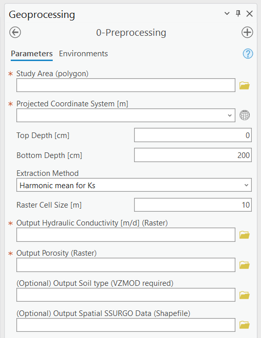

.. _preprocessing:

0-Preprocessing
===============

The purpose of the Preprocessing Module (Figure 2‑1) is to automatically
extract soil properties from the SSURGO database to prepare three input
files for ArcNLET-Py. Soil properties that this module can prepare
include hydraulic conductivity, porosity, and soil types.

ArcNLET-Py also requires other input files, including DEM and water
bodies shapefile. These two files need to be prepared by the user. DEM
and water body data are easily downloaded from sites like the USGS The
National Map (TNM) Data Download Application. An alternative data source
for water bodies is the National Hydrography Dataset. Be mindful that
water body data always requires manual revision by the user because of
accuracy issues (i.e., missing ditches and canals).

   Figure 2‑1: The Preprocessing Module in the Geoprocessing Pane.

Input Layers
------------

-  **Study Area (polygon):** The area where users wish to extract soil
   properties from the SSURGO database. The input file must be a polygon
   with one feature. Note that the coordinate system of the file is not
   critical. Either a geographic coordinate system or a projected
   coordinate system works for the data extraction.

Options and Parameters
----------------------

-  **Projected Coordinate System:** The projected coordinate system of
   the output files. If the study area is specified, this text box
   automatically shows the coordinate system of the study area. But if
   the coordinate system is a geographic coordinate system, there is an
   error.

-  **Top Depth [cm]:** A numeric value for upper boundary depth is used
   to extract data from the SSURGO database. 0 at ground level,
   increasing as you go down.

-  **Bottom Depth [cm]:** A numeric value for the bottom boundary depth
   is used to extract data from the SSURGO database. The bottom depth
   must be greater than the top depth, and the maximum value is 200 cm.

-  **Extraction Method:** Method to deal with the extracted SSURGO data.
   There are five options: **Harmonic mean for Ks**, **Weighted
   Average**, **Dominant Component (Numeric)**, **Min**, and **Max**.

   a. The weighted average means that parameters such as hydraulic
      conductivity and porosity are calculated by taking a weighted
      average both horizontally and vertically.

   b. The harmonic mean for Ks is similar to the weighted average,
      except that in the vertical direction, Ks is calculated by a
      harmonic mean instead of a weighted average.

   c. The dominant component means that the value of the parameters of
      the dominant component is used as the output.

   d. The min/max means the minimum and maximum value of parameters is
      used as the output.

-  **Raster Cell Size [m]:** This is the resolution of the output raster
   files for hydraulic conductivity, porosity, and soil types.

Outputs
-------

-  **Output Hydraulic Conductivity (Raster):** Hydraulic conductivity
   extracted from the SSURGO database. Unit m/d.

-  **Output Porosity (Raster):** Porosity extracted from the SSURGO
   database. Porosity is dimensionless, and it is a fraction number
   between zero and one given in SSURGO.

-  **(Optional) Output Soil Texture (Raster):** Soil type extracted from
   the SSURGO database and USDA classification standard. VZMOD requires
   this file, which may not be exported if the user does not use VZMOD.

-  **Output Spatial SSURGO Data (Raster):** Spatial division and data
   extracted from the SSURGO database are used to generate the three
   output files described above.

Notes:

-  The tools extracted SSURGO data from the website
   https://sdmdataaccess.nrcs.usda.gov. Therefore, the Preprocessing
   Module requires access to the Internet.

-  The unit of hydraulic conductivity is m/d.

-  This module is developed based on the software soilDB, a soil
   database interface. More information on soilDB is available at
   https://cran.r-project.org/web/packages/soilDB/index.html.

Troubleshooting
---------------

Troubleshooting Table 2‑1 lists some possible issues encountered during
model execution, a possible cause, and a suggested solution. Note that
the error messages may appear for reasons other than those listed. If
you cannot find a solution to the issue, then please submit a [New
issue] in the ArcNLET-Py GitHub repository (`Issues ·
ArcNLET-Py/ArcNLET-Py ·
GitHub <https://github.com/ArcNLET-Py/ArcNLET-Py/issues>`__) as
described in the GitHub instructions at `Creating an issue - GitHub
Docs <https://docs.github.com/en/issues/tracking-your-work-with-issues/creating-an-issue>`__.

Table 2‑1: The Preprocessing Module troubleshooting guide.

+--------------------------+---------------------+---------------------+
|    **Error**             |    **Cause**        |    **Solution**     |
+==========================+=====================+=====================+
|    The                   |    Your computer is |    Make sure that   |
|    “HTTPSConnectionPool( |    not connected to |    you are          |
|    host='sdmdat          |    the internet.    |    connected to the |
|                          |                     |    internet and     |
|  aaccess.nrcs.usda.gov', |                     |    able to connect  |
|    port=443): Max        |                     |    to sdmdataac     |
|    retries exceeded with |                     |                     |
|    url: /Tabular/SDM     |                     | cess.nrcs.usda.gov. |
|                          |                     |                     |
| TabularService/post.rest |                     |                     |
|    (Caused by NewConnec  |                     |                     |
|                          |                     |                     |
|   tionError('<urllib3.co |                     |                     |
|                          |                     |                     |
| nnection.HTTPSConnection |                     |                     |
|    object at HEX MEMORY  |                     |                     |
|    ADDRESS>: Failed to   |                     |                     |
|    establish a new       |                     |                     |
|    connection: [Errno    |                     |                     |
|    11001] getaddrinfo    |                     |                     |
|    failed'))” error is   |                     |                     |
|    in the Message pane.  |                     |                     |
+--------------------------+---------------------+---------------------+
|    The “HTTPSConn        |    Your firewall or |    Make sure port   |
|                          |    virus protector  |    443 is           |
|  ectionPool(host='sdmdat |    is blocking port |    accessible. If   |
|                          |    443.             |    you do not have  |
|  aaccess.nrcs.usda.gov', |                     |    permission to    |
|    port=443): Max        |                     |    change your      |
|    retries exceeded with |                     |    firewall         |
|    url: /Tabular/SDM     |                     |    setting, then    |
|                          |                     |    contact your     |
| TabularService/post.rest |                     |    system           |
|    (Caused by NewConnec  |                     |    administrator or |
|                          |                     |    IT specialist.   |
|   tionError('<urllib3.co |                     |                     |
|                          |                     |                     |
| nnection.HTTPSConnection |                     |                     |
|    object at HEX MEMORY  |                     |                     |
|    ADDRESS>: Failed to   |                     |                     |
|    establish a new       |                     |                     |
|    connection: [WinError |                     |                     |
|    10013] An attempt was |                     |                     |
|    made to access a      |                     |                     |
|    socket in a way       |                     |                     |
|    forbidden by its      |                     |                     |
|    access                |                     |                     |
|    permissions'))” error |                     |                     |
|    is in the Message     |                     |                     |
|    pane.                 |                     |                     |
+--------------------------+---------------------+---------------------+
