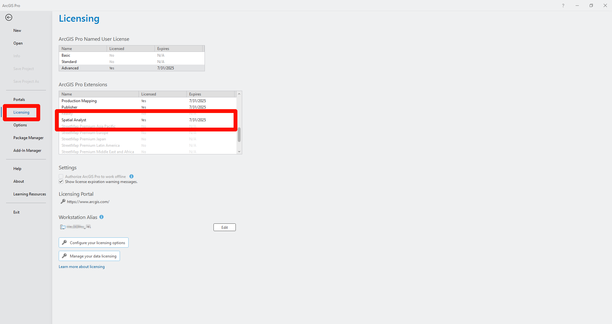
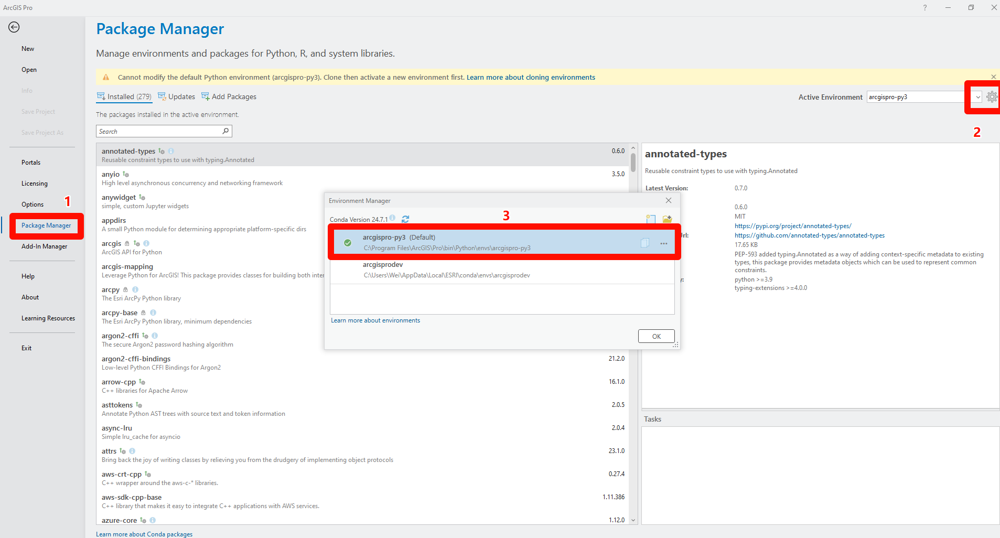
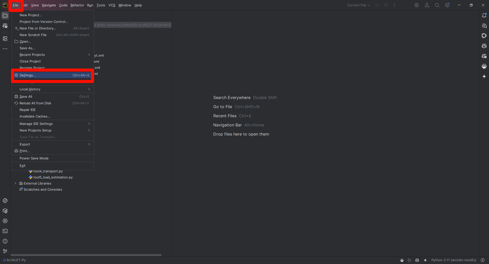
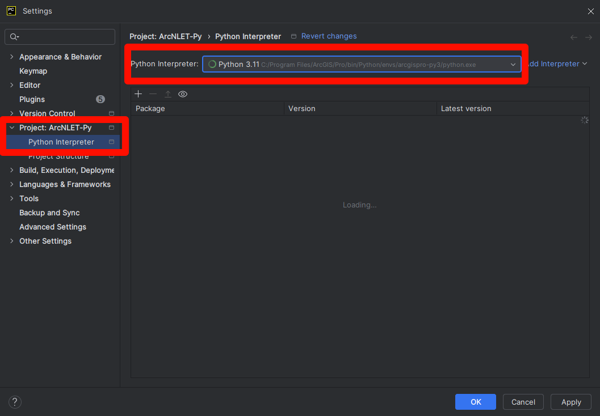
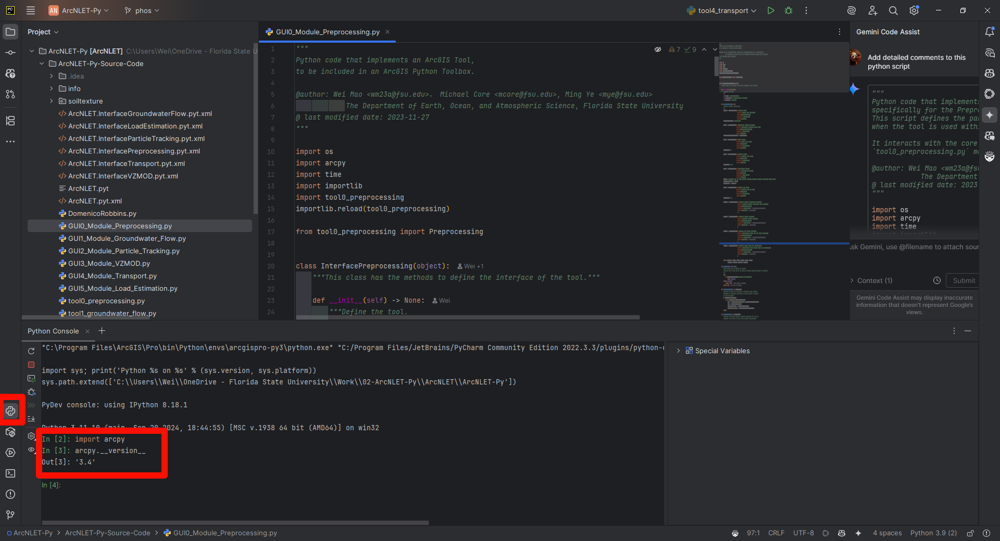

.. _runningwithIDE:
.. role:: raw-html(raw)
   :format: html

Using ArcNLET-Py ourside the ArcGIS Pro Interface
=================================================

In some cases, users may prefer to run ArcNLET-Py outside the ArcGIS Pro
interface. This is because ArcGIS Pro is a large application, and its
graphical user interface (GUI) can consume significant system resources.
Running ArcNLET-Py from the command line or from an Integrated
Development Environment (IDE) such as PyCharm—without launching the
ArcGIS Pro GUI—not only improves runtime efficiency but also makes it
more convenient for development and debugging. In fact, our tests show
that running ArcNLET-Py outside the ArcGIS interface can significantly
reduce execution time.

This document provides a step-by-step guide on how to run ArcNLET-Py
within an IDE (Pycharm), while still utilizing the ArcGIS Pro Python
environment.

1. ArcPy Dependency and License Requirements
--------------------------------------------

ArcNLET-Py relies on ArcPy, a core Python package included with ArcGIS
Pro. Since ArcGIS Pro manages licenses at the application level, and
ArcPy is governed by these licensing rules, users must ensure they have
the appropriate license—particularly the Spatial Analyst extension.

To check your license status:

1. Open ArcGIS Pro.

2. Go to Settings → Licensing.

3. Under ArcGIS Pro Extensions, verify that Spatial Analyst is listed as
   “Licensed” (as shown in the figure below).

2. Locating the ArcGIS Pro Python Environment
---------------------------------------------

| Still within the **Settings** page of **ArcGIS Pro**, under the
  **Licensing** section, you will find an entry called **Package
  Manager**. This is where ArcGIS Pro manages its Python environments.
  ArcGIS Pro uses **conda** for environment management. For more
  detailed information, please refer to the official documentation:
| `Package Manager (ArcGIS
  Pro) <https://pro.arcgis.com/en/pro-app/latest/arcpy/get-started/what-is-conda.htm>`__

| Refer to the screenshot below to locate the exact path of the Python
  environment used by ArcGIS Pro:

In the **Environment Manager**, all new Python environments are created
based on the default environment named **``arcgispro-py3``**. Note that
``arcgispro-py3`` itself is a **read-only base environment**—you cannot
install or remove packages from it. This restriction is intentional to
ensure the stability of ArcGIS Pro. Esri recommends cloning this base
environment if you need to install additional packages.

Fortunately, **ArcNLET-Py** does not require any extra packages beyond
the default ``arcgispro-py3`` environment. Therefore, you can either use
``arcgispro-py3`` directly or create a clone if preferred. In this
guide, we will demonstrate how to use the Python interpreter path of the
**``arcgispro-py3``** environment directly.

3. ArcNLET-Py Source Code Structure
-----------------------------------

| Once you download the ArcNLET-Py source code from GitHub
| (https://github.com/ArcNLET-Py/ArcNLET-Py), you will find a folder
  named **``ArcNLET-Py-Source-Code``**. This folder contains all the
  source code necessary to run ArcNLET-Py.

The contents of this folder can be divided into several categories:

- | **ArcNLET.pyt**
  | This is the main toolbox file that serves as the entry point when
    using ArcNLET-Py within ArcGIS Pro.

- | **XML files**
  | These define the pop-up tooltips for parameters when using
    ArcNLET-Py inside ArcGIS Pro. When hovering over input fields, the
    tooltips are generated based on these XML configuration files.

- | **GUI\*.py files** (6 in total)
  | These files define the GUI layout for the six modules of ArcNLET-Py
    within the ArcGIS Pro interface. They handle the interface
    presentation and capture user inputs.

- | **tool\*.py files** (6 in total)
  | Each of these files contains the computational logic for one of the
    six ArcNLET-Py modules. The GUI files collect user inputs and pass
    them to the corresponding tool files to perform the actual
    calculations.

- **Other supporting files**

  - ``DomenicoRobbins.py``: Provides analytical solutions for modeling
    groundwater plumes, used specifically by ``tool4_transport.py``.
  - ``soiltexture/`` folder: Contains soil classification functions used
    by ``tool0_preprocessing.py`` to interpret SSURGO-based soil data.

4. Debugging ArcNLET-Py in PyCharm
----------------------------------

To run or debug ArcNLET-Py outside ArcGIS Pro using an IDE like
**PyCharm**, follow the steps below:

1. | **Create a new PyCharm project**
   | You can either create a new project or open an existing one, then
     copy the ``ArcNLET-Py-Source-Code`` folder into your project
     directory. For details, refer to the official guide:
   | `Creating and running your first Python
     project <https://www.jetbrains.com/help/pycharm/creating-and-running-your-first-python-project.html>`__

2. **Configure the Python interpreter**

   - | Go to **File → Settings**

   - Under **Project: <Your Project Name> → Python Interpreter**, click
     the interpreter dropdown on the right and select **“Add…”**.

   - Browse to the Python interpreter path from **Step 2** (i.e., the
     one from the ``arcgispro-py3`` environment).

   - | Click **Apply**, then **OK** to confirm the environment setup.
  

3. **Verify ArcPy availability**

   Open the Python Console in PyCharm and enter:

   .. code:: python

      import arcpy
      arcpy.__version__

Running ArcNLET-Py from other IDEs is similar.

