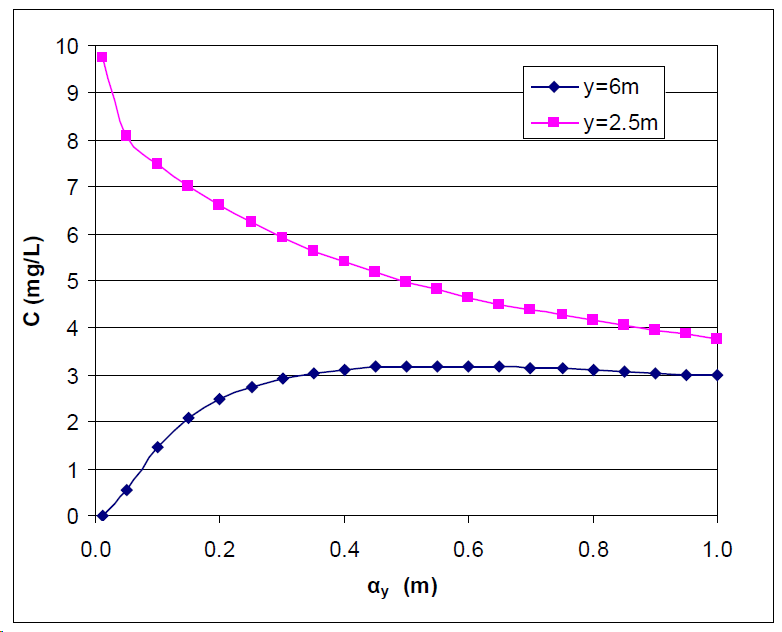
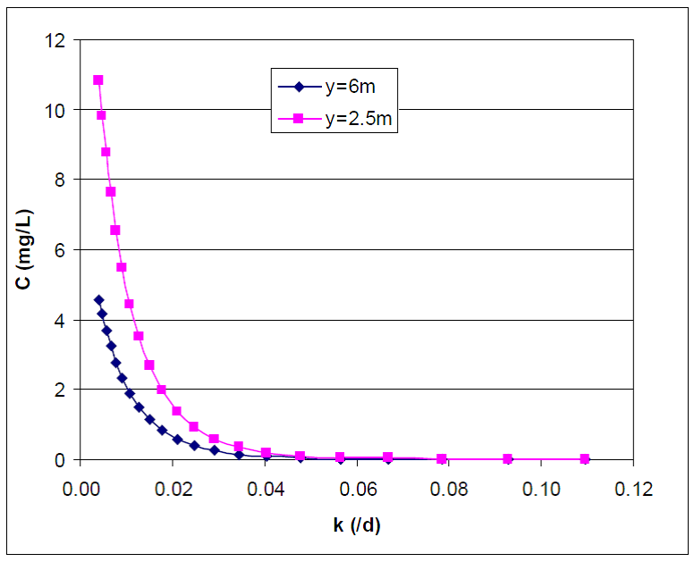

.. _sensitivityandcalibration:

Sensitivity and Calibration
===========================

.. contents:: Table of Contents
   :local:
   :depth: 2

As explained in the technical manual (Rios et al., 2011), the nitrate
concentration is evaluated in ArcNLET using the two-dimensional,
steady-state version of the solution of Domenico (1987) for the
advection-dispersion equation. It is shown in equation (16-1).

+--------------------------------------------------------------+------+
| |image1|                                                     |      | 
+==============================================================+======+
| |image2|                                                     | (    |
|                                                              | 16-1) |
+--------------------------------------------------------------+------+
| |image4|                                                     |      |
+--------------------------------------------------------------+------+

where *C* [ML\ :sup:`-3`] is simulated nitrate concentration at location
(*x*,y), α\ :sub:`x` [L] is longitudinal dispersivity, *α*\ :sub:`y` [L]
is horizontal transverse dispersivity, [L]; *k* [T\ :sup:`-1`] is the
first order decay coefficient, *v* [LT\ :sup:`−1`] is groundwater
seepage velocity in the longitudinal direction, *Y* [L] is the width of
the source plane respectively, and C\ :sub:`0` [ML\ :sup:`-3`] is the
nitrate concentration at the source plane. The seepage velocity is
evaluated in the groundwater flow model that uses hydraulic
conductivity, porosity, and a smoothing factor to process DEM to obtain
the shape of the water table. ArcNLET has seven parameters: the
smoothing factor, hydraulic conductivity, porosity, longitudinal
dispersivity, horizontal transverse dispersivity, first-order decay
coefficient, and source nitrate concentration. Both local and global
sensitivity analyses are performed to identify the parameters most
critical to the simulated nitrate concentration. The local sensitivity
reveals the relationships between the simulated nitrate concentration
and individual parameters. The global sensitivity is more robust than
the local sensitivity since it considers interactions between the
parameters and the nonlinearity of the concentration concerning the
parameters. For simplicity, the sensitivity to the smoothing factor,
hydraulic conductivity, and porosity is not evaluated. Instead, the
sensitivity to seepage velocity is calculated as a surrogate.

Local Sensitivity
-----------------

The local sensitivity is the derivative of the nitrate concentration to
an individual parameter calculated for specific nominal parameter
values. In this study, the nominal parameter values and their sources
are as follows:

1. Seepage velocity: *v* = 0.2 m/d. This velocity is the representative
   value of the domains of interest.

2. Source plane concentration: *C\ 0* = 40 mg/L. This value is from a
   review article by McCray et al. (2005).

3. First-order decay coefficient: *k* = 0.008/day. This value is from a
   review article by McCray et al. (2005). Longitudinal dispersivity:
   α\ *x* = 2.113 m. This value is from the work of Davis (2000) at a
   vicinity site in Jacksonville, FL.

4. Longitudinal dispersivity: α\ *x* = 2.113 m. This value is from the work of Davis (2000) at a vicinity site in 
   Jacksonville, FL.

5. Horizontal transverse dispersivity: α\ *x* = 0.234 m. This value is
   from the work of Davis (2000) at a vicinity site in Jacksonville, FL.

6. Source plane length: *Y* = 6m. This value is the typical length of
   the drain field of a septic system.

7. X coordinate: *X* = 30m. This coordinate value is arbitrarily
   selected for the demonstration.

By the analytical solution, analytical expressions of the local sensitivity can be easily derived. The local sensitivity 
to the source plane nitrate concentration is shown in the equation (16-2).

+----------------+
| |image5| (16-2) |
+----------------+

It suggests a positive linear relationship between the simulated nitrate
concentrations and the source plane nitrate concentration. This
relationship is illustrated in Figure 16-1 for two y values, the nominal
parameters' values listed above. The equation and figure show that the
increase in source plane nitrate concentration increases the simulated
concentration within the plume. The increase is prominent at locations
closer to the plume center line (y=0m).

.. rst-class:: center 

|image6|

.. raw:: html

   

   Figure 16-1: Relationship between the source plane and simulated concentrations.
   

     <!-- Add a line break here --> 

For illustration, the plot shows the measured and simulated nitrate
concentrations at two locations of y.

The local sensitivity to the first-order decay coefficient is shown in equation
(16-3).

+----------------+
| |image7| (16-3) |
+----------------+

It suggests a negative relationship with the simulated concentration, as
demonstrated in Figure 16-2. In other words, increasing the first-order
decay coefficient decreases the simulated concentration within the
plume. The decrease is faster at locations closer to the plume center
line (*y*\ =0m).

.. rst-class:: center

|image8|

.. raw:: html

   

   Figure 16-2: Relationship between first-order decay and concentration.
   

     <!-- Add a line break here --> 

.. raw:: html

   
 <!-- Close the centering div to reset text alignment -->

The plot illustrates the relationship between the first-order decay
coefficient and simulated nitrate concentration at two locations of y.

The analytical expressions of sensitivity to the seepage velocity are
shown in equation (6‑4).

+----------------+
| |image9| (6‑4) |
+----------------+

The expression suggests a positive relationship with simulated
concentration. Figure 16-3 shows that the velocity increase is associated
with an increased simulated concentration within the plume. The increase
is greater at locations closer to the plume center line (*y*\ =0m).

.. rst-class:: center 

|image10|

.. raw:: html

   

   Figure 16-3: The relationship between velocity and concentration.
   

     <!-- Add a line break here --> 

For illustration, the plot shows the average flow velocity and simulated
nitrate concentration at two locations of y.

The analytical expression of sensitivity to the longitudinal
dispersivity is shown in (16-5).

+-----------------+
| |image11| (16-5) |
+-----------------+

Indicates that increasing the longitudinal dispersivity causes an
increase in the simulated concentration within the plume. Figure 6‑4
shows that the increase is more rapid at locations closer to the plume
center line (y=0m).

.. rst-class:: center 

|image12|

.. raw:: html

   

   Figure 6‑4: Relationship between dispersivity and concentration.
   

     <!-- Add a line break here --> 

For illustration, the plot shows the relationship between longitudinal
dispersivity and simulated nitrate concentration at two locations of y.

The sensitivity to the horizontal transverse dispersivity is more
complicated than longitudinal. The analytical expression is shown in equation (16-6).

+-------------------------------------------------------+------------+
| |image13|                                             |            |
+=======================================================+============+
| |image14|                                             | (16-6)      |
+-------------------------------------------------------+------------+
| |image15|                                             |            |
+-------------------------------------------------------+------------+

The equation above shows that the relationship between the simulated
nitrate concentration and the parameter depends on the length of the
source plane (*Y*) and the location (*x* and *y*) in the plume. In
addition, there is a threshold value shown in equation (16-7).

+-----------------+
| |image16| (16-7) |
+-----------------+

When the horizontal transverse dispersivity is smaller than the
threshold value, the relationship is positive but becomes negative when
the threshold value is exceeded. This is demonstrated in Figure 16-5.

   Figure 16-5: Relationship between horizontal dispersivity and concentration.

For illustration, the plot shows the relationship between horizontal
transverse dispersivity and simulated nitrate concentration at two
locations of y.

In summary, the local sensitivity analyses indicate that the simulated
concentration is an increasing function of the source plane
concentration, flow velocity, and longitude dispersivity but a
decreasing function of the decay coefficient. The relationship with the
horizontal transverse dispersivity depends on the parameter value and
the locations where concentration is evaluated. These results are
physically reasonable. For example, a large value of the decay
coefficient means more denitrification and, thus, small values of
simulated concentration. The relationships serve as guidelines for
adjusting model parameters by trial and error to match field
observations of nitrate concentration during the model calibration.

Table 16-1: The critical parameters at selected locations within the
nitrate plume.

   +--------+------+------+------+------+------+------+------+------+
| **x    | 0.   | 5    | 10   | 15   | 20   | 30   | 40   | 50   |
| (m)**  | 0001 |      |      |      |      |      |      |      |
|        |      |      |      |      |      |      |      |      |
| **y    |      |      |      |      |      |      |      |      |
| (m)**  |      |      |      |      |      |      |      |      |
+========+======+======+======+======+======+======+======+======+
| 0      | *C   | *k,  | *k   | *k,  | *k,  | *k,  | *k,  | *k,  |
|        | 0,   | v*   | ,v*  | v*   | v*   | v*   | v*   | v*   |
|        | v*   |      |      |      |      |      |      |      |
+--------+------+------+------+------+------+------+------+------+
| 1      | *C   | *k,  | *k   | *k,  | *k,  | *k,  | *k,  | *k,  |
|        | 0,   | v*   | ,v*  | v*   | v*   | v*   | v*   | v*   |
|        | v*   |      |      |      |      |      |      |      |
+--------+------+------+------+------+------+------+------+------+
| 2      | *C   | *k,  | *k   | *k,  | *k,  | *k,  | *k,  | *k,  |
|        | 0,   | v*   | ,v*  | v*   | v*   | v*   | v*   | v*   |
|        | v*   |      |      |      |      |      |      |      |
+--------+------+------+------+------+------+------+------+------+
| 3      | *C   | *k,  | *k   | *k,  | *k,  | *k,  | *k,  | *k,  |
|        | 0,   | v*   | ,v*  | v*   | v*   | v*   | v*   | v*   |
|        | v*   |      |      |      |      |      |      |      |
+--------+------+------+------+------+------+------+------+------+
| 4      | ／   | *k,  | *k   | *k,  | *k,  | *k,  | *k,  | *k,  |
|        |      | v*   | ,v*  | v*   | v*   | v*   | v*   | v*   |
+--------+------+------+------+------+------+------+------+------+
| 6      | ／   | *k,  | *k   | *k,  | *k,  | *k,  | *k,  | *k,  |
|        |      | v*   | ,v*  | v*   | v*   | v*   | v*   | v*   |
+--------+------+------+------+------+------+------+------+------+
| 8      | ／   | *k,  | *k   | *k,  | *k,  | *k,  | *k,  | *k,  |
|        |      | α*   | ,v*  | v*   | v*   | v*   | v*   | v*   |
|        |      | *y*  |      |      |      |      |      |      |
+--------+------+------+------+------+------+------+------+------+
| 10     | ／   | *α*  | *k,  | *k,  | *k,  | *k,  | *k,  | *k,  |
|        |      | *y , | α*   | α*   | v*   | v*   | v*   | v*   |
|        |      | k*   | *y*  | *y*  |      |      |      |      |
+--------+------+------+------+------+------+------+------+------+
| 12     | ／   | *α*  | *k,  | *k,  | *k,  | *k,  | *k,  | *k,  |
|        |      | *y , | α*   | α*   | α*   | v*   | v*   | v*   |
|        |      | k*   | *y*  | *y*  | *y*  |      |      |      |
+--------+------+------+------+------+------+------+------+------+

.. raw:: html

   
 <!-- Close the centering div to reset text alignment -->

Phosphorus Sensitivity Analyses
-------------------------------

The main objective of this section is to analyze the effect of the phosphorus module parameters on the sensitivity of the results.

**Linear Sorption Isotherm Analysis**

The initial concentration: C₀ = 10 mg P/L, is used as the default value in VZMOD. Results are presented as ratios of concentration at specific depths to the initial concentration, making the specific value of the initial concentration irrelevant.

1. **Soil type:** Sand, chosen based on Florida's conditions.
2. **Depth to water table:** Depth = 150 cm, which is the default value.
3. **Linear distribution coefficient:** k = 15.1 L/kg, based on McCray et al. (2005).
4. **Precipitation rate:** Rprecip = 0.002 1/day, referenced from Zhou et al. (2023) and Müller and Bünemann (2014).

In this study, the ratios of concentrations at the full depth and half-depth to the initial concentration were used as the y-values. Various precipitation rates and linear distribution coefficients were applied to examine their relationship with these ratios. Results are presented in Figure 16-6, showing negative correlations between the concentration ratios and parameters. Higher precipitation rates and sorption coefficients result in less phosphorus leaching. The parameters can be adjusted based on the ranges shown in Figure 16-6. Site-specific calibration is highly recommended for phosphorus modeling.

   Figure 16-6: Relationships between C/C0 and (a) precipitation rate, and (b) linear distribution coefficient for the linear sorption isotherm.

**Langmuir Sorption Isotherm Analysis**

The Langmuir sorption isotherm was also analyzed with initial conditions similar to those used previously:

1. **Precipitation rate:** Rprecip = 0.002 1/day, consistent with Zhou et al. (2023) and Müller and Bünemann (2014).
2. **Langmuir coefficient:** K = 0.2 L/mg, values from Zhou et al. (2023) and McGechan and Lewis (2002).
3. **Maximum sorption capacity:** Qmax = 237 mg P/kg, referenced from McCray et al. (2005).

Various precipitation rates, Langmuir coefficients, and maximum sorption capacity were applied to examine their relationship with concentration ratios. Results are shown in Figures 16-7 and 16-8. Site-specific calibration is recommended for phosphorus modeling.

.. figure:: ./media/sensitivityandcalibrationMedia/media/fig10.png
   :align: center
   :alt: Relationships between C/C0 and parameters for Langmuir sorption isotherm.

   Figure 16-7: Relationships between C/C0 and (a) precipitation rate, (b) Langmuir coefficient, and (c) maximum sorption capacity for the Langmuir sorption isotherm.

   Figure 16-8: Various sorption isotherms for different soil types with the data given by McGechan (2002).

**Sensitivity in Groundwater**

Nominal parameter values for groundwater include:

1. **Seepage velocity:** v = 0.2 m/d.
2. **Longitudinal dispersivity:** αx = 2.113 m (Davis, 2000).
3. **Horizontal transverse dispersivity:** αy = 0.234 m (Davis, 2000).
4. **Source plane length:** Y = 6 m.
5. **Bulk density:** ρ = 1.42 g/cm³.
6. **Porosity:** θ = 0.4 cm³/cm³.
7. **Linear distribution coefficient:** k = 15.1 L/kg (McCray et al., 2005).
8. **Precipitation rate:** Rprecip = 0.002 1/day.

The analytical expressions of sensitivity to precipitation rate and linear distribution coefficient are shown in equations (17) and (18). Increasing these parameters leads to a decrease in the simulated concentration within the plume.

.. figure:: ./media/sensitivityandcalibrationMedia/media/fig12.png
   :align: center
   :alt: Relationships between C/C0 and parameters in groundwater.

   Figure 16-9: Relationships between C/C0 and (a) precipitation rate, and (b) linear distribution coefficient for linear sorption in groundwater.

**Sensitivity in VZMOD**

VZMOD, being a steady-state model, adopts smaller values than those used in Zhou et al. (2023). The analytical expressions of sensitivity to the precipitation rate and linear distribution coefficient are represented by Equations (16-8) and (16-9):

+-------------------------------------------------------+------------+
| |image18|                                             |   (16-8)   |
+=======================================================+============+
| |image19|                                             |   (16-9)   |
+-------------------------------------------------------+------------+

Where F1 and F2 are calculated as follows:

+-------------------------------------------------------+------------+
| |image20|                                             |   (16-10)  |
+=======================================================+============+
| |image21|                                             |   (16-11)  |
+-------------------------------------------------------+------------+

These expressions suggest negative relationships with the simulated concentration. Specifically, increasing the precipitation rate and linear distribution coefficient results in a decrease in the simulated concentration within the plume, with a more rapid decline observed at locations closer to the plume centerline (*y* = 0 m).

**Summary**

The sensitivity analyses indicate that phosphorus sorption is significantly influenced by factors such as Fe concentration, total organic carbon concentration, pH, and others. These findings suggest that site-specific calibration is essential for accurate phosphorus modeling.

Model Calibration
-----------------

Generally speaking, model calibration matches the simulated nitrate and phosphorus concentrations to observed values by adjusting model parameters. Due to the lack of comprehensive characterization data, model calibration in this study is necessary.

For nitrate, calibration begins with adjusting parameters like hydraulic conductivity, porosity, dispersivities, and decay coefficients to match observed concentrations. Phosphorus modeling also involves fine-tuning precipitation rates, sorption coefficients, and other related parameters.

.. note::
   Site-specific calibration is recommended to enhance the accuracy of both nitrate and phosphorus modeling due to the varying influence of site conditions on sorption processes.

Generally speaking, model calibration matches the simulated nitrate
concentration to the observed ones by adjusting the model parameters.
Model calibration in this study is necessary due to the lack of
characterization data for describing the hydrogeologic conditions of the
modeling domains. For example, no other parameter measure is available
except for the hydraulic conductivity and porosity downloaded from the
SSURGO database. The only site-specific measurements are the particulate
organic carbon (POC) content collected from the Eggleston Heights and
Julington Creek neighborhoods at the top 1.5 m of the saturated zone.
The data shows that the average POC content is 0.35% and 1.08% in the
Eggleston Heights and Julington Creek neighborhoods. Anderson (1998)
states that the denitrification rate is positively correlated with POC
content. The higher POC content in the Julington Creek area suggests a
higher denitrification rate. This data is taken as prior information for
the model calibration.

The trial-and-error model calibration starts from the Eggleston Height
neighborhood by evaluating nitrate concentration in the modeling domains
using the smoothing factor of 60, heterogeneous hydraulic conductivity
and porosity downloaded from the SSURGO database, longitude dispersivity
α\ :sub:`x` of 2.113 m (Davis 2000), α\ :sub:`y` of 0.234 m (Davis
2000), *C*\ :sub:`0` of 40 mg/L (McCray et al. 2005), and first-order
decay coefficient *k* of 0.025/d (McCray et al. 2005). The most
sensitive parameters identified in the sensitivity analyses are
subsequently adjusted to obtain an improved fit between the simulated
and observed nitrate concentration. The sensitivity to seepage velocity
is reflected by adjusting hydraulic conductivity because it plays the
most critical role in determining the velocity's magnitude.

The detailed procedure of model calibration within ArcNLET is as
follows:

1. Calibrate the flow model by adjusting the smoothing factor and using
   the mean hydraulic head observations at the monitoring wells as the
   calibrated targets. Since ArcNLET does not simulate hydraulic head
   but hydraulic gradient, the goal of adjusting the smoothing factor is
   to obtain a linear relationship between the smoothed DEM (which is an
   intermediate output layer of the Groundwater Flow Module, described
   in detail in the user's manual) and the calibration targets values at
   the observation wells. The slope of the linear relationship must be
   close to 1.0 so that the shape of the smoothed DEM mimics the shape
   of the water table. Hydraulic conductivity is not calibrated in this
   step unless observations of groundwater velocity are available.

2. Calibrate the transport model using trial and error by adjusting the
   first-order decay coefficient, hydraulic conductivity,
   dispersivities, and source concentration. The calibration goal is to
   match the simulated nitrate concentration to the mean observations at
   the monitoring wells. Due to the complex nature of nitrate transport
   and the simplicity of the model behind ArcNLET, it is not likely that
   the match is achieved at all the wells. A reasonable expectation is
   that the simulated nitrate concentration falls in the inter-quartile
   range or maximum and minimum observations at each well. Given that
   multiple septic systems can impact nitrate concentration at a
   monitoring well, the global sensitivity analysis results are
   essential guidelines to adjust different parameters for different
   septic systems. Using homogenous values of the first-order decay
   coefficient, dispersivities, and source concentration is recommended
   because they may be considered representative values of the modeling
   domain. Adjusting the hydraulic conductivity within the high and low
   values given in the soil survey data is recommended.

Based on our experience, the model calibration for the flow model is
relatively easy. In contrast, the calibration of the transport model may
be time-consuming and require a solid understanding of the nitrate
transport from the hydrogeologic point of view.

