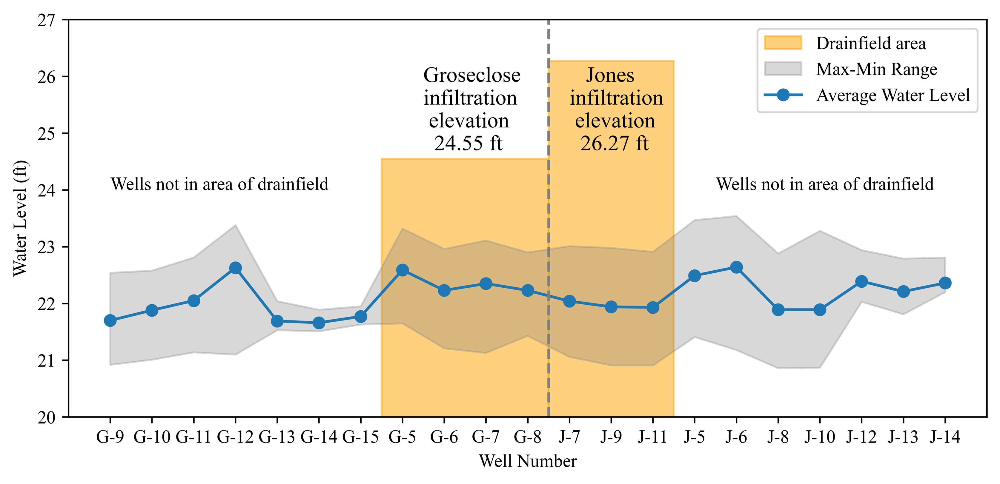
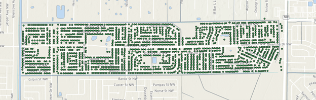
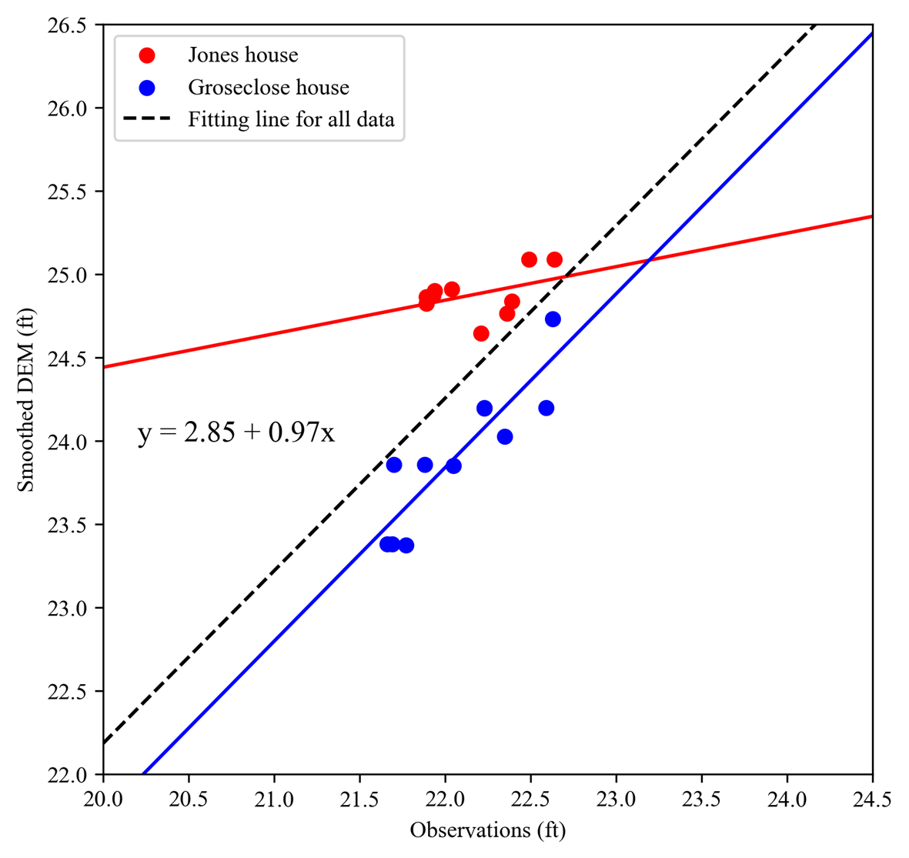
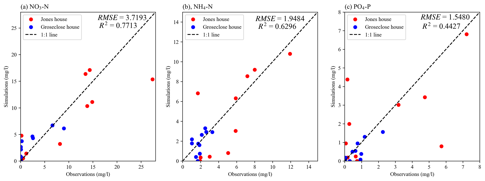
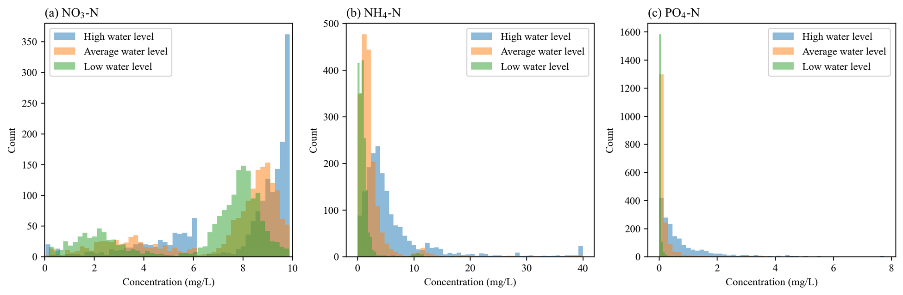
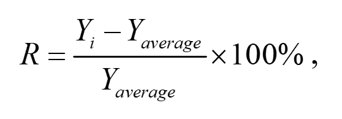

.. _temporalvariation:
.. role:: raw-html(raw)
   :format: html

Temporal Variation
==================

.. contents:: Table of Contents
   :local:
   :depth: 2

Variation of ArcNLET-Estimated Nitrogen and Phosphorus Loads for High and
Low Groundwater Levels

While ArcNLET-Py assumes steady-state groundwater flow and solute
transport, real-world hydrology conditions (e.g., water levels in
groundwater and surface water) and OSTDS uses (e.g., amounts of domestic
wastewater discharged from OSTDS) vary over time. One way to address the
discrepancy between the model assumption and the real-world conditions is
to develop a transient model for ArcNLET-Py. However, we decided not to do
so mainly because there are inadequate data to support a realistic model
simulation of transient flow and solute transport. For example, there is
always a lack of temporal data of water levels in groundwater and surface
water, and temporal data of OSTDS uses (e.g., temporal variation of the
amount of water percolating from drainfields to soils) are also unavailable
for ArcNLET-Py modeling. Therefore, a steady-state simulation and load
estimation for average conditions is not unreasonable.

However, it is still necessary to evaluate temporal variation of the
ArcNLET-simulated nitrogen and phosphorus concentrations and the ArcNLET-
estimated nitrogen and phosphorus loads. This is pursued in this study in
an empirical manner by selecting a study area in the Turkey Creek sub-basin
located in Brevard County. This study area is selected mainly because
continuous measurements of groundwater levels and nitrogen and phosphorus
concentrations are available at a total of 21 monitoring wells for the
period from February 7, 1990 to March 26, 1992. The details of the study
area and the monitoring data are referred to the report of Ayres
Association (1993). Among a number of study areas that we have reviewed,
the Turkey Creek area is the best one in terms of data quantity.
It however should be noted that the data reported in Ayres Association
(1993) are still inadequate to evaluate temporal variation of the ArcNLET-
simulated concentrations and ArcNLET-estimated loads, because Ayres
Association (1993) did not report all their data but the minimum, average,
and maximum values. This is illustrated in Figure 17-1 for groundwater levels
at two study sites of the Turkey Creek sub-basin. The two study sites are
two residential houses with OSTDS, and they are referred to as the
Groseclose site and the Jones Site in this study. Ayres Association (1993)
only reported the minimum, average, and maximum values of groundwater
levels at 11 monitoring wells at the Groseclose site and at 10 monitoring
wells at the Jones site. We therefore choose to evaluate the ArcNLET-
simulated concentrations and ArcNLET-estimated loads for high and low
groundwater levels.

   Figure 17-1: Minimum, average, and maximum groundwater levels at 11 monitoring wells for 
   the Groseclose site and at 10 monitoring wells for the Jones site.

Three Scenarios of High, Average, and Low Groundwater Levels
------------------------------------------------------------

Based on the data availability, this study considers three scenarios of
high, average, and low groundwater level, which is critical to the
concentrations of nitrogen and phosphorus and therefore their loading to
surface waterbodies. We first calibrated ArcNLET-Py against the average
values of groundwater levels and nitrogen and phosphorus concentrations,
and then used the calibrated model to simulate the concentrations and to
estimate the loads. The results for the high and low groundwater levels are
compared with those for the average groundwater level, so that we can
evaluate the extent of overestimation and underestimation of the
concentrations and loads under the scenarios of high and low groundwater
levels.

The ArcNLET-Py model calibration was conducted using the data of
groundwater level and solute concentrations at the Groseclose and Jones
site, and the model calculation is described below. The simulation using
the calibrated model was conducted for a total of 1,769 OSTDS in the
neighborhood of the Groseclose and Jones sites, and the locations of the
OSTDS are shown in Figure 17-2.

   Figure 17-2: Spatial distribution of 1,769 OSTDS in the study area.

Based on the data shown in Figure 17-1, the three scenarios of high, average,
and low groundwater levels were determined as follows:

  1. Average groundwater level: based on the average values of groundwater level
     at the 21 monitoring wells, the average groundwater level was calculated
     over the 21 wells, and it is about 3.38 ft below land surface.

  2. High groundwater level: following the way of estimating the average
     groundwater level, the high groundwater level is the average of the high
     values of the 21 monitoring wells. It is about 0.84 ft higher than the
     average groundwater level.

  3. Low groundwater level: following the way of estimating the average
     groundwater level, the low groundwater level is the average of the low
     values of the 21 monitoring wells. It is about 1.00 ft lower than the
     average groundwater level.

After the ArcNLET-Py model calibration was completed, the groundwater level
given by the calibrated model was used as the average groundwater level.
Adding 0.84 ft to the average groundwater level created the high
groundwater level, and subtracting  1.00 ft from the average groundwater
level leads to the lowest groundwater level.

While the difference between the average high and average low groundwater
levels is 1.84 ft, the maximum difference between the high and low
groundwater levels is 2.4 feet. This value is consistent with the
groundwater level changes reported at St. George Island (Corbett and
Iverson, 1999), Seminole County (Florida Department of Health, 2012), Polk
County (Florida Department of Health, 2013), and the SDA site (Ayres
Associates, 1996). However, the change of groundwater level at the Wekiva
River Basin can be more than 10 feet (Aley IV et al., 2007). The
groundwater level changes can be larger under extreme conditions such as
hurricanes. We have not found data to quantify the groundwater level
changes related to OSTDS studies.

ArcNLET Model Calibration
-------------------------

The details of ArcNLET modeling and model calibration were given in the
technical report of Ye et al. (2023), which is available online at . We
only present the model calibration results in this report. Figure 17-3 shows
the comparison between the smoothed DEM (given by ArcNLET-Py) and the
average groundwater levels observed at 21 monitoring wells at the Jones and
Groseclose sites. This figure indicates that ArcNLET can reasonably
simulate the shape of average groundwater level. The DEM smoothing was done
by using ArcNLET-Py in a procedure described in the ArcNLET-Py manual. For
this study, the smoothing process starts with the smoothing factor value of
20 with the smoothing cell number of 31. Afterward, the smoothing was
conducted five times using the smoothing factor value of 10, 1, 1, 1, and
2, and the corresponding smoothing cell number of 31, 31, 27, 23, and 7,
respectively. For each smoothing, the smoothed DEM and the DEM of surface
waterbodies were merged. The detailed procedure of smoothing can be found
in the ArcNLET-Py manual.

   Figure 17-3: Comparison of smoothed DEM and observed groundwater level at the Jones and Groseclose sites.

The calibration of ArcNLET-Py against the average concentrations of
ammonium and nitrate was described in detail in Ye et al. (2023), and the
same calibration procedure was applied in this study to calibrate ArcNLET-
Py against the average phosphate concentrations. The calibrated values of
ArcNLET-Py model parameters are listed in Table 17-1. For the phosphate model
calibration, the monitoring data for the Groseclose site indicated that the
total phosphorus concentrations in septic tank effluent are 18 mg/L in
blackwater and 1.14 mg/L in graywater (Ayres Association, 1993). Since more
than 85% of the phosphorus in septic tank effluent is phosphate (McCray et
al., 2005; Tchobanoglous and Schroeder, 1985), we assumed that all
phosphorus in the report of Ayres Association (1993) was orthophosphate.
Due to the higher concentrations of phosphate phosphorus, the Langmuir
sorption isotherm was selected for the vadose zone model calculations (Lusk
et al., 2017; McCray et al., 2005). For groundwater model calibration, the
linear sorption isotherm was used because the phosphate phosphorus
concentration is lower in groundwater.

Table 17-1. Calibrated values of ArcNLET-Py model parameter values for
reactive transport modeling of nitrogen and phosphate at the Groseclose and
Jones sites.

+------------------------------+------------------------+-----------------+
| Parameter                    | Groseclose site        | Jones site      |
+==============================+========================+=================+
| Vadose zone                  |                        |                 |
+------------------------------+------------------------+-----------------+
| Correction factor of         | 0.275                  | 0.048           |
| nitrification (1/day)        |                        |                 |
+------------------------------+------------------------+-----------------+
| Correction factor for        | 0.585                  | 0.122           |
| denitrification (1/day)      |                        |                 |
+------------------------------+------------------------+-----------------+
| Phosphate precipitation      | 0.0011                 | 0.00015         |
| rate (1/day)                 |                        |                 |
+------------------------------+------------------------+-----------------+
| Phosphate Langmuir           | 0.2                    | 0.2             |
| coefficient (L/mg)           |                        |                 |
+------------------------------+------------------------+-----------------+
| Phosphate maximum sorption   | 700                    | 700             |
| capacity (mg/kg)             |                        |                 |
+------------------------------+------------------------+-----------------+
| Groundwater                  |                        |                 |
+------------------------------+------------------------+-----------------+
| Phosphate precipitation      | 0.00025                | 0.0002          |
| rate (1/day)                 |                        |                 |
+------------------------------+------------------------+-----------------+
| Phosphate linear             | 30                     | 15.1            |
| distribution coefficient     |                        |                 |
| (L/kg)                       |                        |                 |
+------------------------------+------------------------+-----------------+

Figure 17-4 shows the comparison between the simulated and average measured
concentrations of NO\ :sub:`3`-N, NH\ :sub:`4`-N, and PO\ :sub:`4`-P. Generally speaking, the
calibrated model can reasonably simulate the average values of the measured
concentrations. However, the calibrated model cannot adequately simulate
spatial variation of the nitrogen and phosphorus concentrations especially
at the Jones site. For example, the highest nitrate concentration at the
Jones site was not simulated by the calibrated ArcNLET-Py model (Figure 17-4a), 
and the low phosphate concentrations were not simulated by the
calibrated model (Figure 17-4c).

   Figure 17-4: Comparison between simulated and average measured concentrations 
   of (a) NO\ :sub:`3`-N, (b) NH\ :sub:`4`-N, and (c) PO\ :sub:`4`-P in groundwater.

ArcNLET-Py Results for High and Low Groundwater Levels
------------------------------------------------------

Figure 17-5 presents histograms of simulated concentrations of NO\ :sub:`3`-N, NH\ :sub:`4`-N,
and PO\ :sub:`4`-P at the water table under the three scenarios with high, average,
low groundwater levels. For NH\ :sub:`4`-N, its concentrations become smaller when
groundwater levels become lower because of nitrification, and this is
observed in Figure 17-5(b). For NO\ :sub:`3`-N, the relation between its concentrations
and the groundwater level positions is more complicated than that for
NH\ :sub:`4`-N, because NO\ :sub:`3`-N concentrations depend on both nitrification and
denitrification processes. If there is no denitrification, NO\ :sub:`3`-N
concentrations are larger when groundwater levels become lower. However,
the denitrification process reduces NO\ :sub:`3`-N concentrations when groundwater
levels become lower. The final NO\ :sub:`3`-N concentrations depend on the amount of
nitrification and denitrification. Figure 17-5(a) for NO\ :sub:`3`-N concentrations
indicates that denitrification plays an important role to determine NO\ :sub:`3`-N
concentrations.

   Figure 17-5: Histograms of simulated concentrations of (a) NO\ :sub:`3`-N, (b) NH\ :sub:`4`-N,
   and (c) PO\ :sub:`4`-P at the water table under the three scenarios of high,
   average, and low groundwater levels.

This is observed in Figure 17-6 that shows the relation
between NH\ :sub:`4`-N and NO\ :sub:`3`-N concentrations and groundwater level for one OSTDS
that appears to be representative. Figure 17-6(b) shows that, when the
groundwater level decreases, the NH\ :sub:`4`-N concentration monotonically
decreases because of nitrification. Figure 17-6(a) shows that the NO\ :sub:`3`-N
concentration increases first because of nitrification and then decreases
because of denitrification. For Figure 17-6(a), the final NO\ :sub:`3`-N concentration
is determined by the amount of denitrification.

  .. figure:: ./media/temporalvariationMedia/media/image6.png
   :align: center
   :alt: Profiles of the high, average, and low groundwater 

   Figure 17-6: Vertical profiles of the concentrations of (a) NO\ :sub:`3`-N, (b) NH\ :sub:`4`-N,
   and (c) PO\ :sub:`4`-P under the three scenarios of high, average, and low
   groundwater levels.

The relation between the PO\ :sub:`4`-P concentration and groundwater level is
simpler than that of nitrogen, because the PO\ :sub:`4`-P concentration continues
decreasing when PO\ :sub:`4`-P moves in soils due to PO\ :sub:`4`-P adsorption and
precipitation. This relation is observed in Figures 17-5(c) and 17-6(c).
To quantify the difference of the simulated nitrogen and phosphorus
concentrations between the three scenarios of high, average, and low
groundwater level, we calculated the relative difference (%) defined as

+------------------+
| |image10| (17-1) |
+------------------+

where Y\ :sub:`i` represents the simulated concentrations under the scenario of
either high or low groundwater level, and Y\ :sub:`average` is for the scenario of
average groundwater level. The concentrations are the average values over
the 1,769 OSTDS shown in Figure 17-2, and the average values for the three
scenarios are listed in Table 17-2. For nitrogen, the sum of the average NO\ :sub:`3`-N
and NH\ :sub:`4`-N concentrations was used for calculating the relative difference,
R (%), for nitrogen. The relative difference is 46.7% for the scenario of
high groundwater level, indicating an overestimation of the nitrogen
concentrations. The relative difference is -21.2% under the scenario of low
groundwater level, indicating an underestimation of the nitrogen
concentration. For phosphorus, the relative differences are 320% and -80%
under the scenarios of high and low groundwater levels, respectively.

Table 17-2. Average concentrations of NO\ :sub:`3`-N, NH\ :sub:`4`-N, and PO\ :sub:`4`-P entering water
table under the three scenarios of high, average, and low groundwater
levels. The average concentrations are over the 1,769 OSTDS shown in Figure 17-2.

+-------------------------------------------+-------------------------+-------------------------+-------------------------+
| Parameter                                 | High groundwater level  | Average groundwater     | Low groundwater level   |
+===========================================+=========================+=========================+=========================+
| :raw-html:`NO3-N (mg/L):`      | 7.75                    | 7.11                    | 6.33                    |
+-------------------------------------------+-------------------------+-------------------------+-------------------------+
| :raw-html:`NH4-N (mg/L):`      | 6.20                    | 2.40                    | 1.16                    |
+-------------------------------------------+-------------------------+-------------------------+-------------------------+
| R                                         | 46.7%                   | N/A                     | -21.2%                  |
+-------------------------------------------+-------------------------+-------------------------+-------------------------+
| :raw-html:`PO4-P (mg/L):`      | 0.84                    | 0.20                    | 0.04                    |
+-------------------------------------------+-------------------------+-------------------------+-------------------------+
| R                                         | 320%                    | N/A                     | -80%                    |
+-------------------------------------------+-------------------------+-------------------------+-------------------------+

  .. figure:: ./media/temporalvariationMedia/media/image7.png
   :align: center
   :alt: Histograms of the nutrient concentrations 

   Figure 17-7: Histograms of simulated concentrations of (a) NO\ :sub:`3`-N, (b) NH\ :sub:`4`-N,
   and (c) PO\ :sub:`4`-P entering surface waterbodies under the three scenarios of
   high, average, and low groundwater levels.

Similar to Figure 17-5, Figure 17-7 plots the histograms of simulated
concentrations of NO\ :sub:`3`-N, NH\ :sub:`4`-N, and PO\ :sub:`4`-P entering surface waterbodies
under the three scenarios. The concentrations are close to zero, indicating
that nitrogen and phosphorus are significantly reduced after passing
through the unsaturated zone and groundwater. Therefore the discussion
below is focused on loads than on concentrations.

Figure 17-8 shows the ArcNLET-estimated NO\ :sub:`3`-N and NH\ :sub:`4`-N loads to different
waterbodies under the three scenarios. It is consistent that, for a given
surface waterbody, the loads of both NO\ :sub:`3`-N and NH\ :sub:`4`-N are larger for high
groundwater level but smaller for low groundwater level. Figure 17-8 shows
that the impacts of groundwater level are larger for the H4-N load than for
the NO\ :sub:`3`-N load. This is not surprising, because the nitrification of NH\ :sub:`4`-N
heavily depends on groundwater level and the removal of NH\ :sub:`4`-N in
groundwater is minimal due to the anoxic conditions in groundwater. For
NO\ :sub:`3`-N, its removal in groundwater due to denitrification may be substantial
in groundwater, and this reduces the impacts of groundwater level on NO\ :sub:`3`-N
removal.

  .. figure:: ./media/temporalvariationMedia/media/image8.png
   :align: center
   :alt: Charts of load estimations 

   Figure 17-8: ArcNLET-estimated (a) NO\ :sub:`3`-N and (b) NH\ :sub:`4`-N loads to different
   waterbodies under the three scenarios of high, average, and low groundwater
   levels.

Figure 17-9 plots the ArcNLET-estimated PO\ :sub:`4`-P load to different waterbodies
under the three scenarios. The figure shows that, for a given surface
waterbody, the estimated PO\ :sub:`4`-P load is larger for a higher groundwater
level. It however should be noted that the amount of PO\ :sub:`4`-P load is
substantially smaller than that of NO\ :sub:`3`-N and NH\ :sub:`4`-N loads.

  .. figure:: ./media/temporalvariationMedia/media/image9.png
   :align: center
   :alt: Charts of PO\ :sub:`4`-P load estimations

   Figure 17-9. ArcNLET-estimated PO\ :sub:`4`-P load to different waterbodies under the
   three scenarios of high, average, and low groundwater levels.

The relative difference defined in Equation (17-1) was calculated for the
ArcNLET-estimated NO\ :sub:`3`-N, NH\ :sub:`4`-N, and PO\ :sub:`4`-P loads listed in Table 17-3. For
NO\ :sub:`3`-N, the relative differences are 18.4% and -11.8% for the high and low
groundwater levels, respectively, indicating overestimation and
underestimation of the load, respectively. For NH\ :sub:`4`-N, the relative
differences are 111.8% and -41.5% for the high and low groundwater levels,
respectively. For PO\ :sub:`4`-P, the relative differences are 530% and -805% for
the high and low groundwater levels, respectively. The relative differences
are more significant for the NH\ :sub:`4`-N and PO\ :sub:`4`-P loads than for the NO\ :sub:`3`-N load.

Table 17-3. ArcNLET-estimated NO\ :sub:`3`-N, NH\ :sub:`4`-N, and PO\ :sub:`4`-P loads to surface
waterbodies under the three scenarios of high, average, and low groundwater
levels.

+-------------------------------------------+-------------------------+-------------------------+-------------------------+
| Parameter                                 | High groundwater level  | Average groundwater     | Low groundwater level   |
+===========================================+=========================+=========================+=========================+
| :raw-html:`NO3-N load (g/d):`  | 767.5                   | 648.0                   | 571.8                   |
+-------------------------------------------+-------------------------+-------------------------+-------------------------+
| R                                         | 18.4%                   | N/A                     | -11.8%                  |
+-------------------------------------------+-------------------------+-------------------------+-------------------------+
| :raw-html:`NH4-N load (g/d):`  | 620.4                   | 293.0                   | 171.3                   |
+-------------------------------------------+-------------------------+-------------------------+-------------------------+
| R                                         | 111.8%                  | N/A                     | -41.5%                  |
+-------------------------------------------+-------------------------+-------------------------+-------------------------+
| :raw-html:`PO4-P load (g/d):`  | 6.3                     | 1.0                     | 0.2                     |
+-------------------------------------------+-------------------------+-------------------------+-------------------------+
| R                                         | 530%                    | N/A                     | -80%                    |
+-------------------------------------------+-------------------------+-------------------------+-------------------------+

The values of the relative differences (R) listed in Tables 2 and 3
indicate that, for the study site, the groundwater level has substantial
impacts on the simulated nitrogen and phosphorus concentrations at water
table and on the estimated nitrogen and phosphorus loads to surface
waterbodies. The relative difference may be used to correct the average
load estimated by ArcNLET. Taking the NO\ :sub:`3`-N load estimation as an example,
if the estimated load is 100, then the load for high groundwater level may
be about 118.4, given that the relative difference is 18.4%, as listed in
Table 17-3. The correction factor is certainly site dependent, and the values
listed in Table 17-3 do not represent other sites. It may be useful to conduct
more studies to explore whether more realistic values of correction factors
can be obtained.

