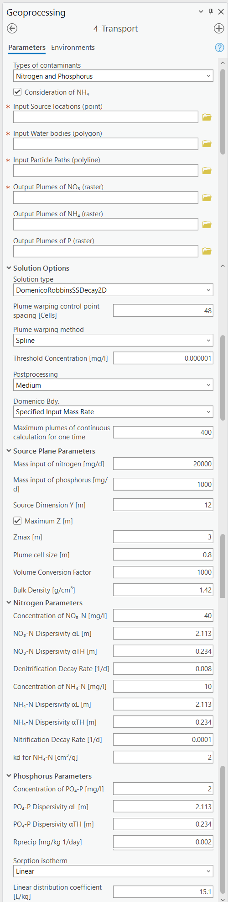

.. _transport:
.. role:: raw-html(raw)
   :format: html

4-Transport
===========

After generating particle paths and estimating ammonium, nitrate, and 
phosphate concentrations at the water table, the Transport Module 
(Figure 4-1) estimates the plumes of ammonium, nitrate, and phosphate, 
i.e., the spatial distribution of their concentrations, using the 
Domenico solution’s steady state, 2D version. Note that the calculations 
performed by this module are the most computationally demanding out of 
all the modules. If there is insufficient memory or free disk space, 
calculations may fail unexpectedly. If this happens, users need to 
reduce the resolution or conduct the simulation for a sub-area of the 
domain. A common practice is to first split the OSTDS into several 
sub-areas, prepare corresponding OSTDS input files, and then run 
ArcNLET-Py for the input files. There is no need to re-do the flow 
and Particle Tracking Modules because the flow conditions do not 
change between the ArcNLET-Py runs. After the ArcNLET-Py runs, one 
can mosaic together the plumes generated by the runs.

The transport model is based on an analytical solution introduced by 
Domenico and Robbins (1985) for the advection-dispersion equations that 
govern the transport of ammonium, nitrate, and phosphate. This analytical 
solution considers advection along a single dimension and dispersion 
along one, two, or three dimensions. Additionally, it assumes homogenous 
flow fields and homogeneous aquifer transport properties. The advantage 
of using an analytical solution is that the concentration of contaminants 
can be determined anywhere, anytime, without having to solve any 
differential equations numerically. For more advanced solute transport 
modeling with complicated hydrogeological conditions (e.g., heterogeneous 
aquifer transport properties), one should use more sophisticated 
software and/or computer codes such as MT3DMS.

The Domenico solution used in this Python Toolbox is a two-dimensional, 
steady-state with first-order decay (first-order decay is used to simulate 
denitrification (Domenico, 1987)). This formulation produces a two-dimensional 
plume later converted to a pseudo-3D form by extending the 2D solution in 
the vertical dimension. Using a pseudo-3D form avoids the large memory 
requirements of calculating the complete 3D solution formulated by 
Domenico and Robbins (1985). The shape of each plume depends on the groundwater 
flow field near the NO\ :sub:`3`, NH\ :sub:`4`, or PO\ :sub:`4` source, as 
determined by the Groundwater Flow Module. Since the analytical solution 
requires uniform flow to deal with heterogeneity in the flow magnitude, 
the harmonic mean averaged along the flow path is used. This average value 
is used in evaluating the analytical solution. Heterogeneous porosity is 
handled by averaging the porosity along the path using the arithmetic mean. 
Heterogeneous decay coefficients and dispersivities are handled using a 
constant value for each plume, with the possibility of the values varying 
from plume to plume. The values of the decay coefficient and dispersivities 
should be representative of the plume. Each plume is individually warped to 
conform to a flow path, using a first- or second-order transformation or 
a thin-plate spline transformation to handle curved paths.

For phosphate transport, the module supports both linear and Langmuir 
adsorption models to account for sorption processes. The 
**linear distribution coefficient** (\(K_d\)) is used for the linear isotherm, 
representing a constant ratio between the adsorbed and dissolved phosphate 
concentrations. The **Langmuir adsorption model** includes the Langmuir 
coefficient and the maximum sorption capacity, which describe the affinity 
of phosphate for adsorption sites and the maximum amount of phosphate that 
can be adsorbed onto the soil surface, respectively. These models allow for 
a more accurate representation of phosphate transport, considering both 
reversible adsorption processes and surface saturation effects.

Note that the Domenico solution is for a single species 
(i.e., ammonium, nitrate, or phosphate). Zhu et al. (2016) expanded the solution 
for both ammonium and nitrate with the transformation introduced by 
Sun et al. (1999). The current version of ArcNLET-Py is based on the work of 
Zhu et al. (2016).

The outputs of the Transport Module are a raster, representing the combined 
concentration distribution of all OSTDS, and an auxiliary point shapefile that 
stores associated plume information (e.g., transport simulation parameters, 
calculated mass inputs, etc.) for each OSTDS. Lastly, the plume info shapefile 
output from the Transport Module is used in the functionality of the 
Load Estimation Module to determine load from OSTDS to surficial water bodies.

   
   Figure 4-1: The Transport Module.

Input Layers
------------

-  **Types of Contaminants:** This option allows users to select the type 
   of contaminants to be modeled in the transport simulation. The three 
   available options are as follows.

   a.  **Nitrogen:** This selection enables the modeling of nitrogen species, 
       specifically ammonium (NH\ :sub:`4`\ :sup:`+`) and nitrate 
       (NO\ :sub:`3`\ :sup:`-`). When this option is selected, input fields 
       related to nitrogen transformation processes, such as nitrification 
       and denitrification, become available.

   b.  **Phosphorus:** This selection focuses on the transport of phosphorus in 
       the form of phosphate (PO\ :sub:`4`\ :sup:`3-`). Input fields related to 
       phosphorus adsorption processes, including options for linear and Langmuir 
       sorption isotherms, are revealed to provide detailed modeling of phosphorus 
       behavior in the subsurface.

   c.  **Nitrogen and Phosphorus:** This option enables the simultaneous modeling 
       of both nitrogen (ammonium and nitrate) and phosphorus (phosphate) species. 
       It activates input fields for nitrogen transformation processes and 
       phosphorus adsorption, allowing for a comprehensive assessment of nutrient 
       transport and interaction within the study area.

-  :raw-html:`<strong>Consideration of NH4-N:</strong>` This option allows for estimating the
   load of ammonium (NH\ :sub:`4`\ :sup:`+`) to surface water bodies. By 
   default, this option is unchecked. Utilizing this option increases 
   computation time. There are several input fields revealed when 
   considering NH\ :sub:`4`\ :sup:`+`.

-  **Input Source locations (point):** This layer specifies the areas of
   the contaminant sources. This point feature class may optionally
   contain several numeric (FLOAT) fields in its attribute table that
   allow for the specification of transport parameters on a
   source-by-source basis. The fields that are permitted are described
   in Table 4‑1.

-  **Input Water bodies (polygon):** Specifies the locations of water
   bodies. It is the same input used in the Particle Tracking
   Module.

-  **Input Particle Paths (polyline):** The particle paths
   correspond with the **Source locations** and are the output file of the
   Particle Tracking Module. The Transport Module uses this file to
   calculate the average velocity (harmonic mean) and porosity (arithmetic
   mean) along each flow path. These values are then used for the
   calculation of each plume.

.. raw:: html

   

      Table 4‑1: Optional parameters in the attribute table of the source locations file.
   

+--------------+-----------------------------------+-------------------+
| **Field      | **Description**                   | **Corresponding   |
| Name**       |                                   | Parameter**       |
+==============+===================================+===================+
| C_NH4-N      | The initial concentration of the  | C0                |
|              | source plane for                  | [M/l\ :sup:`3`]   |
|              | ammonium-nitrogen.                |                   |
+--------------+-----------------------------------+-------------------+
| C_NO3-N      | The initial concentration of the  | C0                |
|              | source plane for                  | [M/l\ :sup:`3`]   |
|              | nitrate-nitrogen.                 |                   |
+--------------+-----------------------------------+-------------------+
| C_PO4-P      | The initial concentration of the  | C0                |
|              | source plane for                  | [M/l\ :sup:`3`]   |
|              | phosphate-phosphorus.             |                   |
+--------------+-----------------------------------+-------------------+

The field names must be labeled as shown in the table and be of the
FLOAT type. If one wants to use constant concentrations of ammonium, 
nitrate, and/or phosphate for all OSTDS, he/she can input the concentration 
values in the **Parameters** section.

Options and Parameters
----------------------

-  **Solution type:** The form of the Domenico solution to use. The
   available options are:

   a. **DomenicoRobbinsSS2D:** The two-dimensional, steady-state Domenico
      solution without decay (i.e., denitrification). This is a legacy method,
      and it is retained for understanding the impact of denitrification. This
      solution should not be used for OSTDS modeling because denitrification
      is always expected to occur.

   b. **DomenicoRobbinsSSDecay2D:** The two-dimensional, steady-state 
      Domenico solution with decay. This solution should always be used.

-  **Plume warping control point spacing [Cells]:** This parameter is used
   to warp the plume to specific flow paths. It specifies the number of
   cells along the plume centerline (starting from the OSTDS location)
   separating the control points for warping. The control point spacing,
   plume length, and the plume cell size determine the number of control
   points. TakingFigure 4-1 as an example, the parameter value of 48
   means that a control point is set for every 48 cells along the plume
   centerline. The warping **Method** includes three options: spline,
   first-order polynomial (also called affine transformation), and
   second-order polynomial. The default method is the second-order
   polynomial transformation.

   a. A smaller **Plume warping control point spacing** yields a more
      accurate warp at the expense of a longer computation time. The
      computation time depends on the **Method** used for warping.
      Setting the **Plume warping control point spacing** too small may
      increase computation time or cause the warp to fail if the flow
      path is nearly straight. Setting this value too large is not
      problematic since the software automatically ensures sufficient
      control points are available for warping. If the algorithm cannot
      generate a sufficient number of points (likely because the plume
      is too short or has a cell size that is too large), then the warp
      fails. The default value (48 cells) should be acceptable for most
      applications. For example, if the spacing is set to 48 cells,
      control points are spaced 48 raster cells apart. If it is
      impossible to place the required number of control points (i.e.,
      due to a short plume), the program adjusts this number to an
      appropriate value. If, after adjusting spacing, the requirements
      for the number of points cannot be met, the warp fails, and the
      plume is discarded. If many plumes are discarded for this reason,
      a possible solution is to increase the plume resolution (i.e.,
      decrease the **Plume Cell Size** value).

-  **Plume warping methods:** The warping algorithm to use. More details
   of the wrapping methods can be found on the Esri website at
   https://pro.arcgis.com/en/pro-app/latest/tool-reference/data-management/warp.htm.
   ArcNLET-Py has the following three options:

   a. **Spline:** This option is for the thin-plate spline
      transformation. This method has the best overall result regarding
      computational time and numerical accuracy.

   b. **Polynomial2:** This selection is for the second-order polynomial
      transformation. This transformation can be used in exceptional
      cases where the flow paths are simple and are generally
      arc-shaped. This transformation is the default, as it yields
      slightly more accurate results than the Spline method does.

   c. **Polynomial1**: This selection is for the first-order polynomial
      (affine) transformation. This transformation should only be used
      for troubleshooting or when the flow path is straight.

-  :raw-html:`<strong>Threshold Concentration [M/L3]:</strong>` By default, the threshold value
   is set to 10-6 for ammonium and nitrate concentrations. If a
   concentration in a cell is smaller than the threshold value, it is
   not used for the plume calculation. This value can speed up
   computation and reduce memory requirements by discarding portions of
   the plume below the threshold value. Setting this value too low may
   increase resource utilization beyond the capabilities of the machine
   running the model. Setting this value too high may result in
   discarding significant portions of the plume, resulting in large mass
   balance errors. The units of the threshold value are the same as
   those of NH4_conc and NO3_conc. For example, if the units of NO3_conc
   are in mg/L, then the default of 1E-6 mg/l should be sufficient for
   most applications. If the concentration units are not in mg/L, this
   value should be changed to the equivalent value in the correct units.

-  **Post-processing**: This setting controls how plumes intersecting
   water bodies are handled:

   a. **None:** When the plumes reach a water body, the plume terminates
      with a straight line perpendicular to the flow direction. This
      option is for troubleshooting or when the other methods are too
      slow.

   b. **Medium:** Plumes are all post-processed as a single raster.
      Plumes that reach a water body are terminated with a shape that
      conforms to the shape of the water body boundary. This option
      works in cases where the configuration of the water bodies is
      simple (e.g., a single large water body). This setting is the
      default selection.

   c. **Full:** Plumes are processed individually. This option is the
      slowest of the three and, depending on the number of plumes, is
      significantly slower than the **Medium** option. **Medium** and
      **Full** produce the same result when only a single plume exists.
      In cases where plumes appear to cross small creeks, ditches, or
      other complicated water body configurations, this option or the
      **None** option should be used.

-  **Domenico Boundary:** A mass balance calculation requiring either
   specifying or estimating the inflow mass rate from an OSTDS. When the
   inflow mass rate is specified, ArcNLET-Py needs to estimate the
   height (called Z) of a source plane associated with an OSTDS. If the
   Z value is specified, ArcNLET estimates the inflow mass rate.
   Although a 2D version of the Domenico solution is used, the Z value
   is required since it converts the 2D solution into a pseudo-3D form
   by extending the 2D solution vertically downwards. There are two
   options for this variable:

   a. **Specified Input Mass Rate:** Setting the **Domenico Boundary**
      to this option enables the **Mass input [M/T]**. The value of the
      **Mass input** (**M\ in)** parameter represents a known input mass
      rate, in units of mass per time, from the constant concentration
      source plane. The mass unit must be the same as that of :raw-html:`<strong>NO3-N Concentration</strong>` (C0), and/or the :raw-html:`<strong>PO4 Concentration</strong>` (C0),
      The time units must be the same as the time units of the groundwater 
      flow velocity magnitude. A 20,000 mg/day value per OSTDS is a 
      reasonable starting point. Using a specified mass inflow rate 
      requires estimating the Z value, and the option for a 
      **Maximum Z [L]** value, which limits the value of Z, is enabled. 
      In extreme situations, an unreasonably large Z value may be estimated 
      based on the specified input mass rate. The **Z max [L]** value 
      is the maximum Z value of the Domenico source plane that limits 
      the value of Z, and the default is 3 meters. Note that the value 
      for **Source Dimension Z [L]** is automatically estimated when using 
      the **Specified Input Mass Rate** option.

   b. **Specified Z:** Setting the **Domenico Boundary** parameter to
      this option enables the **Source Dimension Z [L]** allocation. The
      mass units of **M\ in** are automatically calculated. The Z value
      is based on the measured plume’s thickness.

-  **Source Plane Parameters:** The user can determine which option to use 
   based on available information. For example, if only the inflow mass 
   rate is available from a report, the first option should be used. If a 
   reasonable Z value is available, the second option should be used.

   -  **Source Dimension Y (m)** and **Source Dimension Z (m):** The 
      dimensions are in map units and should be the same as the DEM unit. 
      The source plane represents the **Source Dimension Y [L]** (Y) 
      and **Source Dimension Z [L]** (Z). The Y\ **-**\ value is estimated 
      by measuring the width of the drainfield in the direction 
      perpendicular to groundwater flow. The default values are 
      **Source Dimension Y [L]** is 6 meters, and **Source Dimension Z** 
      is 1.5 meters. The value of Z should not typically exceed 3 meters. 
      These values are in units of meters and should be changed if the 
      map units are not meters. The units of Y and Z must have the same 
      units for length as the groundwater flow velocity magnitude. 
      If the **Domenico Boundary** parameter is set to **Specified Input Mass Rate**, 
      the **Source Dimension Z** value is calculated automatically. 
      If the **Domenico Boundary** parameter is set to **Specified Z**, 
      then the **Mass Input** value is calculated automatically.

   -  **Plume cell size [L]**: The grid resolution in map units over which
      the Domenico solution is evaluated. Smaller values yield
      higher-resolution plumes at the expense of increased computation time
      and memory usage. An out-of-memory or other error likely occurs if
      the cell size is too small when there are many plumes. The cell size
      should be between 5 and 30 times smaller than the source width to
      represent the plume. By default, the cell size is set to a value 15
      times smaller than the value of **Source Dimension Y**. This value
      can be set higher to speed up calculations. The plume resolution can
      differ from the DEM and generally should be smaller. Likewise, the
      resolution of the plumes should be smaller than the resolution used
      in particle tracking, rendering the model execution more flexible.
      The units of this parameter must have the same length units as the
      groundwater flow velocity magnitude. Although a general guideline is
      provided for reasonable values of this parameter, the smaller the
      **Plume cell size**, the more accurate the solution.

   -  **Volume Conversion Factor:** This factor converts volumes calculated
      from the units of length to the volume units used for concentration.
      For example, if the value of NO3_conc was specified using the unit of
      mg/L, and the length units (units of the cell size, source
      dimensions, dispersivities, and length portion of the groundwater
      flow velocity magnitude units) are in meters, the conversion factor
      is 1,000 since 1,000 liters equals one cubic meter. The correct
      conversion factor is CRITICAL to calculate the nitrate load
      correctly.

-  :raw-html:`<strong>Bulk Density [M/L3]:</strong>` The bulk density of the soil. By default,
      this value is 1.42 g/cm\ :sup:`3`.

-  **Nitrogen Parameters:**

   a.  :raw-html:`<strong>NO3-N Concentration [M/L3]:</strong>` The concentration of the source
      plane. Its range is between 0 and 80 mg/L, and the default is 40
      units (e.g., mg/L). If there are data in the :raw-html:`<strong>Input Source locations
      (point)</strong>` (i.e., the exported shapefile from VZMOD) in the No3_conc
      field, then the :raw-html:`<strong>NO3-N Concentrations [M/L3]</strong>` input field is
      removed from the Geoprocessing Pane, and the values in the :raw-html:`<strong>Input
      Source locations (point)</strong>` attribute table are used.

   b. :raw-html:`<strong>NH4-N Concentration [M/L3]:</strong>` The NH:raw-html:`4` concentration
      of the source plane. If the input source locations (shapefile)
      contain a column named nh4_conc, then the value in the input file
      is used. This field allows users to enter different initial
      concentrations for different OSTDS. If not, the input value here
      is the initial value for all OSTDS. By default, the value is 10
      mg/L. If there are data in the :raw-html:`<strong>Input Source locations (point)</strong>`
      (i.e., the exported shapefile from VZMOD) in the nh4_conc field,
      then the :raw-html:`<strong>NH4-N Concentrations [M/L3]</strong>` input field is removed
      from the Geoprocessing Pane, and the values in the :raw-html:`<strong>Input Source
      locations (point)</strong>` attribute table are used.

-  **Dispersivities:** These approximate values for a given soil type's
   horizontal and longitudinal dispersivities may be obtained from the
   literature (e.g., Freeze and Cherry, 1979). The defaults are based on
   a model by USGS scientists of the Naval Air Station in Jacksonville.
   This number should be changed accordingly if the map units are not
   meters. This parameter has two settings:

   a. :raw-html:`<strong>NO3 Dispersivity αL [L]:</strong>` This is for the longitudinal
      dispersivity of :raw-html:`NO3`. The default is 2.113 m/day.

   b. :raw-html:`<strong>NO3 Dispersivity αTH [L]:</strong>` This parameter represents the
      horizontal dispersivity of :raw-html:`NO3`. The default value is
      0.234 meters.

   c. :raw-html:`<strong>NH4-N Dispersivity αL [L]:</strong>` This is the longitudinal
      dispersivity for :raw-html:`NH4+`. By default, the value is
      2.113 meters.

   d. :raw-html:`<strong>NH4-N Dispersivity αTH [L]:</strong>` This is the horizontal
      transverse dispersivity of :raw-html:`NH4+`. By default, the
      value is set to 0.234 meters.

   e. :raw-html:`<strong>kd for NH4-N cm3/g:</strong>` AKA the 
      :raw-html:`<strong>Adsorption coefficient [L3/M]:</strong>` The measure of how much
      :raw-html:`NH4+` is adsorbed by the soil at a given temperature
      and pH. By default, this value is set to 2 g/:raw-html:`cm3`.

-  **Denitrification Decay Rate [1/T]:** This represents the first-order
   decay constant. This constant controls the amount of nitrate loss due
   to denitrification. An approximate value may be obtained from the
   literature (e.g., McCray, 2005). The default value is 0.008
   day\ :sup:`-1`.

-  **Nitrification Decay Rate [1/T]:** This is the first-order decay
   constant for NH\ :sub:`4`\ :sup:`+`. This constant controls the
   amount of ammonium loss due to nitrification. By default, the value
   is 0.0001 day-1.

-  **Phosphorus Parameters:** These parameters allow for modeling 
   of phosphate transport in the subsurface environment, considering both 
   its movement and interactions with soil particles. Accurate specification 
   of these parameters helps in simulating the behavior of phosphate, 
   ensuring a realistic assessment of its potential impact on groundwater 
   quality and the surrounding ecosystem.

   a. :raw-html:`<strong>Concentration of PO4-P [mg/l]:</strong>` The initial concentration 
      of phosphate-phosphorus in the source plane.

   b. :raw-html:`<strong>PO4-P Dispersivity αL [m]:</strong>` Longitudinal dispersivity for 
      phosphate-phosphorus. The default is 2.113 meters.

   c. :raw-html:`<strong>PO4-P Dispersivity αTH [m]:</strong>` Horizontal transverse dispersivity 
      for phosphate-phosphorus. The default value is 0.234 meters.

   d. :raw-html:`<strong>Rprecip [mg/kg1/day]:</strong>` Represents the rate of precipitation for phosphate. 
      The default value is 0.002 mg/kg/day.

-  **Sorption isotherm:** The sorption isotherm defines how phosphate interacts 
   with soil particles, either through a linear relationship or via Langmuir adsorption, 
   which accounts for both the affinity of phosphate to soil and the maximum capacity 
   of soil to adsorb phosphate.

   **Linear:** The linear option assumes a constant, proportional relationship between 
   phosphate concentration and soil adsorption.

   - **Linear distribution coefficient [L/kg]:** Represents the linear relationship 
     between adsorbed phosphate and its concentration in the solution. The default 
     value is 15.1 L/kg.

   **Langmuir:** The Langmuir option models phosphate adsorption with a fixed maximum 
   capacity and varying affinity.

   - **Langmuir coefficient [L/mg]:** Indicates the affinity of phosphate for adsorption 
     sites. The default value is 0.2 L/mg.

   - **Maximum sorption capacity [mg P/kg]:** The total amount of phosphate that can be 
     adsorbed onto the soil surface at saturation. The default value is 237 mg P/kg.

Outputs
-------

The raster output(s) contain the concentration distribution of the
calculated plumes. An additional file, the “\_info” shapefile, is saved
in the disk location as the plume’s raster, with the same name and
having the “\_info” suffix. The “\_info” file contains points
corresponding to each source location. Each point has attributes that
describe the plume corresponding to that location (i.e., the parameters
used to calculate the plume, the warping, and post-processing methods,
to name a few). Since the Load Estimation Module uses some of this
information, the values in the attribute table should not be modified
manually. For reference purposes, the field descriptions of the “\_info”
file are given in Table 4‑2. In the table, the Load Estimation Module
uses the fields indicated with an asterisk to calculate loads. The
fields not used for calculation are for informational/archival purposes.
They should not be modified as they serve to record the parameters used
for each plume.

Additionally, the presence and consistency of the fields are checked to
ensure the parameters exist in the data. There are two options for plume
outputs. The first option is the default. The second option is enabled
by checking the box for the **Consideration of NH\ :sub:`4`\ -N**. The raster
output options are as follows:  

-  :raw-html:`<strong>Output Plumes of NO3-N (raster):</strong>` This is the name of the output
   raster file of the :raw-html:`<strong>NO3-` concentration plumes. Note
   that the “_info” shapefile has the same file name and location as the
   raster.

-  :raw-html:`<strong>Output Plumes of NH4-N (raster):</strong>` This is the file name and
   location of the optional raster for the :raw-html:`<strong>NH4+` plumes.
   Note that the “_info” shapefile has the same file name and location as
   your raster.

-  **Output Plumes of P (raster):** This is the name of the output raster file
   for phosphate :raw-html(PO\ :sub:`4`\ :sup:`3-`) concentration plumes, showing
   the spatial distribution of phosphorus concentrations. Similar to the other
   outputs, the associated “\_info” shapefile has the same file name and location as
   the raster.

.. raw:: html

   

      Table 4‑2: The field descriptions for the plumes auxiliary file.
   

+-------------------------+--------------------------------------------+
|    **Field Name**       |    **Description**                         |
+=========================+============================================+
| PathID                  | This is the PathID of the flow paths that  |
|                         | generate a particular plume. Values in     |
|                         | this field correspond to values of the     |
|                         | PathID field of Table 2‑1.                 |
+-------------------------+--------------------------------------------+
| Is2D                    | 1 – Indicates the plume is pseudo 3D.      |
|                         |                                            |
|                         | 0 – Indicates the plume is fully 3D (not   |
|                         | currently supported).                      |
+-------------------------+--------------------------------------------+
| domBdy                  | – The source plane has a specified mass    |
|                         | input rate.                                |
|                         |                                            |
|                         | – The source plane has a specified Z       |
|                         | dimension.                                 |
+-------------------------+--------------------------------------------+
| decayCoeff              | The decay coefficient.                     |
+-------------------------+--------------------------------------------+
| avgVel                  | The velocity value. It is obtained by      |
|                         | averaging along the flow path.             |
+-------------------------+--------------------------------------------+
| avgPrsity               | The porosity value. It is obtained by      |
|                         | averaging along the flow path.             |
+-------------------------+--------------------------------------------+
| dispL                   | The longitudinal dispersivity.             |
+-------------------------+--------------------------------------------+
| dispTH                  | The transverse-horizontal dispersivity.    |
+-------------------------+--------------------------------------------+
| dispTV                  | This is for the transverse-vertical        |
|                         | dispersivity that is not currently         |
|                         | supported.                                 |
+-------------------------+--------------------------------------------+
| sourceY                 | The Y source dimension.                    |
+-------------------------+--------------------------------------------+
| sourceZ                 | The Z source dimension.                    |
+-------------------------+--------------------------------------------+
| MeshDX                  | This mesh is the plume cell size in the    |
|                         | x-direction (same as the MeshDY).          |
+-------------------------+--------------------------------------------+
| MeshDY                  | This mesh is the plume cell size in the    |
|                         | y-direction (same as the MeshDX).          |
+-------------------------+--------------------------------------------+
| MeshDZ                  | This mesh is the plume cell size in the    |
|                         | z-direction (same as the sourceZ).         |
+-------------------------+--------------------------------------------+
| plumeTime               | The plume time is the time at which the    |
|                         | plume is calculated. This value is -1 for  |
|                         | steady-state plumes (only steady-state     |
|                         | solutions are supported).                  |
+-------------------------+--------------------------------------------+
| pathTime                | The total time that flow takes from the    |
|                         | start of the flow path to the end.         |
+-------------------------+--------------------------------------------+
| plumeLen                | Plume length represents the length of the  |
|                         | plume in map units.                        |
+-------------------------+--------------------------------------------+
| pathLen                 | The path length is the total length of the |
|                         | flow path.                                 |
+-------------------------+--------------------------------------------+
| plumeVol                | Plume volume is the total volume           |
|                         | calculated by summing the volumes of the   |
|                         | individual plume cells. Each plume cell    |
|                         | has dimensions MeshDX \* MeshDY \* MeshDZ. |
+-------------------------+--------------------------------------------+
| massInRate\*            | The mass input rate of nitrate is from the |
|                         | Domenico constant concentration plane due  |
|                         | to advective and dispersive flow. This     |
|                         | number is calculated based on an           |
|                         | analytical solution.                       |
+-------------------------+--------------------------------------------+
| massDNRate\*            | The nitrate mass removal rate is due to    |
|                         | denitrification. This value is calculated  |
|                         | for each plume cell using the definition   |
|                         | of first-order decay.                      |
+-------------------------+--------------------------------------------+
| srcAngle                | The orientation of the Domenico source     |
|                         | plane is in degrees clockwise from north.  |
+-------------------------+--------------------------------------------+
| Warp                    | This field represents the warping          |
|                         | algorithm utilized.                        |
|                         |                                            |
|                         | 0 – Spline                                 |
|                         |                                            |
|                         | 1 – Polyorder1                             |
|                         |                                            |
|                         | 2 – Polyorder2                             |
+-------------------------+--------------------------------------------+
| PostP                   | The post-processing method.                |
|                         |                                            |
|                         | 0 – None                                   |
|                         |                                            |
|                         | 1 – Medium                                 |
|                         |                                            |
|                         | 2 – Full                                   |
+-------------------------+--------------------------------------------+
| msRtInNMR               | This rate is the mass input rate of        |
|                         | nitrate from the Domenico constant         |
|                         | concentration plane due to advective and   |
|                         | dispersive flow. The method that           |
|                         | calculates this is similar to numerical    |
|                         | modeling software in which the inflow is   |
|                         | calculated on a cell-by-cell basis, given  |
|                         | the size of the source plane, groundwater  |
|                         | flow velocity, and concentration           |
|                         | gradients. The field is for information    |
|                         | purposes, as it is not used in             |
|                         | calculations.                              |
+-------------------------+--------------------------------------------+
| C_NO3                   | The source concentration of                |
|                         | NO\ :sub:`3`-N.                            |
+-------------------------+--------------------------------------------+
| C_NH4                   | The source concentration of NH\ :sub:`4`-N |
+-------------------------+--------------------------------------------+
| C_PO4                   | The source concentration of PO\ :sub:`4`-P |
+-------------------------+--------------------------------------------+
| VolFac                  | The volume conversion factor.              |
+-------------------------+--------------------------------------------+
| nextConc                | It is an approximate value of the          |
|                         | concentration gradient at the source. This |
|                         | value corresponds to the cell              |
|                         | concentration located at x=MeshDX, y=0.    |
+-------------------------+--------------------------------------------+
| threshConc              | The concentration threshold value.         |
+-------------------------+--------------------------------------------+
| WBId_plume\*            | Records the FID of the water body that the |
|                         | plume discharges to. If the plume does not |
|                         | reach a water body, this value is -1.      |
+-------------------------+--------------------------------------------+
| WBId_path\*             | Records the FID of the water body that the |
|                         | flow path reaches. If the flow path does   |
|                         | not reach a water body, this value is -1.  |
+-------------------------+--------------------------------------------+

Troubleshooting
---------------

Table 4‑3 lists possible issues encountered during model execution,
probable causes, and possible solutions. Note that the error messages
may appear for reasons other than those listed. If you cannot find a
solution to the issue, then please submit a [New issue] in the
ArcNLET-Py GitHub repository (`Issues · ArcNLET-Py/ArcNLET-Py ·
GitHub <https://github.com/ArcNLET-Py/ArcNLET-Py/issues>`__) as
described in the GitHub instructions at `Creating an issue - GitHub
Docs <https://docs.github.com/en/issues/tracking-your-work-with-issues/creating-an-issue>`__.

.. raw:: html

   

      Table 4‑3: The Transport Module troubleshooting guide.
   

+---------------------+-----------------------+-----------------------+
|    **Error**        |    **Cause**          |    **Solution**       |
+=====================+=======================+=======================+
| Depending on the    | The system has        | Free up memory by     |
| choice of           | insufficient memory   | closing other         |
| parameters, plume   | or disk space.        | programs.             |
| calculation may     |                       |                       |
| fail if there are   |                       | Split up the input    |
| many sources.       |                       | file (paths or        |
|                     |                       | sources) into         |
|                     |                       | multiple parts        |
|                     |                       | (either split up the  |
|                     |                       | point sources or the  |
|                     |                       | particle paths).      |
+---------------------+-----------------------+-----------------------+
| Junk is output in   | Warping may succeed   | Try a different       |
| the plume’s raster  | in specific           | warping method or     |
| after warping.      | configurations of the | different control     |
|                     | warping control       | point spacing.        |
|                     | points (e.g., when    |                       |
|                     | many points fall on a |                       |
|                     | path that is almost a |                       |
|                     | straight line), but   |                       |
|                     | the plume raster      |                       |
|                     | consists of garbled   |                       |
|                     | data.                 |                       |
+---------------------+-----------------------+-----------------------+
| Some plumes are not | Warping fails due to  | Decrease the value of |
| calculated.         | insufficient control  | the Plume cell size   |
|                     | points if the plume   | parameter.            |
|                     | is too short.         |                       |
|                     |                       | Move the OSTDS point  |
|                     | The OSTDS point may   | outside or modify the |
|                     | be inside a water     | water body boundary   |
|                     | body.                 | if appropriate.       |
|                     |                       |                       |
|                     |                       | If a plume is not     |
|                     |                       | calculated for any    |
|                     |                       | reason, the input     |
|                     |                       | load to the system    |
|                     |                       | due to that source is |
|                     |                       | ignored.              |
+---------------------+-----------------------+-----------------------+
