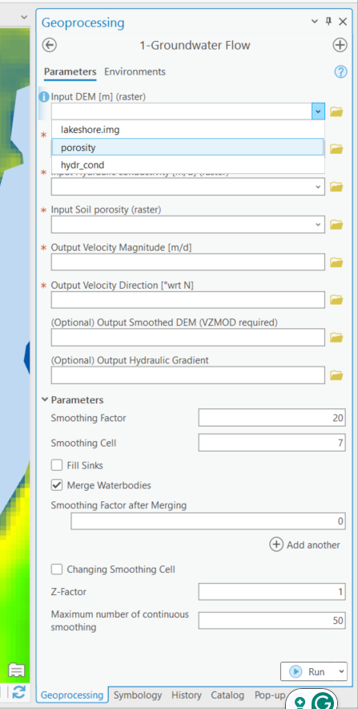
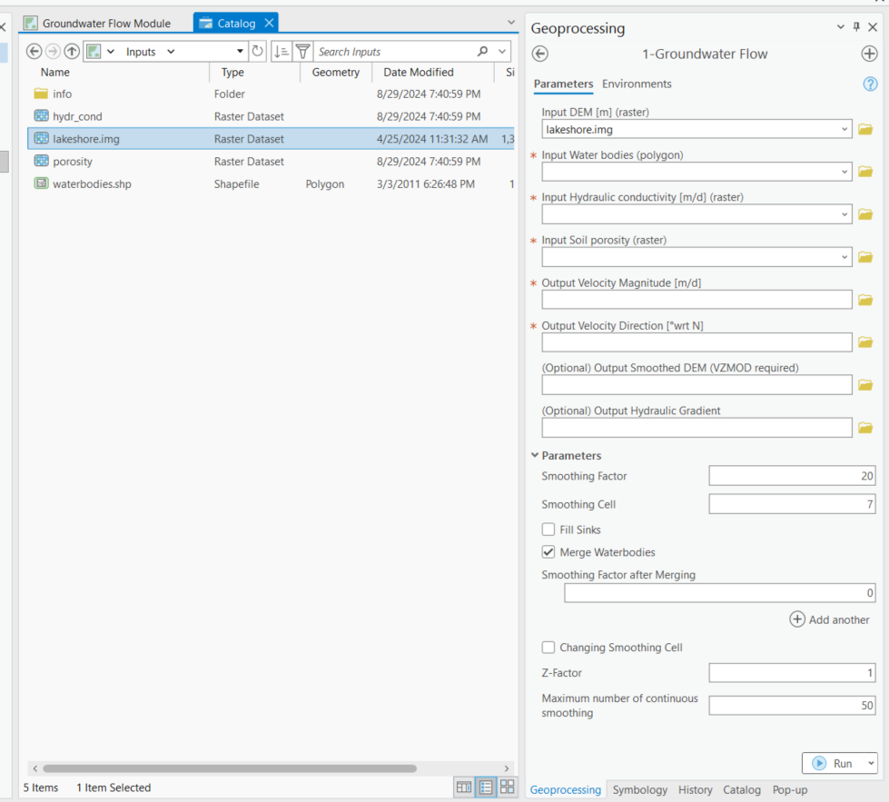
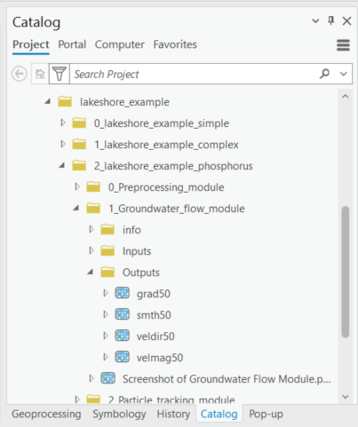

.. _usinggroundwaterflow:

Using the Groundwater Flow Module
=================================

The Groundwater Flow Module simulates groundwater flow velocity, which
is magnitude- and direction-velocity, using a digital representation of
the earth’s surface and soil porosity.

Data Inputs
-----------

1. Double-click the [1 Groundwater Flow] module, and the groundwater
   flow Python toolset opens in the [Geoprocessing Pane], as shown in
   Figure 5‑19.

   a. Take a moment to review the data inputs, outputs, and parameters.
      Please remember that data inputs and outputs marked with a red
      asterisk [\*] are required for the geoprocessing operation.

.. raw:: html

   <!-- -->

2. Click the drop-down arrow next to [Parameters] to expose the options.

   Data inputs:

   a. Input the digital elevation model (DEM) surface elevation map [L]       (raster).

      i. Lakeshore Example input DEM raster: [lakeshore.img]

   b. Input the water bodies (polygon).

      i. Lakeshore Example input water body polygons: [water bodies.shp]

   c. Input the hydraulic conductivity [L/T] (raster).

      i. Lakeshore Example input raster: [hydr_cond.img]

   d. Input the soil porosity (raster).

      i. Lakeshore Example input raster: [porosity.img]

   Figure 5‑19: The Groundwater Flow Module in the Geoprocessing Pane.

There are several options for selecting data for a geoprocessing tool in
ArcGIS Pro. If you are unfamiliar with ArcGIS Pro geoprocessing tools,
please use the following URL to learn how to use geoprocessing tools.
URL:
https://pro.arcgis.com/en/pro-app/latest/help/analysis/geoprocessing/basics/run-geoprocessing-tools.htm

3. Use the [Map] (Figure 5‑20), [Catalog View], [Catalog Pane], or [Folder Icon] to select the necessary data inputs.

   a. If you have the data from the Lakeshore example in a [Map] in your
      ArcGIS Pro Project file and the [Geoprocessing Pane] open, you can drag
      and drop the necessary inputs or select the files from the drop-down
      menu for each of the input fields.
   b. The input raster images are automatically styled with a black-and-white
      contrast stretch. ArcGIS Pro assigns two stretch types based on whether
      your raster dataset has one value or many values. The stretch type
      [Standard Deviation] is for raster datasets with many values, and the
      stretch type [None] is for datasets with only one value.
   c. Please note that the symbology for the Lakeshore Example data inputs
      and outputs have been changed from the ArcGIS Pro automatic default
      symbology for aesthetic purposes.

   Figure 5‑20: Selecting Groundwater Flow Module inputs in the Map View.

4. If you have the data from the lakeshore example open in a [Catalog Pane] or [Catalog View] (Figure 5‑21) and the [Geoprocessing Pane] open, then you can drag and drop the necessary inputs.

   Figure 5‑21: Selecting Groundwater Flow Module inputs by dragging and dropping from the Catalog View.

5. You can also click the [Folder Icon] next to each field to select the
   data inputs using the Windows File Explorer. To use this method, you
   must use the Windows File Explorer to navigate to the
   […\\lakeshore_example\\lakeshore_example] folder to select each data
   input and click [OK], as shown in Figure 5‑22

   Figure 5‑22: Selecting Groundwater Flow Module inputs from the Windows File Explorer.

Data Outputs and Parameters
---------------------------

Storing your files in an organized and appropriately named manner is
good practice when selecting locations for data outputs. For this
exercise, use the [Windows File Explorer] or ArcGIS Pro [Catalog Pane]
to create a new folder titled [LakeshoreExampleOutputs_YYYY_MM_DD] to
store the raster images and vector shapefiles. For this example, the
folder name is [LakeshoreExampleOutputs_2023_09_28].

1. To create a new file folder in ArcGIS Pro, use the [Catalog Pane],
   right-click on the folder […\\lakeshore_example\\lakeshore_example],
   hover over the option [New] in the submenu, and click [Folder]
   (Figure 5‑23).

   Figure 5‑23: Creating a new file folder in the ArcGIS Pro Catalog Pane.

2. Select the necessary data outputs by clicking the [Folder Icon] next
   to each field in the [Geoprocessing Pane] for each data output.

3. The Windows File Explorer opens, and in the left pane under
   [Project], click the drop-down arrows to expand the [Folders] and
   [ArcGIS Pro] home folder.

4. Select the [lakeshore_example\\lakeshore-example] folders.

5. Click the output folder, created in step 2 above, to store the output
   raster images from the Groundwater Flow Module.

   a. The file path and name for the [Output Velocity Magnitude [L/T] (raster)] for this example is: 
      […\\lakeshore_example\\lakeshore_example\\LakeshoreExampleOutputs_2023_09_28\\demo_vel_mag]

6. Type the name of the raster data output into the [Name] field with no
   file extension and click [OK].

   a. The ArcNLET-Py ArcGIS Pro Python toolset automatically assigns the
      correct file types, and if you enter a file type, a warning is
      triggered.

7. Then, move to the subsequent output raster in the [Geoprocessing Pane].

   a. Please note that you must use the [Folder Icon] to select the
      output folder location and the Windows File Explorer to name each
      output.

8. Data outputs:

    a. The output velocity magnitude [L/T].

       i. Lakeshore Example output raster: [demo_vel_mag]

    b. The output velocity direction is in degrees from north [°wrt N].

       i. Lakeshore Example output raster: [demo_vel_dir]

    c. The optional output hydraulic gradient.

       i. Lakeshore Example output raster: [demo_grad]

    d. The optional output smoothed DEM.

       i. Lakeshore Example output raster: [demo_smth_dem]

          1. Please note that when typing the data outputs into the
             provided field in the [Geoprocessing Pane], the outputs are
             automatically stored in the folder with the [Input DEM
             surface elevation map [L] (raster)] or the home default
             folder the ArcGIS Pro Project file.

9. The Parameters are related to model validation and verification. For
   the Lakeshore Example, the Smoothing Factor is set to [50], and the
   rest of the parameters are set to the default values.

    a. Smoothing Factor

       i. You must change the value to [50]

          1. Please note that when calibrating ArcNLET-Py, you may label
             the Groundwater Flow Module outputs with the smoothing
             factor number after the file name to track changes in your
             groundwater shape. For example, the output velocity
             magnitude and velocity direction can be labeled [mag50] and
             [dir50].

    b. Smoothing Cell

       i. Default value: [7]

    c. Fill Sinks

       i. Default option: [Unchecked Box]

    d. Merge Water bodies

       i. Default option: [Unchecked Box]

    e. Z-factor

       i. Default value: [1]

.. figure:: ./media/usinggroundwaterflowMedia/media/image6.png
   :align: center
   :alt: A screenshot of a computer Description automatically generated
   :width: 6.5in
   :height: 4.33681in

   Figure 5‑24: Selecting the data output location from the Windows File Explorer for the Groundwater Flow Module.

10. Double-check to ensure all red astricts [\*] are removed from the
    [Geoprocessing Pane], indicating that all necessary data inputs and
    outputs have the correct file type and are accessible.

   Figure 5‑25: The Groundwater Flow Module data inputs and outputs in the Geoprocessing Pane.

Executing the Module
--------------------

1. Once satisfied with the data input and output selections, click [Run]
   in the [Geoprocessing Pane].

.. figure:: ./media/usinggroundwaterflowMedia/media/image8.png
   :align: center
   :alt: A screenshot of a computer Description automatically generated
   :width: 4in
   :height: 0.82031in

   Figure 5‑26: The Run button in the Geoprocessing Pane.

2. The ArcNLET-Py Groundwater Flow Module begins to process data, and
   the progress bar appears. The runtime can vary depending on the data
   sets’ file sizes, spatial scale, and raster cell size.

   Figure 5‑27: The progress bar in the ArcGIS Pro Geoprocessing Pane for the Groundwater Flow Module.

3. ArcGIS Pro indicates the tool is finished with a green notification
   box at the bottom of the [Geoprocessing Pane]. You may click [View
   Details] for more information about the process, including data
   inputs and outputs, start and end times and dates, and a success or
   failure message.

   Figure 5‑28: The green notification box in the ArcGIS Pro Geoprocessing Pane for the Groundwater Flow Module.

View and Verify Results
-----------------------

If you have your data inputs in an open [Map] in ArcGIS Pro, the data
outputs are automatically added to the [Contents Pane] and the [Map]
view. Alternatively, if you do not have your input data in a [Map], nor
do you have a [Map View] open in your ArcGIS Pro Project, and you run
the ArcNLET-Py Groundwater Flow Module from the [Geoprocessing Pane].
Your results are accessible via the [Catalog Pane] or [Catalog View] in
the output folder created in Section 3.3

   Figure 5‑29: The ArcNLET-Py Groundwater Flow Module outputs in the Catalog Pane.

1. Take a moment to review each output to ensure your data has been
   processed correctly. Your data must be processed correctly because
   data outputs from the groundwater flow are used as data inputs in the
   subsequent modules.

   a. The output raster images are automatically styled with a
      black-and-white contrast stretch. ArcGIS Pro assigns two stretch
      types based on whether your raster dataset has one value or many
      values. The stretch type [Standard Deviation] is for raster
      datasets with many values, and the stretch type [None] is for
      datasets with only one value.

      i. Please note that the symbology has been changed from the ArcGIS
         Pro automatic default symbology for aesthetic purposes.

   b. If your raster image outputs have a solid black fill with only
      null or no-data values, then this is an indicator that there might
      have been an error processing the data inputs. Please ensure all
      your data inputs are correct, in an accessible file folder, and
      are uncorrupted.

2. If you continue having issues processing your data, please [View
    Details] as mentioned in Section 5.6.3 to see if empty datasets were
    created as outputs. Empty datasets indicate an issue with the input
    data, an error in the file names, or ArcGIS Pro not having
    read/write access to input or output file locations.

    a. If you cannot find a solution to the issue, then please submit a [New
       issue] in the ArcNLET-Py GitHub repository (`Issues ·
       ArcNLET-Py/ArcNLET-Py ·
       GitHub <https://github.com/ArcNLET-Py/ArcNLET-Py/issues>`__) as
       described in the GitHub instructions at `Creating an issue - GitHub
       Docs <https://docs.github.com/en/issues/tracking-your-work-with-issues/creating-an-issue>`__.

   Figure 5‑30: The ArcNLET-Py Groundwater Flow Module outputs in the Contents Pane and Map.
