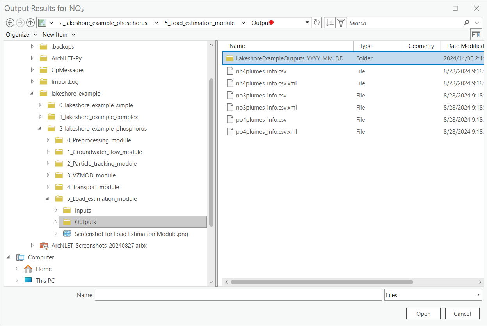
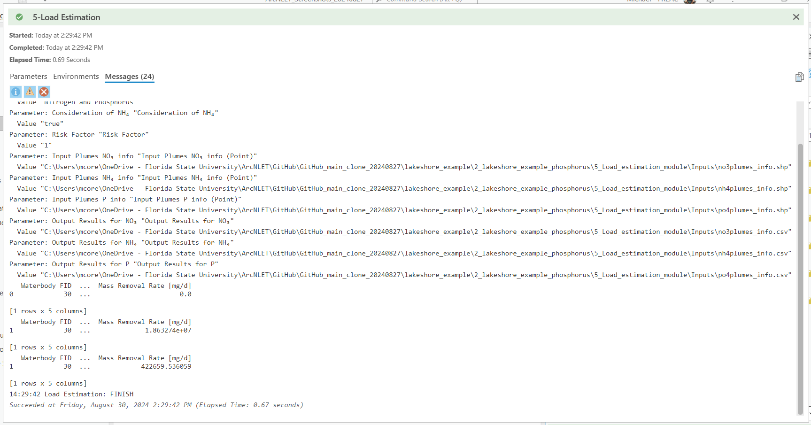

.. _usingloadestimation:
.. role:: raw-html(raw)
   :format: html

Using the Load Estimation Module
================================

The Load Estimation Module uses the Transport Module output to simulate
the mass input load of ammonium and nitrate entering the surface water
body. As a reminder, the Transport Module outputs include the mass
concentration of each plume for each OSTDS. The Load Estimation Module
also simulates the mass of ammonium and nitrate removed by
denitrification from the plumes originating from the OSTDS. Furthermore,
the module has a mass output load estimation for each water body feature
and for plumes that do not intersect a water body feature for a given
time period.

Data Inputs
-----------

1. Once you are satisfied with the Transport Module's data outputs, it
   is time to move on to the Load Estimation Module. Access the
   [ArcNLET.pyt] ArcGIS Python Toolbox and the ArcNLET-Py ArcGIS Pro
   toolsets within, as previosuly described.

   Figure 14-1: The ArcNLET-Py Python Toolset and Load Estimation Module in the Catalog Pane.

2. Double-click the [5 Load Estimation] module, and the load estimation
   Python toolset opens in the [Geoprocessing Pane].

   a. Take a moment to review the data inputs, outputs, and options.
      Please remember that data inputs and outputs marked with a red
      asterisk [*] are required for the geoprocessing operation.

      i.   **Types of Contaminants**

           1. Contaminants to be considered: [Nitrogen and Phosphorus]

      ii.  **Consideration of NH4**

           1. Default option: [Enabled]

      iii. **Risk Factor**

           1. Default value: [1]

      iv.  **Input Plumes NO3 info (Point)**

           1. Transport Module output info vector point: [Input Plumes NO3 info (Point)]

      v.   **Input Plumes NH4 info (Point)**

           1. Specify the input for NH4 plume information if applicable.

      vi.  **Input Plumes P info (Point)**

           1. Specify the input for phosphorus plume information if applicable.

      vii. **Output Results for NO3**

           1. Define the output location for nitrate results.

      viii. **Output Results for NH4**

           1. Define the output location for ammonium results.

      ix.  **Output Results for P**

           1. Define the output location for phosphorus results.

.. figure:: ./media/usingloadestimationMedia/media/image2.png
   :align: center
   :alt: A screenshot of a computer screen Description automatically generated

   Figure 14-2: The Load Estimation Module in the Geoprocessing Pane.

3. There are several options for selecting data for a geoprocessing tool
   in ArcGIS Pro. If you are unfamiliar with ArcGIS Pro geoprocessing
   tools, please use the following URL to learn how to use geoprocessing
   tools. URL:
   https://pro.arcgis.com/en/pro-app/latest/help/analysis/geoprocessing/basics/run-geoprocessing-tools.htm

4. Use the [Map], [Catalog View], [Catalog Pane], or [Folder Icon] to
   select the necessary data inputs.

   a. If you have the data from the Lakeshore example in a [Map] in your
      ArcGIS Pro Project file and the [Geoprocessing Pane] open, you can
      drag and drop the necessary inputs or select the files from the
      drop-down menu for each of the input fields.

   Figure 14-3: Selecting the Load Estimation Module data input in the Map View.

b. If you have the data from the Lakeshore example open in a [Catalog
   Pane] or [Catalog View] and the [Geoprocessing Pane] open, then you
   can drag and drop the necessary inputs.

   Figure 14-4: Selecting the Load Estimation Module input by dragging and dropping from the Catalog View.

c. You can also click the [Folder Icon] next to the field to select the
   data input using the Windows File Explorer. To use this method, you
   must use the Windows File Explorer to navigate to the
   [...\\2_lakeshore_example_phosphorus\\5_Load_estimation_module\\Inputs] folder to
   select the data input and click [OK].

   Figure 14-5: Selecting the Load Estimation Module input from the Windows File Explorer.

Data Outputs and Parameters
---------------------------

1. Storing your files in an organized and appropriately named manner is
   good practice when selecting locations for data outputs. Earlier in
   this exercise, we used the Windows File Explorer or ArcGIS Pro
   [Catalog Pane] to create a new folder titled
   [LakeshoreExampleOutputs_YYYY_MM_DD]. The folder stores the output
   comma-separated values (CSV) data table.

   a. If you need to create a new file folder in ArcGIS Pro, use the
      [Catalog Pane], right-click on the folder
      [...\\2_lakeshore_example_phosphorus\\5_Load_estimation_module\\Outputs], hover over the option
      [New] in the submenu, and click [Folder].

   b. Otherwise, use the default [Output] folder in the [5_Load_estimation_module] directory.

   Figure 14-6: The Lakeshore example output folders in the Windows File Explorer.

2. Select the necessary data output by clicking the [Folder Icon] next
   to the field in the [Geoprocessing Pane] for the data output.

   a. The Windows File Explorer opens, and in the left pane under
      [Project], click the drop-down arrows to expand the [Folders] and
      ArcGIS Pro home folder.

   b. Select the [...\\2_lakeshore_example_phosphorus\\5_Load_estimation_module\\Outputs] folders.

3. Click the [Output] folder, or your custom [...\\2_lakeshore_example_phosphorus\\5_Load_estimation_module\\Outputs] folder that was created above, to store the output CSV files for the Load Estimation Module. The file paths and names for the output results are as follows:

   a. **Output Results for NO3**

      i. Output file path: [...\\2_lakeshore_example_phosphorus\\5_Load_estimation_module\\Outputs\\no3plumes_info.csv]

   b. **Output Results for NH4**

      i. Output file path: [...\\2_lakeshore_example_phosphorus\\5_Load_estimation_module\\Outputs\\nh4plumes_info.csv]

   c. **Output Results for P**

      i. Output file path: [...\\2_lakeshore_example_phosphorus\\5_Load_estimation_module\\Outputs\\po4plumes_info.csv]

4. Type the name of the data output into the [Name] field.

   a. Data output:

      i. **The Output Results NO3 text file.**

         1. Lakeshore Example output text file: [no3plumes_info.csv]

            a. ArcNLET-Py auto-fills the file path and name in the output field based on the [Input Plumes NO3 info (Point)] shapefile.

      ii. **The Output Results NH4 text file.**

         1. Lakeshore Example output text file: [nh4plumes_info.csv]

            a. ArcNLET-Py auto-fills the file path and name in the output field based on the [Input Plumes NH4 info (Point)] shapefile.

      iii. **The Output Results P text file.**

         1. Lakeshore Example output text file: [po4plumes_info.csv]

            a. ArcNLET-Py auto-fills the file path and name in the output field based on the [Input Plumes P info (Point)] shapefile.

   Figure 14-7: Selecting the data output location from the Windows File Explorer for the Load Estimation Module.

5. Double-check to ensure all red astricts [\*] are removed from the
   [Geoprocessing Pane], indicating that all necessary data inputs and
   outputs have the correct file type and are accessible.

   Figure 14-8: The Load Estimation Module data inputs and output in the Geoprocessing Pane.

Executing the Module
--------------------

1. Once satisfied with the data input and output selections, click [Run]
   in the [Geoprocessing Pane].

.. figure:: ./media/usingloadestimationMedia/media/image9.png
   :align: center
   :alt: A white wall with a black border Description automatically generated with medium confidence
   
   Figure 14-9: The Run button in the Geoprocessing Pane.

2. The ArcNLET-Py Load Estimation Module begins to process data, and the
   progress bar appears.

   Figure 14-10: The Progress Bar in the ArcGIS Pro Geoprocessing Pane for the Load Estimation Module.

3. If you feel the process has stalled or frozen, please click [View
   Details] below the blue progress bar. In the dialog box, click
   [Messages], then scroll to the bottom to ensure a load estimation is
   calculated for the plumes entering the water body feature (water body
   feature ID (FID) [30]) and for plumes that do not intersect the water
   body feature (water body feature ID (FID) [-1]). A new message should
   populate the window for each water body feature.

   Figure 14-11: The Messages box showing calculating load estimations for the water body.

4. ArcGIS Pro indicates the tool is finished with a green notification
   box at the bottom of the [Geoprocessing Pane]. You may click [View
   Details] for more information about the process, including data
   inputs and output(s), start and end times and dates, and a success
   or failure message.

   Figure 14-12: The green notification box in the ArcGIS Pro Geoprocessing Pane for the Load Estimation Module.

View and Verify Results
-----------------------

1. The output of the Load Estimation Module is a CSV text file. The text
   file does not automatically appear in the [Contents Pane] and the
   [Map View].

   a. Your results are accessible via the [Catalog Pane] or [Catalog
      View] in the [Output] folder or in your custom [LakeshoreExampleOutputs_YYYY_MM_DD] folder.

   b. Please note that if you did not change the [Output] folder then ArcNLET will automatically choose the same directory that contains the input files as your output directory. 

   
   Figure 14-13: The ArcNLET-Py Transport Module outputs in the Catalog Pane.

   c. If you are unsure of the load estimation output location for the CSV text files, please check the [Parameters] and [Output Results for NO\ :sub:`3`], [Output Results for NH4], and [Output Results for PO4] sections of the geoprocessing tool history entries. The full file paths and names of the output CSV text files are present and clickable.

   Figure 14-14: The history entry for the Load Estimation Module showing the output.

2. Take a moment to review the output to ensure your data has been processed correctly. Your data must be processed correctly because data outputs from the Load Estimation Module are used for decision-making, planning, and ecological stewardship.

   a. Your CSV text file outputs (Table 14-1, Table 14-2, and Table 14-3) have mass per time input/output load and removal rate estimates for all plumes. The ammonium and nitrate plumes that intersect a water body have the feature ID (FID) of the   intersecting water body feature. The water body feature ID (FID) is [30] for the Lakeshore example.

      i. If the CSV text file is empty, then this indicates that there might have been an error processing the data inputs. Please ensure all your data inputs are correct, in an accessible file folder, and are uncorrupted.

3. If you continue having issues processing your data, please [View Details] to see if empty datasets were created as outputs. 
   Empty datasets indicate an issue with the input data, or ArcGIS Pro does not have read/write access to input or output file locations.

    a. If you cannot find a solution to the issue, then please submit a [New issue] in the ArcNLET-Py GitHub repository (`Issues · ArcNLET-Py/ArcNLET-Py · GitHub <https://github.com/ArcNLET-Py/ArcNLET-Py/issues>`__) as described in the GitHub instructions at `Creating an issue - GitHub Docs <https://docs.github.com/en/issues/tracking-your-work-with-issues/creating-an-issue>`__.

.. raw:: html

   

      Table 14-1: The Load Estimation Module CSV text file output for NO3.
   

+--------+-------------------+---------------------------+-------------------+-------------------+
| **Water|    **Mass         |    **Mass                 |    **Mass         |    **Mass         |
| body   |    Output         |    Output                 |    Input          |    Removal        |
| FID**  |    Load           |    Load * Risk Factor     |    Load           |    Rate           |
|        |    [mg/d]**       |    [mg/d]**               |    [mg/d]**       |    [mg/d]**       |
+========+===================+===========================+===================+===================+
|        |                   |                           |                   |                   |
|   30   |  776,388.773407   |  776,388.773407           |  19,409,130.000   |  18,632,741.227   |
|        |                   |                           |                   |                   |
+--------+-------------------+---------------------------+-------------------+-------------------+

.. raw:: html

   

      Table 14-2: The Load Estimation Module CSV text file output for NH4.
   

+--------+-------------------+---------------------------+-------------------+-------------------+
| **Water|    **Mass         |    **Mass                 |    **Mass         |    **Mass         |
| body   |    Output         |    Output                 |    Input          |    Removal        |
| FID**  |    Load           |    Load * Risk Factor     |    Load           |    Rate           |
|        |    [mg/d]**       |    [mg/d]**               |    [mg/d]**       |    [mg/d]**       |
+========+===================+===========================+===================+===================+
|        |                   |                           |                   |                   |
|   30   |    58.96497       |    58.96497               |    58.96497       |        0.0        |
|        |                   |                           |                   |                   |
+--------+-------------------+---------------------------+-------------------+-------------------+

.. raw:: html

   

      Table 14-3: The Load Estimation Module CSV text file output for PO4.
   

+--------+-------------------+---------------------------+-------------------+-------------------+
| **Water|    **Mass         |    **Mass                 |    **Mass         |    **Mass         |
| body   |    Output         |    Output                 |    Input          |    Removal        |
| FID**  |    Load           |    Load * Risk Factor     |    Load           |    Rate           |
|        |    [mg/d]**       |    [mg/d]**               |    [mg/d]**       |    [mg/d]**       |
+========+===================+===========================+===================+===================+
|        |                   |                           |                   |                   |
|   30   |  27,856.8685      |  27,856.8685              |  450,516.404558   |  422,659.536059   |
|        |                   |                           |                   |                   |
+--------+-------------------+---------------------------+-------------------+-------------------+