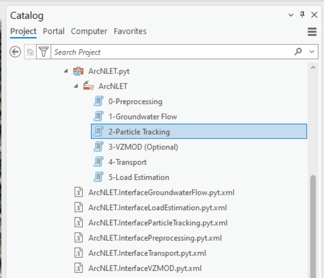
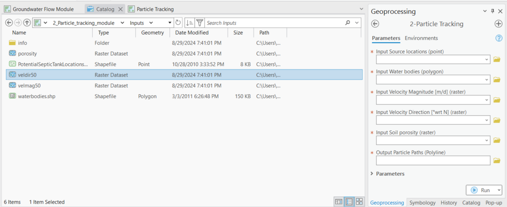
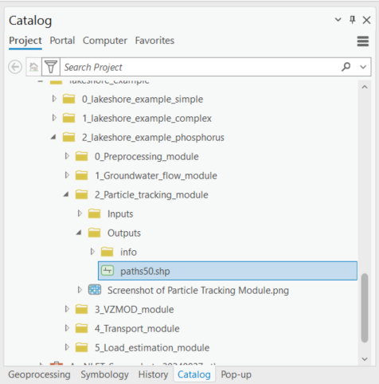
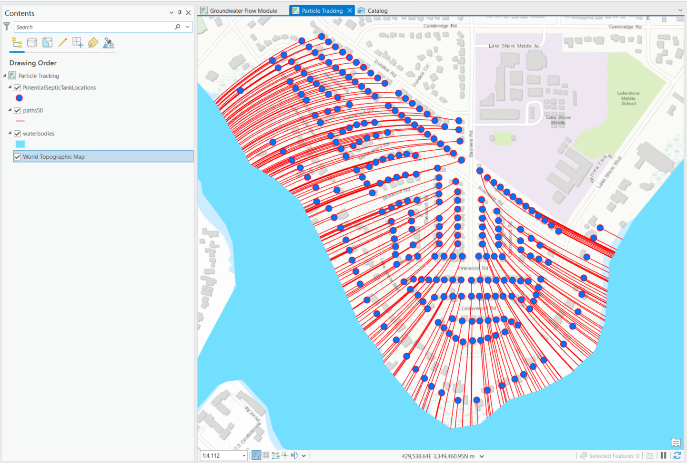

.. _usingparticletracking:
.. role:: raw-html(raw)
   :format: html

Using the Particle Tracking Module
==================================

The Particle Tracking Module places a water particle (point) at each
septic tank location. It uses the Groundwater Flow Module outputs for
velocity direction and velocity magnitude to simulate flow paths from a
septic tank to a nearby water body.

Data Inputs
-----------

Once you are satisfied with the Groundwater Flow Module's data outputs,
it is time to move on to the Particle Tracking Module. Access the
[ArcNLET.pyt] ArcGIS Python Toolbox and the ArcNLET-Py ArcGIS Pro
toolsets within.

   Figure 11-1: The ArcNLET-Py Python Toolset and Particle Tracking Module in the Catalog Pane.

1. Double-click the [2 Particle Tracking] module, and the particle
   tracking Python toolset opens in the [Geoprocessing Pane].

   a. Take a moment to review the data inputs, outputs, and parameters.
      Please remember that data inputs and outputs marked with a red
      asterisk [\*] are required for the geoprocessing operation.

2. Click the drop-down arrow next to [Parameters] to expose the options.

3. Data inputs:

   a. **Input Source Locations (point)**

      i. Lakeshore Example input vector point: [PotentialSepticTankLocations.shp]

   b. **Input Water Bodies (polygon)**

      i. Lakeshore Example input water body polygons: [waterbodies.shp]

   c. **Input Velocity Magnitude [m/d] (raster)**

      i. Groundwater Flow Module output raster: [velmag50]

   d. **Input Velocity Direction [°wrt N] (raster)**

      i. Groundwater Flow Module output raster: [veldir50]

   e. **Input Soil Porosity (raster)**

      i. Lakeshore Example input raster: [porosity]

   Figure 11-2: The Particle Tracking Module in the Geoprocessing Pane.

4. There are several options for selecting data for a geoprocessing tool
   in ArcGIS Pro. If you are unfamiliar with ArcGIS Pro geoprocessing
   tools, please use the following URL to learn how to use geoprocessing
   tools. URL:
   https://pro.arcgis.com/en/pro-app/latest/help/analysis/geoprocessing/basics/run-geoprocessing-tools.htm

5. Use the [Map], [Catalog View], [Catalog Pane], or [Folder Icon] to
   select the necessary data inputs.

   a. If you have the data from the Lakeshore example in a [Map] in your
      ArcGIS Pro Project file and the [Geoprocessing Pane] open, you can
      drag and drop the necessary inputs or select the files from the
      drop-down menu for each of the input fields.

   Figure 11-3: Selecting Particle Tracking Module Data Inputs in the Map View.

b. If you have the data from the Lakeshore example open in a [Catalog
   Pane] or [Catalog View] and the [Geoprocessing Pane] open, then you
   can drag and drop the necessary inputs.

   Figure 11-4: Selecting Particle Tracking Module inputs by dragging and dropping from the Catalog View.

c. You can also click the [Folder Icon] next to each field to select the data 
   inputs using the Windows File Explorer. To use this method, you must use 
   the Windows File Explorer to navigate to the 
   […\\2_lakeshore_example_phosphorus\\2_Particle_tracking_module\\Inputs] 
   folder to select each data input and click [OK].

   Figure 11-5: Selecting Particle Tracking Module inputs from the Windows File Explorer.

Data Outputs and Parameters
---------------------------

Storing your files in an organized and appropriately named manner is
good practice when selecting locations for data outputs. Earlier in this
exercise, we used the Windows File Explorer or ArcGIS Pro [Catalog Pane]
to create a new folder titled [LakeshoreExampleOutputs_YYYY_MM_DD]. The
folder stores the output shapefiles.

1. If you need to create a new file folder in ArcGIS Pro, use the [Catalog Pane], 
   right-click on the folder 
   [……\\2_lakeshore_example_phosphorus\\2_Particle_tracking_module\\Outputs], 
   hover over the option [New] in the submenu, and click [Folder].

.. figure:: ./media/usingparticletrackingMedia/media/image6.png
   :align: center
   :alt: A screenshot of a computer Description automatically generated

   Figure 11-6: The Lakeshore example output folders in the Windows File Explorer.

2. Select the necessary data output by clicking the [Folder Icon] next
   to the [Output Particle Paths (Polyline)] field in the [Geoprocessing
   Pane].

   a. The Windows File Explorer opens, and in the left pane under
      [Project], click the drop-down arrows to expand the [Folders] and
      ArcGIS Pro home folder.

   b. Please note that when typing the data output into the provided
      field in the [Geoprocessing Pane], the outputs are automatically
      stored in the folder with the [Input Velocity Magnitude [L/T]
      (raster)].

3. Select the […\\2_lakeshore_example_phosphorus\\2_Particle_tracking_module\\Outputs] folders.

   a. Click the above output folder to store the output vector shapefile from the 
      Particle Tracking Module. The file path and name for the [Output Particle Paths (Polyline)] 
      is […\\2_lakeshore_example_phosphorus\\2_Particle_tracking_module\\Outputs\\paths50.shp]

4. Type the name of the shapefile output into the [Name] field with no
   file extension and click [OK].

   a. The ArcNLET-Py ArcGIS Pro Python toolset automatically assigns the
      correct file types, and if you enter a file type, a warning is
      triggered.

5. Data output:

   a. The output particle paths (polyline).

      i. Lakeshore Example output shapefile: [paths50]

6. The Parameters are related to model validation and verification. For
   the Lakeshore Example, the WB Raster Resolution and Step Size
   parameters are automatically set from the [lakeshore.img] DEM file.

   a. Flow Path Truncation

      i. Please check the box for this option: [Checked Box]

         1. The Flow Path Truncation option trims line features
            intersecting the water body polygons and extending particle
            paths that fall short of the water body polygons.
            Furthermore, enabling Flow Path Truncation requires more
            processing time.

   b. WB Raster Resolution [m]

      i. Default value: [5]

   c. Step Size [m]

      i. Default value: [10]

   d. Max Step

      i. Default value: [1000]

   Figure 11-7: Selecting the data output location from the Windows File Explorer for the Particle Tracking Module.

7. Double-check to ensure all red astricts [\*] are removed from the
   [Geoprocessing Pane], indicating that all necessary data inputs and
   outputs have the correct file type and are accessible.

   Figure 11-8: The Particle Tracking Module data inputs and output in the Geoprocessing Pane.

The particle paths are shown in red and the OSTDS points are blue. 

Execute the Module
------------------

1. Once satisfied with the data input and output selections, click [Run]
   in the [Geoprocessing Pane].

   Figure 11-9: The Run button in the Geoprocessing Pane.

2. The ArcNLET-Py Particle Tracking Module begins to process data, and
   the progress bar appears. The runtime can vary depending on the data
   sets’ file sizes, spatial scale, and raster cell size.

   Figure 11-10: The Progress Bar in the ArcGIS Pro Geoprocessing Pane for the Particle Tracking Module.

3. ArcGIS Pro indicates the tool is finished with a green notification
   box at the bottom of the [Geoprocessing Pane]. You may click [View
   Details] for more information about the process, including data
   inputs and output(s), start and end times and dates, and a success
   or failure message.

   Figure 11-11: The green notification box in the ArcGIS Pro Geoprocessing Pane for the Particle Tracking Module.

View and Verify Results
-----------------------

If you have your data inputs in an open [Map] in ArcGIS Pro, the data
output(s) are automatically added to the [Contents Pane] and the [Map
View]. Alternatively, if you do not have your input data in a [Map], nor
do you have a [Map View] open in your ArcGIS Pro Project, and you ran
the ArcNLET-Py Particle Tracking Module from the [Geoprocessing Pane],
then your results are accessible via the [Catalog Pane] or [Catalog
View] in the output folder [LakeshoreExampleOutputs_YYYY_MM_DD].

   Figure 11-12: The ArcNLET-Py Particle Tracking Module output in the Catalog Pane

1. Take a moment to review the shapefile output to ensure your data has
   been processed correctly. Your data processes must be done correctly
   because data outputs from the Particle Tracking Module are used as
   data inputs in the subsequent module.

   a. Please note that if your vector shapefile outputs are not line
      features originating from your potential contamination sources
      (septic tank locations) towards the proximal surface water body
      polygons, then this is an indicator that there might have been an
      error processing the data inputs.

      i. For example, you should have one segmented particle path for
         each septic tank location in the output particle path
         shapefile. You may notice several thousand individual line
         features for the potential septic tank locations.

2. If there seems to be an issue with the output particle paths
   shapefile, please ensure all your data inputs are correct, in an
   accessible file folder, and uncorrupted.

    a. If you continue having issues processing your data, please [View
       Details] as mentioned in Section 5.7.3 to see if empty datasets
       were created as outputs. Empty datasets indicate an issue with
       the input data, or ArcGIS Pro does not have read/write access
       to input or output file locations. 

      i. If you cannot find a solution to the issue, then please
         submit a [New issue] in the ArcNLET-Py GitHub repository
         (`Issues · ArcNLET-Py/ArcNLET-Py · GitHub <https://github.com/ArcNLET-Py/ArcNLET-Py/issues>`__) 
         as described in the GitHub instructions at
         `Creating an issue - GitHub Docs <https://docs.github.com/en/issues/tracking-your-work-with-issues/creating-an-issue>`__.

   Figure 11-13: The ArcNLET-Py Particle Tracking Module outputs in the Contents Pane and Map