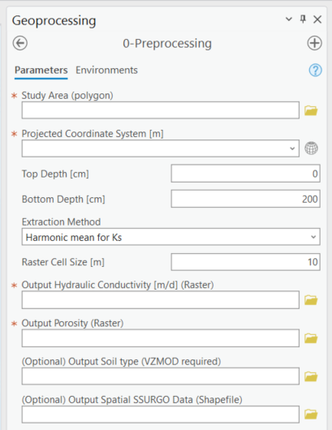
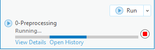
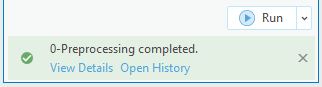

.. _usingpreprocessing:
.. role:: raw-html(raw)
   :format: html

Using the Preprocessing Module
==============================

The Preprocessing Module (Figure 9-1) automatically extracts hydraulic
conductivity, porosity, and soil types from the SSURGO database.

Data Inputs
-----------

1. Double-click the [0 Preprocessing] module, and the preprocessing
   Python toolset opens in the [Geoprocessing Pane].

   a. Take a moment to review the data inputs, outputs, and parameters.
      Please remember that data inputs and outputs marked with a red
      asterisk [\*] are required for the geoprocessing operation.

2. Data inputs:

   a. Input the study area shapefile (polygon).

      i. Lakeshore Example input shapefile: [study_area.shp], as shown
         in Figure 9-2.

         1. Please note that the shapefile must have only one feature.

   Figure 9-1: The Preprocessing Module in the Geoprocessing Pane.

   Figure 9-2: The spatial distribution of the study area, septic tanks, and water bodies.

The OSTDS are green dots, the study area is beige, and the water body is
blue.

Data Outputs and Parameters
---------------------------

1. You are selecting the module parameters, as shown in Figure 9-3.

   a. **Study Area (polygon)**

      i.  Select the shapefile: [study_area.shp]

   b. **Projected Coordinate System [m]**

      i. Use: [NAD_1983_UTM_Zone_17N]

      ii. Please note that the projected coordinate system automatically displays the coordinate system of the study area. However, a projected coordinate system must be used, or an error is triggered.

   c. **Top Depth [cm]**

      i. Default value: [0]

   d. **Bottom Depth [cm]**

      i. Default value: [200]

   e. **Extraction Method**

      i. Default option: [Harmonic mean for Ks]

   f. **Raster Cell Size [m]**

      i. Default value: [10]

2. Selecting the module outputs

   a. **Output Hydraulic Conductivity [m/d] (Raster)**

      i. Output raster name: [hydr_cond]

      ii. Please note that the length of the name of the raster file must not exceed 13 characters. It is a requirement by ArcGIS Pro.

   b. **Output Porosity (Raster)**

      i. Output raster name: [porosity]

   c. **(Optional) Output Soil Type (Raster)** (required for **VZMOD**)

      i. Output raster name: [soiltype]

   d. **(Optional) Output Spatial SSURGO Data (Shapefile)**

      i. Output shapefile name: [spatial]

3. Double-check to ensure all red astricts [\*] are removed from the [Geoprocessing Pane], indicating that all necessary data inputs and outputs have the correct file type and are accessible.

.. figure:: ./media/usingpreprocessingMedia/media/image3.png
   :align: center
   :alt: A screenshot of a computer Description automatically generated

   Figure 9-3: The Preprocessing Module data inputs and outputs in the Geoprocessing Pane.

Executing the Module
--------------------

1. Once satisfied with the data input and output selections, click [Run]
   in the [Geoprocessing Pane] (Figure 9-4).

.. figure:: ./media/usingpreprocessingMedia/media/image4.png
   :align: center
   :alt: A screenshot of a computer Description automatically generated

   Figure 9-4: The Run button in the Geoprocessing Pane.

2. The ArcNLET-Py Preprocessing Module (Figure 9-5) begins to process
   data, and the progress bar appears. The runtime can vary depending on
   the data sets’ file sizes, spatial scale, raster cell size, and
   network speed.

   9-5: The progress bar in the ArcGIS Pro Geoprocessing Pane for the Preprocessing Module.Figure

3. ArcGIS Pro indicates the tool is finished with a green notification
   box, as shown in Figure 9-6, at the bottom of the [Geoprocessing
   Pane]. You may click [View Details] for more information about the
   process, including data inputs and outputs, start and end times and
   dates, and a success or failure message.

   Figure 9-6: The green notification box in the ArcGIS Pro Geoprocessing Pane for the Preprocessing Module.

View and Verify Results
-----------------------

If you have your data inputs in an open [Map] in ArcGIS Pro, the data
outputs are automatically added to the [Contents Pane] and the [Map]
view. Alternatively, if you do not have your input data in a [Map], nor
do you have a [Map View] open in your ArcGIS Pro Project, and you run
the ArcNLET-Py Preprocessing Module from the [Geoprocessing Pane], as
shown in Figure 9-7. Your results are accessible via the [Catalog Pane]
or [Catalog View] in the output folder created in Section 3.3.

   Figure 9-7: The ArcNLET-Py Preprocessing Module outputs in the Catalog Pane.

1. Take a moment to review each output to ensure your data has been
   processed correctly. Your data must be processed correctly because
   data outputs from the Preprocessing Module are inputs in the
   subsequent modules.

   a. The output raster images are automatically styled with a
      black-and-white contrast stretch. ArcGIS Pro assigns two stretch
      types based on whether your raster dataset has one value or many
      values. The stretch type [Standard Deviation] is for raster
      datasets with many values, and the stretch type [None] is for
      datasets with only one value.

   b. Please note that the symbology has been changed from the ArcGIS
      Pro automatic default symbology for aesthetic purposes.
