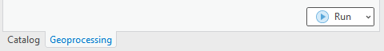
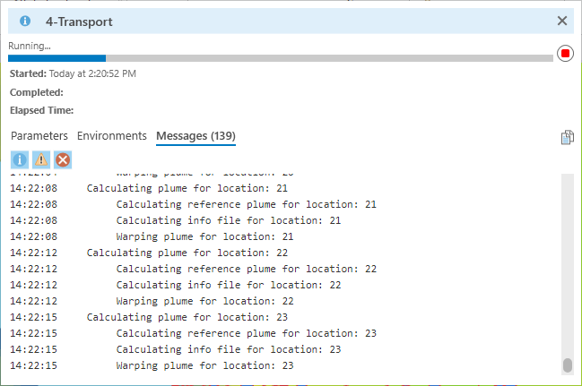

.. _usingtransport:

Using the Transport Module
==========================

The Transport Module uses the Particle Tracking Module particle paths to 
simulate ammonium and nitrate plumes originating from the potential
septic tank locations traveling toward the water bodies. This module
also calculates the inflow mass from the septic tanks into the
groundwater and the amount of mass removed by denitrification.

Data Inputs
-----------

Once you are satisfied with the Particle Tracking Module's data outputs,
it is time to move on to the Transport Module. Access the [ArcNLET.pyt]
ArcGIS Python Toolbox and the ArcNLET-Py ArcGIS Pro toolset.

   Figure 13-1: The ArcNLET-Py Python Toolset and Transport Module in the Catalog Pane.

1. Double-click the [4 Transport] module, and the Transport Python
   toolset opens in the [Geoprocessing Pane].

   a. Take a moment to review the data inputs, outputs, options, and
      parameters. Please remember that data inputs and outputs marked
      with a red asterisk [*] are required for the geoprocessing
      operation.

   b. Click the drop-down arrow next to [Options] and [Parameters] to
      expose the choices.

2. **Types of Contaminants**

   a. Contaminants to be considered: [Nitrogen and Phosphorus]

3. **Consideration of NH4**

   a. Default option: [Enabled]

4. **Data Inputs:**

   a. **Input Source Locations (point)**

      i. Lakeshore Example input vector point: [PotentialSepticTankLocations]

   b. **Input Water Bodies (polygon)**

      i. Lakeshore Example input water body polygons: [waterbodies]

   c. **Input Particle Paths (polyline)**

      i. Lakeshore Example input polyline: [paths50]

   Figure 13-2: The Transport Module in the Geoprocessing Pane.

5. There are several options for selecting data for a geoprocessing tool
   in ArcGIS Pro. If you are unfamiliar with ArcGIS Pro geoprocessing
   tools, please use the following URL to learn how to use geoprocessing
   tools. URL:
   https://pro.arcgis.com/en/pro-app/latest/help/analysis/geoprocessing/basics/run-geoprocessing-tools.htm

6. Use the [Map], [Catalog View], [Catalog Pane], or [Folder Icon] to
   select the necessary data inputs.

   a. If you have the data from the Lakeshore example in a [Map] in your
      ArcGIS Pro Project file and the [Geoprocessing Pane] open, you can
      drag and drop the necessary inputs or select the files from the
      drop-down menu for each of the input fields.

   Figure 13-3: Selecting Transport Module data inputs in the Map View.

b. If you have the data from the Lakeshore example open in a [Catalog
   Pane] or [Catalog View] and the [Geoprocessing Pane] open, then you
   can drag and drop the necessary inputs.

   Figure 13-4: Selecting the Transport Module inputs by dragging and dropping from the Catalog View.

c. You can also click the [Folder Icon] next to each field to select the
   data inputs using the Windows File Explorer. To use this method, you
   must use the Windows File Explorer to navigate to the
   [...\\lakeshore_example\\2_lakeshore_example_phosphorus\\4_Transport_module\\Inputs] and click [OK].

   Figure 13-5: Selecting Transport Module inputs from the Windows File Explorer.

Data Outputs and Parameters
---------------------------

Storing your files in an organized and appropriately named manner is
good practice when selecting locations for data outputs. Earlier in this
exercise, we used the Windows File Explorer or ArcGIS Pro [Catalog Pane]
to create a new folder titled [LakeshoreExampleOutputs_YYYY_MM_DD]. The
folder stores the output raster images.

1. If you need to create a new file folder in ArcGIS Pro, use the
   [Catalog Pane], right-click on the folder
   [...\\2_lakeshore_example_phosphorus\\4_Transport_module\\Outputs], hover over the option
   [New] in the submenu, and click [Folder].

   Figure 13-6: The Lakeshore example output folders in the Windows File Explorer.

2. Select the necessary data output by clicking the [Folder Icon] next
   to the [Output Plumes of NO3 (raster)] field in the [Geoprocessing Pane].

   a. The Windows File Explorer opens, and in the left pane under
      [Project], click the drop-down arrows to expand the [Folders] and
      ArcGIS Pro home folder.

   b. Select the [...\\2_lakeshore_example_phosphorus\\4_Transport_module\\Outputs] folder.

   c. Click the output folder to store the output raster in the Transport Module. The file path and name for the output [Output Plumes of NO3 (raster)] for this example is: [...\\2_lakeshore_example_phosphorus\\4_Transport_module\\Outputs\\no3plumes]

   d. Type the name of the raster output into the [Name] field with no
      file extension and click [OK].

   e. The ArcNLET-Py ArcGIS Pro Python toolset automatically assigns the
      correct file types, and if you enter a file type, a warning is
      triggered.

   f. Please note that when typing the data output into the provided
      field in the [Geoprocessing Pane], the outputs are automatically
      stored in the specified outputs folder [...\\2_lakeshore_example_phosphorus\\4_Transport_module\\Outputs].

3. Data output:

   a. **Output Plumes of NO3 (raster)**

      i. Lakeshore Example output raster: [no3plumes]

   b. **Output Plumes of NH4 (raster)**

      i. Lakeshore Example output raster: [nh4plumes]

   c. **Output Plumes of P (raster)**

      i. Lakeshore Example output raster: [po4plumes]

4. The Options are related to the Domenico Robbins solution type for
   two-dimensional (2-D) denitrification (decay).

   a. **Solution Type**

      i. Selected type: [DomenicoRobbinsSSDecay2D]

   b. **Plume Warping Control**

      i. Point spacing [Cells]: [48]

      ii. Plume warping method: [Spline]

   c. **Threshold Concentration [mg/l]**

      i. Set threshold value: [0.000001]

   d. **Postprocessing Medium**

      i. Use default settings

   e. **Domenico Boundary**

      i. Specified Z: [400]

5. The Parameters are related to the septic tank size, the nitrogen mass
   going into the septic tank for a specific timeframe, and the width of
   the septic tank.

   a. **Source Dimension Y [m]**

      i. Default value: [48]

   b. **Source Dimension Z [m]**

      i. Default value: [2]

   c. **Plume Cell Size [m]**

      i. Default value: [1.5]

   d. **NO3 Concentration [mg/l]**

      i. Default value: [40]

   e. **NO3-N Dispersivity aL [m]**

      i. Default value: [2.113]

   f. **NO3-N Dispersivity aTH [m]**

      i. Default value: [0.234]

   g. **Denitrification Decay Rate [1/d]**

      i. Default value: [0.04]

   h. **Volume Conversion Factor**

      i. Default value: [1000]

6. **Bulk Density [g/cm³]**

   a. Default value: [1.42]

7. **Nitrogen Parameters:**

   a. **NH4-N Dispersivity aL [m]**

      i. Default value: [2.113]

   b. **NH4-N Dispersivity aTH [m]**

      i. Default value: [0.234]

   c. **Nitrification Decay Rate [1/d]**

      i. Default value: [0.0001]

   d. **kd for NH4-N [cm³/g]**

      i. Default value

8. **Phosphorus Parameters:**

   a. **PO4-P Dispersivity aL [m]**

      i. Default value: [2.113]

   b. **PO4-P Dispersivity aTH [m]**

      i. Default value: [0.234]

   c. **Rprecip [mg/kg 1/day]**

      i. Default value: [0.002]

   d. **Sorption Isotherm**

      i. Type: [Linear]

   e. **Linear Distribution Coefficient [L/kg]**

      i. Default value: [15.1]

   Figure 13-7: Selecting the data output location from the Windows File Explorer for the Transport Module.

6. Double-check to ensure all red astricts [\*] are removed from the
   [Geoprocessing Pane], indicating that all necessary data inputs and
   outputs have the correct file type and are accessible.

   Figure 13-8: The Transport Module Data inputs and output in the Geoprocessing Pane.

Execute the Module
------------------

1. Once satisfied with the data input and output selections, click [Run]
   in the [Geoprocessing Pane].

   Figure 13-9: The Run button in the Geoprocessing Pane.

2. The ArcNLET-Py Transport Module begins to process data, and the
   progress bar appears.

   a. Please note that the runtime can be lengthy depending on the data
      sets' file sizes, spatial scale, and raster cell size.

   Figure 13-10: The Progress Bar in the ArcGIS Pro Geoprocessing Pane for the Transport Module.

3. If you feel the process has stalled or frozen, please click [View
   Details] below the blue progress bar. In the dialog box, click
   [Messages], then scroll to the bottom to ensure plumes are calculated
   for each septic tank location. New messages should populate the
   window until the process is complete.

   a. Your Messages have a number that differs on your machine from the
      example depending on how many plumes have been processed.

   Figure 13-11: The Messages box showing calculating plumes for OSTDS.

4. ArcGIS Pro indicates the tool is finished with a green notification
   box at the bottom of the [Geoprocessing Pane]. You may click [View
   Details] for more information about the process, including data
   inputs and output(s), start and end times and dates, and a success
   or failure message.

   Figure 13-12: The green notification box in the ArcGIS Pro Geoprocessing Pane for the Transport. Module.

View and Verify Results
-----------------------

1. If you have your data inputs in an open [Map] in ArcGIS Pro, the data
   output(s) are automatically added to the [Contents Pane] and the [Map
   View].

   a. Alternatively, if you do not have your input data in a [Map], nor
      do you have a [Map View] open in your ArcGIS Pro Project, and you
      ran the ArcNLET-Py Transport Module from the [Geoprocessing Pane],
      then your results are accessible via the [Catalog Pane] or
      [Catalog View] in the output folder
      [...\\2_lakeshore_example_phosphorus\\4_Transport_module\\Outputs].

   Figure 13-13: The ArcNLET-Py Transport Module outputs in the Catalog Pane.

2. Take a moment to review the outputs to ensure your data has been
   processed correctly. Your data must be processed correctly because
   data outputs from the Transport Module are used as inputs in the
   Load Estimation Module.

    a. Your raster image outputs appear in your [Map View] as a black
       image with white plumes with the greatest magnitude at each
       potential septic tank location, and the plume diminishes towards
       the water bodies. This black-and-white symbology is not an
       indicator that there is an error. A solid black raster image in a
       [Map View] in ArcGIS Pro indicated that proper symbology is not
       set for the raster layer.

       i. Please note that if your raster image outputs have a solid
          black fill with only null or no-data values, then this is an
          indicator that there might have been an error processing the
          data inputs. Please ensure all your data inputs are correct,
          in an accessible file folder, and are uncorrupted.

    b. Your vector shapefile outputs appear as point features marking
       your potential septic tank locations.

       i. If the shapefile is empty, then this indicates that there
          might have been an error processing the data inputs. Please
          ensure all your data inputs are correct, in an accessible file
          folder, and are uncorrupted.

3. If you continue having issues processing your data, please 
   [View Details] to see if empty datasets were created as outputs. Empty datasets indicate an issue with the input
   data, or ArcGIS Pro does not have read/write access to input or output file locations.

    a. If you cannot find a solution to the issue, then please submit a [New issue] in the ArcNLET-Py GitHub repository (`Issues · ArcNLET-Py/ArcNLET-Py · GitHub <https://github.com/ArcNLET-Py/ArcNLET-Py/issues>`__) as described in the GitHub instructions at `Creating an issue - GitHub Docs <https://docs.github.com/en/issues/tracking-your-work-with-issues/creating-an-issue>`__.

   13-14: The ArcNLET-Py Transport Module outputs in the Contents Pane and Map Figure

The plumes are shown with the highest magnitude in red, and analyte levels near zero are purple. The water body is shown in blue.