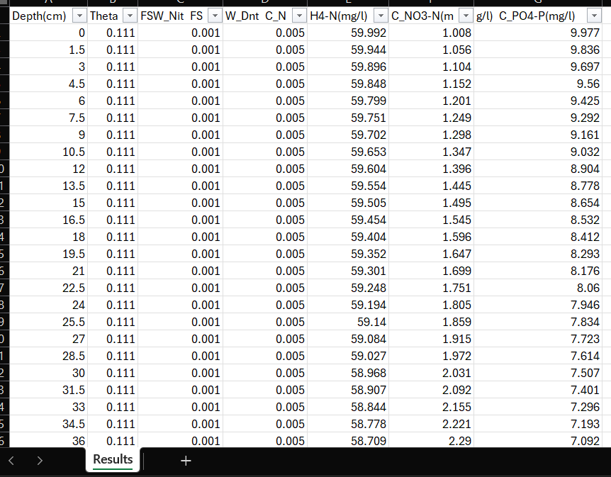

.. _usingvzmod:

Using the VZMOD Module
======================

The Vadose Zone Model (VZMOD) module simulates the flow and the
transport of ammonium and nitrate in the Vadose Zone for single and
multiple OSTDS locations. The module estimates ammonium and nitrate
concentrations at OSTDS locations based on heterogeneous or homogeneous
hydrologic conductivity, porosity, depth to the water table, and soil
type. The module outputs are estimates of nitrification and
denitrification between the OSTDS and the water table. Please note that
the VZMOD Module is optional and allows for more precise estimates of
ammonium and nitrate for use in the ArcNLET-Py Transport as the
concentration of the source plane for groundwater modeling. The VZMOD
Module requires knowledge of the study area and data preparation using
USDA soil data.

Data Inputs
-----------

Once you are satisfied with the Particle Tracking Module's data outputs,
it is time to move on to the VZMOD Module. For this example, you run the
VZMOD Module for multiple OSTDS locations with heterogeneous hydraulic
conductivity and porosity and a soil type of sand and calculate the
depth to the water table.

1. Access the [ArcNLET.pyt] ArcGIS Python Toolbox and the ArcNLET-Py
   ArcGIS Pro toolsets within.

.. figure:: ./media/usingvzmodMedia/media/image1.png
   :align: center
   :alt: A screenshot of a computer Description automatically generated

   Figure 12-1: The ArcNLET-Py Python Toolset and VZMOD Module in the Catalog Pane

2. Double-click the [3-VZMOD (Optional)] module, and the VZMOD Python
   toolset opens in the [Geoprocessing Pane].

3. Take a moment to review the data inputs, outputs, and parameters. The
   VZMOD has many inputs and parameters based on using
   homogenous/heterogeneous hydraulic conductivity and porosity,
   calculating the depth to the water table, and using single/multiple
   soil types. Please remember that data inputs and outputs marked with
   a red asterisk [\*] are required for the geoprocessing operation.

   a. Click the drop-down arrow and the check boxes next to [Parameters]
      to expose the options.

4. Parameters (for the Lakeshore example):

   a. **Types of Contaminants**

      i. Lakeshore Example contaminants: [Nitrogen and Phosphorus]

   b. **Select Single or Multiple OSTDS from the Dropdown Menu**

      i. Lakeshore Example OSTDS: [Multiple OSTDS]

         1. Selecting [Multiple OSTDS] allows for the use of heterogeneous hydraulic conductivity (K) and porosity (θ), calculating the depth to the water table, and using multiple soil types.

   c. **Heterogeneous Ks and θs**

      i. Option: [Enabled]

   d. **Calculate Depth to Water Table**

      i. Option: [Enabled]

   e. **Multiple Soil Types**

      i. Option: [Enabled]

   f. **Septic Tank Sources (Point)**

      i. Input vector point: [PotentialSepticTankLocations]

   g. **Hydraulic Conductivity (Raster)**

      i. Input raster: [hydr_cond]

   h. **Soil Porosity (Raster)**

      i. Input raster: [porosity]

   i. **Soil Types (Raster)**

      i. Input raster: [soiltype]

   j. **Concentration of NH4-N [mg/L]**

      i. Default value: [60]

   k. **Concentration of NO3-N [mg/L]**

      i. Default value: [1]

   l. **Concentration of PO4-P [mg/L]**

      i. Default value: [10]

   m. **Depth to Water Table [cm]**

      i. Default value: [150]

   n. **Output Profile Results (Text File)**

      i. Output file path: [C:\Users\Wei\Downloads\lakeshore_example]

   o. **Hydraulic Params**

      i. Use default values

   p. **Nitrification Params**

      i. Use default values

   q. **Denitrification Params**

      i. **Kdnt [1/d]**: [0.08]

      ii. **Topt-dnt [°C]**: [26]

      iii. **ßdnt [-]**: [0.347]

      iv. **Sdnt [-]**: [0]

   r. **Dispersion, Bulk Density, and Temperature**

      i. Use default values

   s. **Phosphorus Params**

      i. **Rprecip [mg/kg 1/day]**: [0.0008]

      ii. **Sorption Isotherm**: [Linear]

      iii. **Linear Distribution Coefficient [L/kg]**: [15.1]

.. figure:: ./media/usingvzmodMedia/media/image2.png
   :align: center
   :alt: A screenshot of a computer Description automatically generated

   Figure 12-2: The VZMOD Module in the Geoprocessing Pane.

5. There are several options for selecting data for a geoprocessing tool
   in ArcGIS Pro. If you are unfamiliar with ArcGIS Pro geoprocessing
   tools, please use the following URL to learn how to use geoprocessing
   tools. URL:
   https://pro.arcgis.com/en/pro-app/latest/help/analysis/geoprocessing/basics/run-geoprocessing-tools.htm

6. Use the [Map], [Catalog View], [Catalog Pane], or [Folder Icon] to
   select the necessary data inputs.

   a. If you have the data from the Lakeshore example in a [Map] in your
      ArcGIS Pro Project file and the [Geoprocessing Pane] open, you can
      drag and drop the necessary inputs or select the files from the
      drop-down menu for each of the input fields.

   Figure 12-3: Selecting VZMOD Module data inputs in the Map View.

b. If you have the data from the Lakeshore example open in a [Catalog
   Pane] or [Catalog View] and the [Geoprocessing Pane] open, then you
   can drag and drop the necessary inputs.

c. You can also click the [Folder Icon] next to each field to select the
   data inputs using the Windows File Explorer. To use this method, you
   must use the Windows File Explorer to navigate to the
   [...\\2_lakeshore_example_phosphorus\\3_VZMOD_module\\Inputs] folder to select each data
   input and click [OK].

   Figure 12-4: Selecting VZMOD Module inputs from the Windows File Explorer.

Data Outputs and Parameters
---------------------------

Storing your files in an organized and appropriately named manner is
good practice when selecting locations for data outputs. Earlier in this
exercise, we used the Windows File Explorer or ArcGIS Pro [Catalog Pane]
to create a new folder titled [LakeshoreExampleOutputs_YYYY_MM_DD]. The
folder stores the output shapefiles.

1. If you need to create a new file folder in ArcGIS Pro, use the
   [Catalog Pane], right-click on the folder
   [...\\2_lakeshore_example_phosphorus\\3_VZMOD_module\\Outputs], hover over the option
   [New] in the submenu, and click [Folder].

.. figure:: ./media/usingvzmodMedia/media/image7.png
   :align: center
   :alt: A screenshot of a computer Description automatically generated

   Figure 12-5: The Lakeshore example output folders in the Windows File Explorer.

2.  Select the necessary data output folder by clicking the [Folder
    Icon] next to the [Output folder] field in the [Geoprocessing Pane].
    The results from the VZMOD Module are a text file labeled
    [results.txt] and a point shapefile with ammonium and nitrate
    concentration estimates at the water table.

    a. The Windows File Explorer opens, and in the left pane under
       [Project], click the drop-down arrows to expand the [Folders] and
       ArcGIS Pro home folders.

    b. Select the [...\\2_lakeshore_example_phosphorus\\3_VZMOD_module\\Outputs] folders.

3.  Click the above output folder to store the output text file and
    shapefile from the VZMOD Module. The file path and name for the
    [Output] folder is
    [...\\2_lakeshore_example_phosphorus\\3_VZMOD_module\\Outputs], 
    or your custome output folder should be in the following directory 
    [...\\2_lakeshore_example_phosphorus\\3_VZMOD_module\\Outputs\\LakeshoreExampleOutputs_YYYY_MM_DD].

    a. The module automatically names the text file and shapefile
       outputs.

    b. The ArcNLET-Py ArcGIS Pro Python toolset automatically assigns
       the correct file types, and if you enter a file type, a warning
       is triggered.

4.  Data output:

    a. The Output folder

       i. Lakeshore Example output folder:
          [...\\2_lakeshore_example_phosphorus\\3_VZMOD_module\\Outputs]

          1. The outputs of VZMOD are a CSV text file titled
             [Results.txt] that contains the vertical fate and decay of
             nitrate and ammonia below the OSTDS and [PotentialSepticTankLocations.shp]
             shapefile when processing data for [Multiple OSTDS].

5. Double-check to ensure all red astricts [\*] are removed from the [Geoprocessing Pane], 
   indicating that all necessary data inputs and outputs have the correct file type and are 
   accessible as shown in Figure 12-2.

Execute the Module
------------------

1. Once satisfied with the data input and output selections, click [Run]
   in the [Geoprocessing Pane].

.. figure:: ./media/usingvzmodMedia/media/image10.png
   :align: center
   :alt: A screenshot of a computer Description automatically generated

   Figure 12-6: The Run button in the Geoprocessing Pane.

2. ArcNLET-Py VZMOD Module begins to process data, and the progress bar appears. 
   The runtime can vary depending on the data sets' file sizes, spatial scale, and raster cell size. 

.. figure:: ./media/usingvzmodMedia/media/image11.png
   :align: center
   :alt: A screenshot of a computer Description automatically generated

   Figure 12-7: The Progress Bar in the ArcGIS Pro Geoprocessing Pane for the VZMOD Module.

3. ArcGIS Pro indicates the tool is finished with a green notification box at the bottom of the 
   [Geoprocessing Pane]. You may click [View Details] for more information about the process, 
   including data inputs and output(s), start and end times and dates, and a success or failure message.

   Figure 12-8: The green notification box in the ArcGIS Pro Geoprocessing Pane for the VZMOD Module.

View and Verify Results
-----------------------

If you have your data inputs in an open [Map] in ArcGIS Pro, the data
output(s) are automatically added to the [Contents Pane] and the [Map
View]. Alternatively, if you do not have your input data in a [Map], nor
do you have a [Map View] open in your ArcGIS Pro Project, and you ran
the ArcNLET-Py VZMOD Module from the [Geoprocessing Pane], then your
results are accessible via the [Catalog Pane] or [Catalog View] in the
[...\\2_lakeshore_example_phosphorus\\3_VZMOD_module\\Outputs] folder 
or in your custom output folder (i.e.,[LakeshoreExampleOutputs_YYYY_MM_DD]). 
Please note that you may want to use a separate output folder each time 
you run VZMOD to aid in data organization.

   Figure 12-9: The ArcNLET-Py VZMOD output in the Catalog Pane.

1. Take a moment to review the text file and shapefile outputs to
   ensure your data has been processed correctly. Your data must be
   processed correctly because data outputs from the VZMOD Module are
   inputs in the subsequent module.

   a. If there seems to be an issue with the output particle paths
      shapefile, please ensure all your data inputs are correct, in an
      accessible file folder, and uncorrupted.

2. If you continue having issues processing your data, please [View Details] as previosuly 
   to see if empty datasets were created as outputs. Empty datasets indicate an issue with 
   the input data, or ArcGIS Pro does not have read/write access to input or output file locations.

    a. If you cannot find a solution to the issue, then please submit a [New issue] in the ArcNLET-Py GitHub repository 
      (`Issues · ArcNLET-Py/ArcNLET-Py · GitHub <https://github.com/ArcNLET-Py/ArcNLET-Py/issues>`__) 
      as described in the GitHub instructions at 
      `Creating an issue - GitHub Docs <https://docs.github.com/en/issues/tracking-your-work-with-issues/creating-an-issue>`__.

3. The [Results.txt] file can be modified so that it is compatible with Excel. To see the verticle 
   profile for one OSTDS in Excel you must located the desired septic tank number in the [Results.txt] file. 
   
   a. Next, you must copy and paste the headers and data for a given location into a new text file. 
   
   b. Afterwards, you may import the text file into Excel using the [Text Import Wizard] with [Fixed width]
      and [My data has headers] options selected.

   c. Create plots showing the vertical profile.   

   Figure 12-10: The ArcNLET-Py VZMOD text outputs in Microsoft Excel.

.. figure:: ./media/usingvzmodMedia/media/image15.png
   :align: center
   :alt: A plot of numbers and a black and white background Description automatically generated

   Figure 12-11: The ArcNLET-Py VZMOD text outputs are plotted in Excel.

The plots show concentrations of NH\ :sub:`4`, NO\ :sub:`3`, and PO\ :sub:`4`\ :sup:`3-` below the
OSTDS (left) and the saturation function for nitrification and denitrification (right).