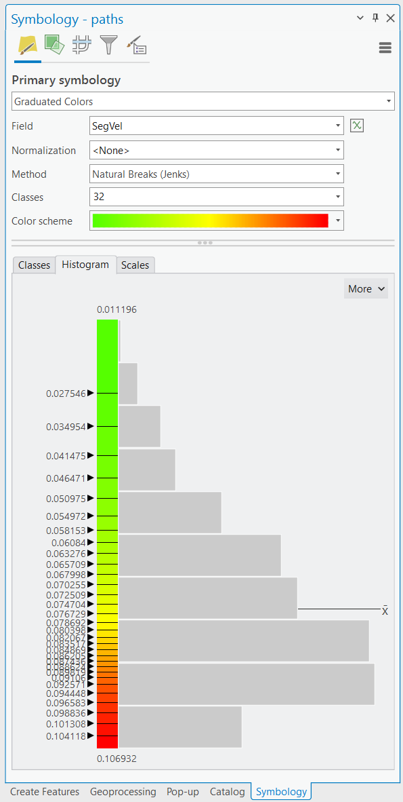
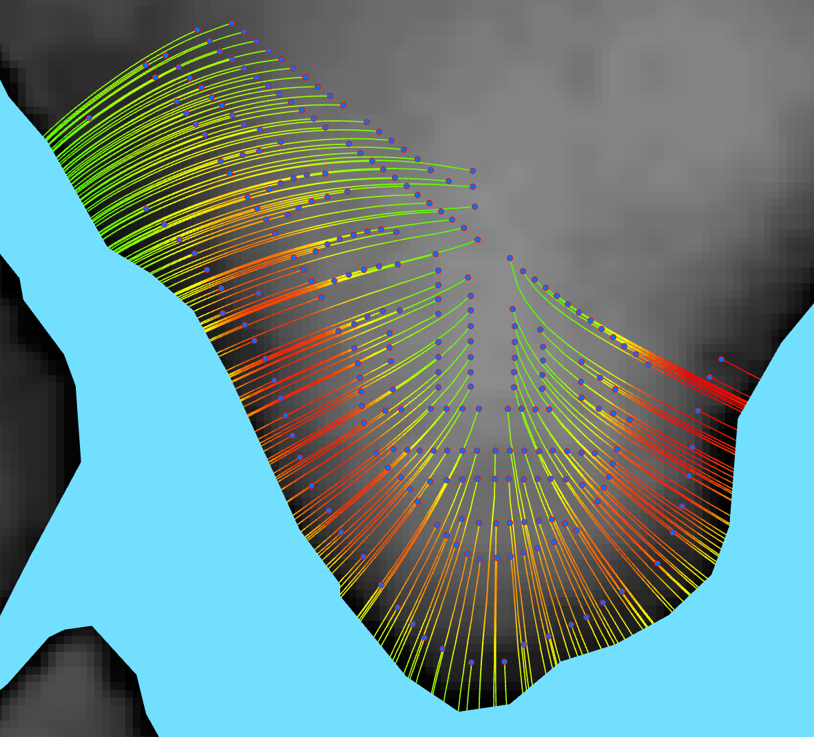
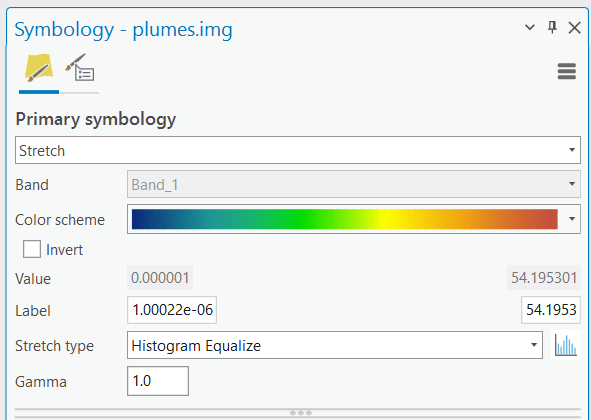
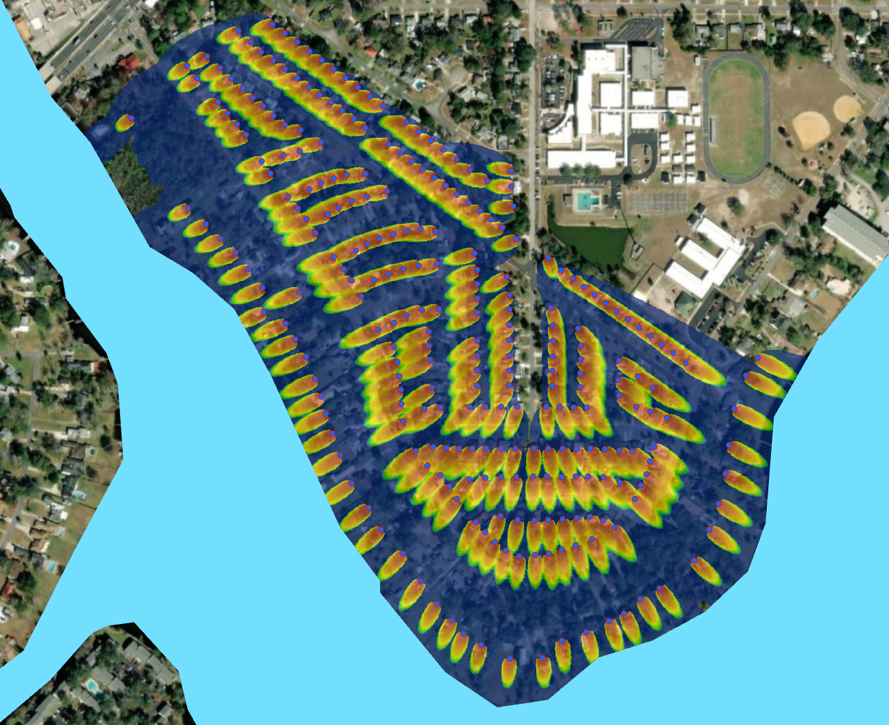
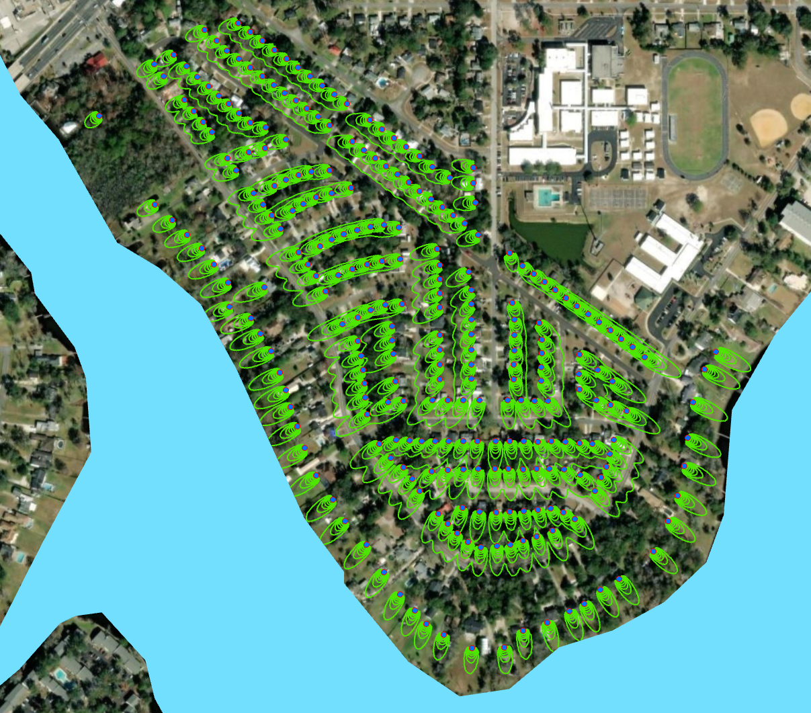

.. _visualization:

Visualization
=============

For better presentation, it may be desirable to enhance the display of
model outputs to highlight specific characteristics of the results. For
example, the particle paths generated by the particle tracking
functionality can be color-coded so that red signifies a faster flow
velocity and green a slower flow velocity. This color change can be done
by changing the layer symbology, as shown in Figure 15-1. The result
should resemble Figure 15-2. Each path segment has been color-coded to
the values in the SegVel attribute of the flow paths attribute table.

   Figure 15-1: Visualizing flow path velocities settings.

   Figure 15-2: Map visualizing flow path velocities.

Higher velocities are in red, and lower velocities are in green.

The display of the plume raster can be improved by selecting an
appropriate color ramp. By selecting the raster symbology to the
settings shown in Figure 15-3, the result in Figure 15-4 can be
obtained. It is recommended to create custom contours using the SA tool
Contour List to determine the locations of specific ranges of nitrate
concentrations (e.g., the EPA level for nitrate concentration in
drinking water, 0.1 mg/l). The result of contouring the plumes is shown
in Figure 15-5.

   Figure 15-3: Visualizing plume settings.

   Figure 15-4: Map visualizing plume concentration distributions.

The plumes have the highest magnitude of nitrate in red, fading to dark
blue for cells with nitrate concentrations near zero. The water body is
shown in blue.

   Figure 15-5: Map visualizing plumes via custom contours.

The contours are shown in green and are classified via the nitrate
concentration range.
