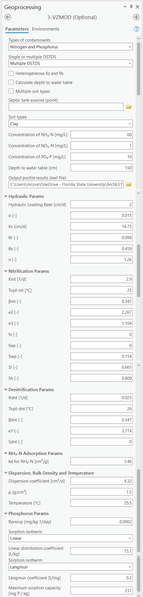
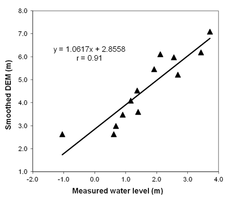
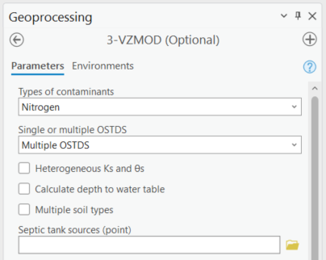
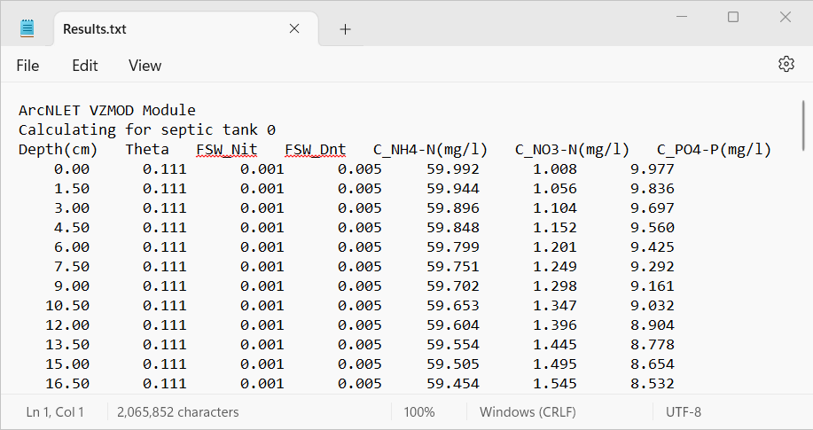

.. _vzmod:

3-VZMOD
=======

The Vadose Zone MODel (VZMOD) is a tool that simulates the
transformation and one-dimensional (1-D) vertical transport of
NH\ :sub:`4`, NO\ :sub:`3`, and PO\ :sub:`4`\ :sup:`3-` in the
vadose zone beneath the drain field of an OSTDS. Since this
module aims to simulate long-term, vertical migration of OSTDS
effluent from a drainfield in the Soil Treatment Unit (STU) to
groundwater, the vadose zone flow and nutrient transport are
assumed to be in a steady state. VZMOD simulates the adsorption and
nitrification processes of ammonium (NH\ :sub:`4`\ :sup:`+`), the
denitrification process of nitrate (NO\ :sub:`3`\ :sup:`-`), and
the adsorption processes affecting phosphate (PO\ :sub:`4`\ :sup:`3-`)
occurring in the vadose zone. For each septic system, VZMOD produces
vertical profiles of NH\ :sub:`4`, NO\ :sub:`3`, and PO\ :sub:`4`\ :sup:`3-`
concentrations in the vadose zone and estimates the concentrations of NH\ :sub:`4`\ :sup:`+`,
NO\ :sub:`3`\ :sup:`-`, and PO\ :sub:`4`\ :sup:`3-` at the water table.
Similar to other modules of ArcNLET-Py, the conceptual model of VZMOD 
simplifies nutrient fate and transport, reduces the modeling data 
requirement, and efficiently manages data and pre- and post-processing.

Running VZMOD is optional for ArcNLET-Py, and it is only needed when
nutrient transport in the vadose zone is of interest to the users, i.e.,
when spatially distributed ammonium, nitrate, and phosphate concentrations 
at the water table are needed. Alternatively, the module can stand alone
without the aid of the rest of the ArcNLET-Py toolbox to simulate
nutrient transformation and transport from an OSTDS in various soil
types. When used with the entire ArcNLET-Py toolset, VZMOD can simulate
nutrient transformation and 1-D transport from multiple septic systems
in the vadose zone with heterogeneous soil hydraulic parameters. The
module reads input hydraulic conductivity and soil porosity raster
layers to assign heterogeneous parameters for individual OSTDS. Figure
3-1 shows the flow chart for VZMOD. The first step is to read the flow,
nutrient transformation, and transport parameters for a given soil type.
Using VZMOD for a **Single OSTDS,** these parameters solve the flow and
nutrient transport equations sequentially, and the concentration
profiles are saved for post-processing.

.. rst-class:: center 

.. raw:: html

   

   Figure 3-1: Flowchart for VZMOD.
   

     <!-- Add a line break here --> 
..

VZMOD can also be used for **Multiple OSTDS** at a neighborhood scale.
In that case, **Heterogeneous Ks and θs**, **Calculate depth to water
table**, and **Multiple soil types** are selected. Then, data are needed
to consider the spatial variability of **Septic tank sources (point)**,
**Hydraulic conductivity (raster)**, and **Soil porosity (raster)**. As
shown in Figure 3-2, three datasets representing **Septic tank sources
(point)**, **DEM file (raster)**, and **Smoothed DEM (raster)** are used
to **Calculate DTW**, where DTW stands for Depth To Water table. The
next step is determining whether homogeneous or heterogeneous hydraulic
conductivity (Ks) and porosity (θs) are used. The homogeneous parameter
values are those read from the VZMOD Geoprocessing Pane when VZMOD is
used for a **Single OSTDS**. The heterogeneous data are extracted from
the **Hydraulic conductivity (raster)** and **Soil porosity (raster)**
to the **Septic tank source (point)** locations. After this, VZMOD
solves the flow and transport models for each OSTDS, simulating the movement
and transformation of NH\ :sub:`4`, NO\ :sub:`3`, and PO\ :sub:`4`\ :sup:`3-`
in the vadose zone and estimating their concentrations at the water table.

.. raw:: html

   

.. rst-class:: center

Figure 3-2: The VZMOD Module in the Geoprocessing Pane.

The VZMOD Geoprocessing Pane (Figure 3-2) has two segments for model
inputs. The first is the input files that address the spatial
variability of hydraulic conductivity, soil porosity, soil types, and
the DTW. The second is for inputting the model parameters. The list of
the input parameters of VZMOD, their units required for the simulation,
and descriptions of the parameters are described below. Based on an
extensive literature review, McCray et al. (2005, 2010) provided the
spreadsheet-based analytical flow and transport model (STUMOD) with
default values for hydraulic, temperature, nitrification, effluent,
denitrification, and adsorption parameters. The default values are used
in VZMOD, except that the values of the first-order reaction rate of
nitrification (**K\ nit**) and denitrification (**K\ dnt**) are from
McCray et al. (2005). In addition, the values of dispersion coefficient
(**D**), temperature (**T**), and depth to water table (**DTW**) are
determined by the users since they are site-specific. Users should
specify appropriate **D**, **T,** and **DTW** values for the site(s).
The hydraulic parameters, the coefficient, **e\ 1**, of the saturation
function of denitrification, and the coefficient, **k\ d**, of
adsorption are specific to soil types, and other parameters are the same
for different soil types. Note that the default parameters are provided
as a reference, and users of VZMOD are responsible for determining
appropriate values for their own nutrient modeling.

The desired functionality of VZMOD dictates the input files. This
process is automated in VZMOD. When VZMOD is used for modeling multiple
septic systems, the user must select **Multiple OSTDS** from the Single
or multiple OSTDS from the drop-down menu. This selection activates the
options for **Heterogeneous K\ s and θ\ s**, **Calculate depth to water
table**, **Multiple soil types**, and reveals the drop-down menu for the
**Septic tank source (point)**. The user can use **Heterogeneous
K\ s and θ\ s** and **Calculate depth to water table** separately or
jointly. Likewise, when selecting **Multiple soil types**, the drop-down
for the input **Soil types (raster)** is available, and the hydraulic
parameters are reduced to the **Hydraulic Loading Rate (cm/d)**.

Alternatively, when selecting **Heterogeneous K\ s and θ\ s**, the
options for inputting the **Hydraulic conductivity (raster)** and **Soil
porosity (raster)** become active for the user. The options allow for
the input raster layers of heterogeneous saturated hydraulic
conductivity and soil porosity (approximately equal to the saturated
water content). The files are also Groundwater Flow Module input data
and can be generated using the Preprocessing Module or data from SSURGO.

VZMOD now supports modeling for different types of contaminants, including 
**Phosphorus**, and **Nitrogen and Phosphorus**. When phosphorus is selected,
additional parameters become available, including sorption isotherms options 
such as **Linear** (with parameters for **Rprecip** and 
**Linear distribution coefficient**) and **Langmuir** (with parameters for 
**Rprecip**, **Langmuir coefficient**, and **maximum sorption capacity**). 
These additional options provide flexibility in simulating phosphorus 
adsorption and transport processes in different soil conditions, enabling more
accurate predictions of phosphorus fate in the vadose zone.

When selecting **Calculate depth to water table**, the user must input
the **DEM file (raster)** and the **Smoothed DEM (raster)**. This
function calculates the depth from the infiltrative surface to the water
table for each OSTDS drainfield. The DEM raster file is the input of the
Groundwater Flow Module and generates an approximation shape of the
water table by assuming that the water table is a subdued replica of
topography. The smoothed DEM is the optional output raster file from the
Groundwater Flow Module and is assumed to have a similar shape as the
groundwater table. In other words, the smoothed DEM is assumed to be
parallel to the water table. Based on this assumption and using the two
files, the distance from the infiltrative surface to the water table
(DTW) for individual septic systems can be calculated in the following
procedure:

1. Calculate the elevation of the water table by subtracting a constant
   (denoted as A) from the smoothed DEM, i.e., (**Smoothed DEM** – A).
   This constant is the distance between the smoothed DEM and the water
   table. It can be estimated from field measurements of water level in
   monitoring wells. This estimation requires first calibrating the
   smoothing factor of ArcNLET in the manner of Wang et al. (2011).
   After the calibration, a plot is created based on the measured water
   level and smoothed DEM, as shown in Figure 3-3, which is adapted from
   Wang et al. (2011). By fitting a linear regression curve between the
   measured water level and smoothed DEM, the intercept of the linear
   curve is the value of A. In Figure 3-3, the A value is 2.86m.

2. Calculate the elevation of the infiltrative surface by subtracting
   the distance of the infiltrative surface to the land surface (denoted
   as B) from the thickness of the vadose zone, i.e., (**DEM** – B). The
   recommended depth for B is 18 inches because the drainfield is about
   12 inches thick (for gravel) and is covered by 6 inches of soil
   (USEPA, 2002).

3. The DTW from the infiltrative surface to the water table is
   calculated via:

4. (**DEM** – B) – (**Smoothed DEM** – A) = **DEM** – **Smoothed DEM** +
   (A – B). The user must input the value of A – B ([cm]) via the
   Distance **(cm)** field shown in Figure 3-2.

   Figure 3-3: Linear regression curve between the measured water level and the
   smoothed DEM.

The plot shows the relationship between the measured and simulated water
table for the Julington Creek Neighborhood.

Input Layers
------------

The input requirements for VZMOD are described in detail below. The sections 
are organized by the functionality of the module due to VZMOD’s many 
combinations of functionalities. The first step is to choose the 
**Types of Contaminants**, which includes options for **Nitrogen**,
**Phosphorus**, or **Nitrogen and Phosphorus**. This selection influences
the additional parameters and input options that will be revealed, such as 
those related to nitrification, denitrification, adsorption, and phosphorus 
sorption isotherms.

After selecting the contaminant type, the user can choose to model either a 
**Single OSTDS** or **Multiple OSTDS**. When **Multiple OSTDS** is selected,
there are additional options (i.e., **Heterogeneous Ks and θs**,
**Calculate depth to water table**, and **Multiple soil types**) revealed 
that have separate data requirements (e.g., **Septic tank sources (point)**,
**Hydraulic conductivity (raster)**, and **Soil porosity (raster)**). The user
may choose to use these options and data separately or in combination based on 
the available data and the specific needs of the study area. For example, you 
may only be interested in analyzing **Multiple OSTDS** with 
**Heterogeneous Ks and θs** that have **Multiple soil types** in the study area. 
VZMOD provides the flexibility to pick and choose the aspects that are relevant 
to your modeling objectives. The workflows and data requirements for each VZMOD 
deployment are detailed separately below. Remember that you must decide which 
combination of inputs and options works best for you.

**Types of Contaminants**

Selecting the contaminant type is the first step in setting up a VZMOD model. 
Each option reveals different parameter inputs:

-  **Nitrogen**: This option (Figure 3-4) enables parameters related to ammonium 
   (NH\ :sub:`4`\ :sup:`+`) and nitrate (NO\ :sub:`3`\ :sup:`-`) transformation 
   and transport, including nitrification and denitrification processes.

   Figure 3-4: Nitrogen in VZMOD.

-  **Phosphorus**: Selecting phosphorus (Figure 3-5) will activate phosphorus-specific 
   parameters, including sorption isotherm options such as **Linear** (with 
   parameters for **Rprecip** and **Linear distribution coefficient**) and 
   **Langmuir** (with parameters for **Rprecip**, **Langmuir coefficient**, 
   and **maximum sorption capacity**).

   Figure 3-5: Phosphorous in VZMOD.

-  **Nitrogen and Phosphorus**: This option, shown in Figure 3-6 includes 
   both nitrogen and phosphorus parameters, combining nitrification, 
   denitrification, and phosphorus adsorption processes for comprehensive 
   nutrient modeling.

   Figure 3-6: Nitrogen and phosphorus in VZMOD.

**Single OSTDS**

Analyzing a **Single OSTDS** utilizing VZMOD (Figure 3-7) is the most
straightforward process, only requiring the user to select the **Soil
types** from the dropdown menu, the **Output folder**, and to use the
default or update the **Hydraulic Params**, **Nitrification Params¸
Denitrification Params, Adsorption Params**, and **Temperature and
Transport** **Params** values, which are shown in Figure 3-2.

-  **Soil types:** When **Single OSTDS** is selected, the soil type is one
   of the USDA soil types.

   Figure 3-7: VZMOD for a single OSTDS.

The Figure shows the selection for using only the **Single OSTDS**
option in VZMOD.

**Multiple OSTDS**

Modeling **Multiple OSTDS** (Figure 3-8) requires more data inputs than
a **Single OSTDS**. Selecting **Multiple OSTDS** reveals the options to
use data inputs for **Heterogeneous Ks and θs**, **Calculate depth to
water table**, and **Multiple soil types**. As the user selects each
additional option, fields are revealed for additional data inputs. The
various options and their data inputs are described below. Please keep
in mind that if you choose to model **Multiple OSTDS,** the data input
requirements increase as you choose additional options (i.e., if you
want to increase the potential of VZMOD modeling for your study area,
then you need a better understanding of the soil porosity, soil
moisture, topology, and/or the depth to the water table in the field for
the study area than modeling a **Single OSTDS**). The data inputs are
described below.

-  **Septic tank sources (point):** A point feature layer specifying the
   OSTDS locations. Note that this is the same input as the Particle
   Tracking Module.\ 
-  **Soil types:** When **Multiple OSTDS,** the soil type
   is one of the USDA soil types.

   Figure 3-8: Modeling multiple OSTDS in VZMOD.

**Multiple OSTDS with Heterogeneous Ks and θs**

**Heterogeneous Ks and θs:** The heterogeneous Ks and θs option is shown
in Figure 3-9. If checked, the parameters Ks and θs in the block of
**Hydraulic Params** are disabled, and the two boxes for the **Hydraulic
conductivity (raster)** and the **Soil porosity (raster)** are
activated. The boxes input the module’s raster layers of heterogeneous
saturated hydraulic conductivity and soil porosity. The data inputs are
described below.

-  **Septic tank sources (point):** A point feature layer specifying the
   OSTDS locations. Note that this is the same input as the Particle
   Tracking Module.\ 
-  **Hydraulic conductivity (raster):** This is the same
   input as the Groundwater Flow Module. This must be a raster layer with
   the units of meters per day. This input represents a map of hydraulic
   conductivity for the domain. The linear units of the hydraulic
   conductivity must be the same as the units of the DEM. For example, if
   the DEM has linear (ground distance) units of meters, the hydraulic
   conductivity must have units of meters per unit of time. The output
   seepage velocity magnitude has the same units as the input. It is the
   user’s responsibility to ensure that all units are consistent. 
-  **Soil porosity (raster):** This is the same input as the Groundwater Flow
   Module. The soil porosity must be a raster layer. This input represents
   a map of soil porosity for the domain. This layer is a derivative of the
   processing module based on SSURGO. 
-  **Soil types:** When **Multiple OSTDS** and **Heterogeneous Ks and θs**
   are selected, then the soil type is one of the USDA soil types.

   Figure 3-9: Modeling multiple OSTDS and heterogeneous Ks and θs in VZMOD.

**Multiple OSTDS with Calculate Depth to Water Table**

**Calculate depth to water table:** This option (Figure 3-10) allows
users to input two raster images by selecting the **DEM (raster)** and
the **Smoothed DEM (raster)**. This function calculates the depth from
the infiltrative surface to the water table for each OSTDS. The DEM
raster is the same as the input from the Groundwater Flow Module. The
**Smoothed DEM (raster)** is the optional output raster after smoothing
the topography (DEM), which is assumed to have the shape of the
groundwater table. The parameter **Depth to water table (cm)** changes
to **Distance (cm)**, which is the value of A – B discussed above. The
Distance is the length from the infiltrative surface to the water table,
which needs to be calibrated. The data inputs are described below.  

-  **Septic tank sources (point):** A point feature layer specifying the
   OSTDS locations. Note that this is the same input as the Particle
   Tracking Module.\ 
-  **DEM file (raster):** This is the same input as the Groundwater Flow
   Module. The DEM is used to generate an approximation of the water 
   table. This input must be a raster layer (preferably in GRID
   format) with the units of meters. Note that a higher resolution DEM does
   not necessarily give better results since a coarser DEM may better
   approximate the water table (Wolock and Price, 1994). 
-  **Smoothed DEM (raster):** The smoothed DEM is an optional output
   of the Groundwater Flow Module and should be in the units of meters.
   The smoothed DEM represents the subdued replica of the topology
   provided by the input DEM. This DEM represents the shape of the
   groundwater and does not represent the elevation of the groundwater. 
-  **Soil types:** When    **Multiple OSTDS** and **Calculate depth to water table**
   are selected, then the soil type is one of the USDA soil types.\ 
-  **Distance (cm):** The distance is the value of A – B discussed above.
   The Distance is the length from the infiltrative surface to the water table,
   which needs to be calibrated.

   Figure 3-10: Modeling multiple OSTDS and calculating the depth to the water table in VZMOD.

**Multiple OSTDS with Multiple Soil Types**

**Multiple soil types:** Modeling multiple soil types is shown in Figure
3-11. If selected, the parameters α, Ks, θr, θs, n, e1, and kd are
disabled, and the **Soil types (raster)** option is active. The data
input requirements are below.

-  **Septic tank sources (point):** A point feature layer specifying the
   OSTDS locations. Note that this is the same input as the Particle
   Tracking Module.\ 
-  **Soil types:** When **Multiple OSTDS** and **Multiple
   Soil types** are selected, the soil type file prepared using the
   pre-processing module is used here.

   Figure 3-11: Modeling Multiple OSTDS and Multiple soil types in VZMOD.

Options and Parameters
----------------------

**Options**

-  **Types of Contaminants:** This option allows the user to select either
   **Nitrogen**, **Phosphorous**, or **Nitrogen and Phosphorous**.\ 
-  **Single or Multiple OSTDS:** This option allows the user to calculate a
   **Single OSTDS** or **Multiple OSTDS**. Multiple OSTDS need to be input
   using a shapefile.\ 
-  **Soil types:** When **Single OSTDS** is selected, the soil type is one
   of the USDA soil types. When **Multiple OSTDS** and
   **Multiple Soil types** are selected, the soil type file prepared using
   the pre-processing module is used here.\ 
-  **Concentration of NH\ 4 (mg/L**): This value represents the OSTDS
   effluent concentration of ammonium. This information is gathered from
   trusted reports or ground-truthing effluent concentration via a monitoring
   well.\ 
-  **Concentration of NO\ 3 (mg/L):** This value represents the
   OSTDS effluent concentration of nitrate. This information is gathered
   from trusted reports or ground-truthing effluent concentration via a
   monitoring well.\
-  **Concentration of (PO\ :sub:`4`\ :sup:`3-`) (mg/L):** This value 
   represents the OSTDS effluent concentration of phosphate. This information 
   is gathered from trusted reports or ground-truthing effluent concentration 
   via a monitoring well.\ 
-  **Distance (cm):** This parameter is available for estimating
   a **Single OSTDS** or **Multiple OSTDS**. The distacne variable represents 
   the depth from the infiltrative surface to the water table. Please note 
   that this variable changes to **Distance (cm)** when using the 
   **Calculate depth to water table** option.

**Hydraulic Parameters**

-  **Hydraulic Loading Rate (cm/d):** The hydraulic loading rate represents
   the average daily volume of effluent discharged for an OSTDS during a
   specified period.\ 
-  **α (-):** This is the parameter of the van Genuchten water retention
   function.\ 
-  **Ks (cm/d):** This value represents the saturated hydraulic conductivity.\ 
-  **θr (-):** Represents the residual moisture content of the soil.\ 
-  **θs (-):** Represents the saturated moisture content of the soil.\ 
-  **n (-):** This is the value for the van Genuchten water retention function.

**Nitrification Parameters**

-  **Knit (1/d):** This is the maximum first-order nitrification rate.\ 
-  **Topt-nit (°C):** This value represents the optimum soil temperature for
   nitrification.\ 
-  **βnit (-):** This is the value for the empirical coefficient for the
   temperature function of nitrification.\ 
-  **e2 (-):** Represents the empirical coefficient for the saturation
   function of nitrification.\ 
-  **e3 (-):** This is the empirical coefficient for the saturation function
   of nitrification.\ 
-  **fs (-):** This is the saturation function of the nitrification at full
   saturation.\ 
-  **fwp (-):** Represents the saturation function of nitrification at the
   wilting point.\ 
-  **Swp (-):** This is the degree of saturation at the wilting point.\ 
-  **Sl (-):** Represents the lower limit of relative saturation for 
   nitrification.\ 
-  **Sh (-):** This is the upper limit of relative saturation for nitrification.   

**Denitrification Parameters**

-  **Kdnt (1/d):** Represents the maximum first-order denitrification
   rate.\ 
-  **Topt-dnt (°C):** This is the optimum soil temperature for
   denitrification.\ 
-  **βdnt (-):** This is the empirical coefficient for the temperature function
   of denitrification.\ 
-  **e1 (-):** This represents the empirical coefficient for the
   saturation function of denitrification.\ 
-  **Sdnt (-):** Represents the threshold degree of saturation for denitrification.    

**(NH\ :sub:`4`-N) Adsorption Parameters**

-  **kd for NH\ :sub:`4`-N (cm\ 3/g):** The distribution coefficient describes the 
   adsorbed concentrations.\ 

**Dispersion, Bulk Density, and Temperature Parameters**

-  **Dispersion coefficient (cm\ :sup:`2`/d)**: Represents the dispersion of contaminants in the soil.
-  **ρ (g/cm\ :sup:`3`)**: Bulk density of the soil.\ 
-  **Temperature (°C)**: Soil temperature affecting chemical reactions and microbial activity.

**Phosphorus Parameters**

-  **Rprecip:** The precipitation rate.
-  **Sorption isotherms:**
   -  **Linear:** Includes parameters for **Linear distribution coefficient**. The linear 
      distribution coefficient (𝐾𝑑) represents the ratio of a solute's concentration 
      adsorbed onto the soil to its concentration in the soil solution, 
      assuming a proportional and reversible adsorption process.\ 
   -  **Langmuir:** Includes parameters for the **Langmuir coefficient**, and the 
      **Maximum sorption capacity (mg P/kg)**. The Langmuir coefficient is a parameter 
      that represents the affinity between the adsorbent surface and the solute, 
      describing how strongly the solute binds to the adsorption sites. The maximum 
      sorption capacity refers to the total amount of solute that can be adsorbed onto the 
      surface at saturation, indicating the limit beyond which no additional solute can be 
      adsorbed regardless of its concentration in the solution.

Outputs
-------

The output files are saved in the folder specified by the users in the
**Output profile results (text file)** field. The output folder should 
already exist. Otherwise, VZMOD raises an error and stops running. 
For the simulation with **Single OSTDS** selected, VZMOD generates an 
output file called results.txt. The output file name is not specified 
by the users but by VZMOD. If the output folder is not empty, when a new 
simulation is completed, the old output files are overwritten by the new 
output files. The results.txt file of **Single OSTDS** has the following 
columns:

-  Depth(cm): This column is the depth below the drainfield (cm).
-  Theta: This column is the calculated soil moisture at depth.
-  FSW_Nit: This column is the first-order reaction rate of nitrification
   adjusted for soil saturation at depth.
-  FSW_Dnt: This column is the first-order reaction rate of denitrification
   adjusted for soil saturation at depth.
-  C_NH4-N (mg/l): This column is the calculated ammonium concentrations at depth.
-  C_NO3-N (mg/l): This column is the calculated nitrate concentrations at depth.
-  C_PO4-P (mg/l): This column is the calculated phosphate concentration at depth.

An example of the result.txt text file is shown in Figure 3-12. When
VZMOD is used at the neighborhood scale with Multiple OSTDS, the
concentration data for every OSTDS are separated with the line
“Calculating for septic tank X” added to the beginning of each data
segment, where X is the FID of the OSTDS point and the sequence starts
with zero. This file is stored in the user-specified output folder. In
addition, the user may plot the concentration profiles generated by
VZMOD in various environments such as Python or Microsoft Excel.

   Figure 3-12: An excerpt from the results.txt file for the Lakeshore example.

If **Multiple OSTDS** checked, then VZMOD generates an additional output file, 
which is a point shapefile called **septictanks.shp** that is stored in the 
user-specified output folder. The new file is the same as the input 
**Septic tank sources (point)** file. If the **Types of Contaminants** is set to
**Nitrogen and Phosphorous**, then there will be three new fields named C_NH4-N, 
C_NO3-N, and C_PO4-P. These new fields store the simulated concentrations at the 
groundwater table for each OSTDS. This updated septic tank file is a data input 
in the other ArcNLET-Py modules.

Troubleshooting
---------------

Table 3-1 lists a possible issue encountered during model execution, a
possible cause, and a suggested solution. Note that the error messages
may appear for reasons other than those listed. If you cannot find a
solution to the issue, then please submit a [New issue] in the
ArcNLET-Py GitHub repository (`Issues · ArcNLET-Py/ArcNLET-Py ·
GitHub <https://github.com/ArcNLET-Py/ArcNLET-Py/issues>`__) as
described in the GitHub instructions at `Creating an issue - GitHub
Docs <https://docs.github.com/en/issues/tracking-your-work-with-issues/creating-an-issue>`__.

Table 3-1: The VZMOD Module troubleshooting guide.

+--------------------------+---------------------+---------------------+
|    **Error**             |    **Cause**        |    **Solution**     |
+==========================+=====================+=====================+
|    Empty output          |    An issue with    |    Ensure all your  |
|    datasets.             |    the input data,  |    data             |
|                          |    an error in the  |    inputs/outputs   |
|                          |    file names, or   |    are correct, in  |
|                          |    ArcGIS Pro does  |    an accessible    |
|                          |    not have         |    file folder, and |
|                          |    read/write       |    uncorrupted.     |
|                          |    access to input  |                     |
|                          |    or output file   |                     |
|                          |    locations.       |                     |
+--------------------------+---------------------+---------------------+
|    The module appears to |    An issue occurs  |    Run VZMOD from   |
|    run to completion,    |    when running     |    the Catalog pane |
|    but the results.txt   |    VZMOD from the   |    or Catalog view  |
|    file is not data, and |    History pane.    |    via the          |
|    the “Fail.            |                     |    ArcNLET-Py       |
|    Unsupported operand   |                     |    toolbox.         |
|    type(s) for -:        |                     |                     |
|    'NoneType' and 'int'” |                     |                     |
|    error is in the       |                     |                     |
|    Messages pane.        |                     |                     |
+--------------------------+---------------------+---------------------+